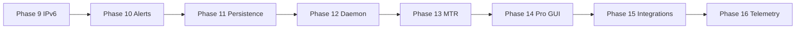

# ROADMAP — PINGUI

> **Language:** English · [Українська](ROADMAP.md)

**Official work plan index.** Detailed atomic plan: **[docs/en/ROADMAP.md](docs/en/ROADMAP.md)** (EN) · **[docs/ROADMAP.md](docs/ROADMAP.md)** (UK).

**MVP status:** ✅ implemented (2026-06-26)

**Target audience for upcoming phases:** NOC/SRE, network engineers, WAN/MPLS admins.

- Launch: `./pingui.sh` / `./pingui.sh --deploy` (beta) · `java/pingui-java.sh` (main)
- CI: ruff + mypy + pytest (beta) · `./gradlew check` (Java)
- Documentation: bilingual `docs/` + `docs/en/`

---

## Project phases (status)

| Phase | Description | Status |
|-------|-------------|--------|
| P0–P8 | Python MVP: venv, ICMP, GUI, CI | ✅ |
| **P9** | Java cross-platform edition | ✅ |
| **9** | IPv6 dual-stack (V6-*) | 🔄 in progress |
| **10** | Route change alerts (webhook, desktop) | 📋 planned |
| **11** | Persistence and timeline (Java parity with Python) | 📋 planned |
| **12** | Headless / daemon + systemd (Linux NOC) | 📋 planned |
| **13** | Probe efficiency (MTR, smart interval, burst) | 📋 planned |
| **14** | Pro GUI (diff, tags, ASN/rDNS, presets) | 📋 planned |
| **15** | Integrations (Prometheus, REST API, export) | 📋 planned |
| **16** | Telemetry: network metrics + LOG-server (SQLite/JSONL, syslog/GELF) | 📋 planned |

---

## MVP goal (achieved)

Linux desktop app: monitor up to 10 targets, ICMP traceroute, RTT per hop, route change detection, topological map in GUI, RAM-only session, GUI CRUD. Java edition — cross-platform parity.

---

## Backlog (completed)

| ID | Task | Status |
|----|------|--------|
| B-01…B-06 | SQLite, export, GeoIP, geo-map, timeseries, jitter/loss (Python) | ✅ |
| J-01…J-06 | Java graph, jpackage, raw ICMP, CI, hop stats | ✅ |
| M-001…M-023 | CLI override, Spotless, Checkstyle | ✅ |
| B-001…B-064 | JUnit, CI, UI split, probe refactor, coverage | ✅ |

---

## Recommended order (2026 Q3–Q4)

1. **Close phase 9** — IPv6 QA gate (V6-035…074)
2. **Phase 10** — alerts (highest ROI for NOC)
3. **Phase 11** — SQLite + history in Java
4. **Phase 12** — daemon for 24/7 monitoring
5. **Phases 13–15** — MTR, pro GUI, Prometheus/API
6. **Phase 16** — telemetry: local storage + LOG-server



---

## Repository structure (current)

```
PINGUI/
├── pingui.sh                 # Python launcher (beta)
├── java/                     # Java edition (main + beta)
├── src/pingui/               # Python (beta)
├── tests/                    # pytest (beta)
├── docs/
│   ├── ROADMAP.md            # ← detailed plan (UK)
│   └── en/ROADMAP.md         # ← detailed plan (EN)
├── config/
├── scripts/
└── systemd/
```

---

## Definition of Done (per feature)

1. No stubs in production paths.
2. Unit/contract/integration tests where logic exists.
3. `./pingui.sh --deploy` or `./gradlew check` green.
4. Row in `docs/LIVING_SPEC.md`.
5. README / DEPLOYMENT / CHANGELOG — if launch or UX changed.

---

## Critical path (MVP — complete)

```
pingui.sh → config/models → icmp/tracer → session_store → worker → main_window/graph → CI
```

Task details P10-001…P16-080: [docs/en/ROADMAP.md](docs/en/ROADMAP.md).
