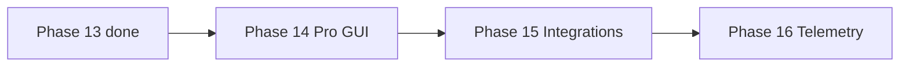

# ROADMAP — PINGUI

> **Language:** English · [Українська](ROADMAP.md)

**Official work plan index.** Detailed atomic plan: **[docs/en/ROADMAP.md](docs/en/ROADMAP.md)** (EN) · **[docs/ROADMAP.md](docs/ROADMAP.md)** (UK).

## NEXT

| Field | Value |
|------|----------|
| **Current task** | **[P14-030](docs/en/ROADMAP.md#next--single-source-of-truth)** |
| **Rule** | `/autopilot` with no args = this ID. **Do not ask** “which item?”. |

Full linear queue: [docs/en/ROADMAP.md — Execution queue](docs/en/ROADMAP.md#execution-queue-linear).

**MVP status:** ✅ implemented (2026-06-26)

**Target audience for upcoming phases:** NOC/SRE, network engineers, WAN/MPLS admins.

- Launch: `./pingui.sh` / `./pingui.sh --deploy` (beta) · `java/pingui-java.sh` (main)
- CI: ruff + mypy + pytest (beta) · `./gradlew check` (Java)
- Documentation: bilingual `docs/` + `docs/en/`

---

## Project phases (status)

| Phase | Description | Status |
|-------|-------------|--------|
| P0–P8 | Python MVP: venv, ICMP, GUI, CI | ✅ |
| **P9** | Java cross-platform edition | ✅ |
| **9** | IPv6 dual-stack (V6-*) | ✅ on `beta` |
| **PY** | Python CLI/NOC hardening | ✅ (tail: **PY-P11**) |
| **10** | Route change alerts | ✅ |
| **11** | Persistence and timeline (Java) | ✅ |
| **12** | Headless / daemon + systemd | ✅ |
| **13** | Probe efficiency (MTR, smart interval, burst) | ✅ P13-001…050 |
| **14** | Pro GUI (diff, tags, ASN/rDNS, presets) | 🔄 **NEXT → P14-030** |
| **15** | Integrations (Prometheus, REST API, export) | 📋 queued after P14 |
| **16** | Telemetry + LOG-server | 📋 queued after P15 |

---

## MVP goal (achieved)

Linux desktop app: monitor up to 10 targets, ICMP traceroute, RTT per hop, route change detection, topological map in GUI, RAM-only session, GUI CRUD. Java edition — cross-platform parity.

---

## Backlog (completed)

| ID | Task | Status |
|----|------|--------|
| B-01…B-06 | SQLite, export, GeoIP, geo-map, timeseries, jitter/loss (Python) | ✅ |
| J-01…J-06 | Java graph, jpackage, raw ICMP, CI, hop stats | ✅ |
| M-001…M-023 | CLI override, Spotless, Checkstyle | ✅ |
| B-001…B-064 | JUnit, CI, UI split, probe refactor, coverage | ✅ |

---

## Work order

**Single source of “what’s next”:** [docs/en/ROADMAP.md § NEXT](docs/en/ROADMAP.md#next--single-source-of-truth).  
Historical sprint tables in `docs/en/ROADMAP.md` are reference-only, not for task selection.



---

## Repository structure (current)

```
PINGUI/
├── pingui.sh                 # Python launcher (beta)
├── java/                     # Java edition (main + beta)
├── src/pingui/               # Python (beta)
├── tests/                    # pytest (beta)
├── docs/
│   ├── ROADMAP.md            # ← detailed plan + NEXT + queue (UK)
│   └── en/ROADMAP.md         # ← detailed plan + NEXT + queue (EN)
├── config/
├── scripts/
└── systemd/
```

---

## Definition of Done (per feature)

1. No stubs in production paths.
2. Unit/contract/integration tests where logic exists.
3. `./pingui.sh --deploy` or `./gradlew check` green.
4. Row in `docs/LIVING_SPEC.md`.
5. README / DEPLOYMENT / CHANGELOG — if launch or UX changed.
6. Update **NEXT** + the matching **Execution queue** row (`[x]` → next ID).

---

## Critical path (MVP — complete)

```
pingui.sh → config/models → icmp/tracer → session_store → worker → main_window/graph → CI
```

Task details: [docs/en/ROADMAP.md](docs/en/ROADMAP.md).
