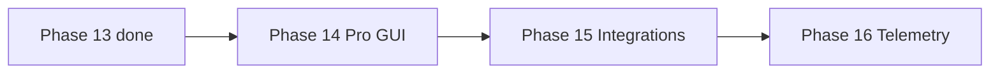

# ROADMAP — PINGUI

> **Мова:** Українська · [English](ROADMAP.en.md)

**Офіційний індекс планів роботи.** Детальний атомарний план: **[docs/ROADMAP.md](docs/ROADMAP.md)** (UK) · **[docs/en/ROADMAP.md](docs/en/ROADMAP.md)** (EN).

## NEXT

| Поле | Значення |
|------|----------|
| **Поточна задача** | **[P14-030](docs/ROADMAP.md#next--єдине-джерело-правди)** |
| **Правило** | `/autopilot` без аргументів = цей ID. **Не питати** «який пункт?». |

Повна лінійна черга: [docs/ROADMAP.md — Черга виконання](docs/ROADMAP.md#черга-виконання-лінійна).

**Статус MVP:** ✅ реалізовано (2026-06-26)

**Цільова аудиторія наступних фаз:** NOC/SRE, мережеві інженери, адміни WAN/MPLS.

- Запуск: `./pingui.sh` / `./pingui.sh --deploy` (beta) · `java/pingui-java.sh` (main)
- CI: ruff + mypy + pytest (beta) · `./gradlew check` (Java)
- Документація: двомовна `docs/` + `docs/en/`

---

## Фази проекту (статус)

| Фаза | Опис | Статус |
|------|------|--------|
| P0–P8 | Python MVP: venv, ICMP, GUI, CI | ✅ |
| **P9** | Java cross-platform edition | ✅ |
| **9** | IPv6 dual-stack (V6-*) | ✅ на `beta` |
| **PY** | Python CLI/NOC hardening | ✅ (хвіст: **PY-P11**) |
| **10** | Оповіщення про зміну маршруту | ✅ |
| **11** | Персистентність і таймлайн (Java) | ✅ |
| **12** | Headless / daemon + systemd | ✅ |
| **13** | Ефективність probe (MTR, smart interval, burst) | ✅ P13-001…050 |
| **14** | GUI для профі (diff, теги, ASN/rDNS, presets) | 🔄 **NEXT → P14-030** |
| **15** | Інтеграції (Prometheus, REST API, export) | 📋 у черзі після P14 |
| **16** | Телеметрія + LOG-server | 📋 у черзі після P15 |

---

## Ціль MVP (досягнуто)

Linux desktop-додаток: моніторинг до 10 цілей, ICMP traceroute, RTT по hop, детекція зміни маршруту, топологічна карта в GUI, RAM-only сесія, CRUD цілей у GUI. Java-редакція — крос-платформний паритет.

---

## Backlog (завершено)

| ID | Задача | Статус |
|----|--------|--------|
| B-01…B-06 | SQLite, export, GeoIP, geo-map, timeseries, jitter/loss (Python) | ✅ |
| J-01…J-06 | Java graph, jpackage, raw ICMP, CI, hop stats | ✅ |
| M-001…M-023 | CLI override, Spotless, Checkstyle | ✅ |
| B-001…B-064 | JUnit, CI, UI split, probe refactor, coverage | ✅ |

---

## Порядок робіт

**Єдине джерело «що далі»:** [docs/ROADMAP.md § NEXT](docs/ROADMAP.md#next--єдине-джерело-правди).  
Історичні sprint-таблиці в `docs/ROADMAP.md` — довідкові, не для вибору задачі.



---

## Структура репозиторію (актуальна)

```
PINGUI/
├── pingui.sh                 # Python launcher (beta)
├── java/                     # Java edition (main + beta)
├── src/pingui/               # Python (beta)
├── tests/                    # pytest (beta)
├── docs/
│   ├── ROADMAP.md            # ← детальний план + NEXT + черга (UK)
│   └── en/ROADMAP.md         # ← детальний план + NEXT + queue (EN)
├── config/
├── scripts/
└── systemd/
```

---

## Definition of Done (на кожну фічу)

1. Код без заглушок у production-шляхах.
2. Unit/contract/integration тест там, де є логіка.
3. `./pingui.sh --deploy` або `./gradlew check` green.
4. Рядок у `docs/LIVING_SPEC.md`.
5. README / DEPLOYMENT / CHANGELOG — якщо змінився запуск або UX.
6. Оновити **NEXT** + рядок у **Черзі виконання** (`[x]` → наступний ID).

---

## Критичний шлях (MVP — завершено)

```
pingui.sh → config/models → icmp/tracer → session_store → worker → main_window/graph → CI
```

Task details: [docs/ROADMAP.md](docs/ROADMAP.md).
