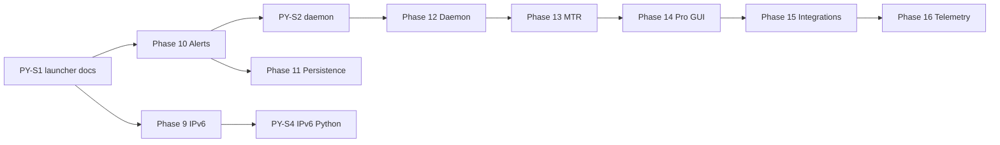

# ROADMAP — PINGUI

> **Мова:** Українська · [English](ROADMAP.en.md)

**Офіційний індекс планів роботи.** Детальний атомарний план: **[docs/ROADMAP.md](docs/ROADMAP.md)** (UK) · **[docs/en/ROADMAP.md](docs/en/ROADMAP.md)** (EN).

**Статус MVP:** ✅ реалізовано (2026-06-26)

**Цільова аудиторія наступних фаз:** NOC/SRE, мережеві інженери, адміни WAN/MPLS.

- Запуск: `./pingui.sh` / `./pingui.sh --deploy` (beta) · `java/pingui-java.sh` (main)
- CI: ruff + mypy + pytest (beta) · `./gradlew check` (Java)
- Документація: двомовна `docs/` + `docs/en/`

---

## Фази проекту (статус)

| Фаза | Опис | Статус |
|------|------|--------|
| P0–P8 | Python MVP: venv, ICMP, GUI, CI | ✅ |
| **P9** | Java cross-platform edition | ✅ |
| **9** | IPv6 dual-stack (V6-*) | 🔄 в роботі |
| **PY** | Python CLI/NOC hardening (PY-010…PY-064) | 📋 заплановано |
| **10** | Оповіщення про зміну маршруту (webhook, desktop) | 📋 заплановано |
| **11** | Персистентність і таймлайн (Java parity з Python) | 📋 заплановано |
| **12** | Headless / daemon + systemd (Linux NOC) | 📋 заплановано |
| **13** | Ефективність probe (MTR, smart interval, burst) | 📋 заплановано |
| **14** | GUI для профі (diff, теги, ASN/rDNS, presets) | 📋 заплановано |
| **15** | Інтеграції (Prometheus, REST API, export) | 📋 заплановано |
| **16** | Телеметрія: метрики мережі + LOG-server (SQLite/JSONL, syslog/GELF) | 📋 заплановано |

---

## Ціль MVP (досягнуто)

Linux desktop-додаток: моніторинг до 10 цілей, ICMP traceroute, RTT по hop, детекція зміни маршруту, топологічна карта в GUI, RAM-only сесія, CRUD цілей у GUI. Java-редакція — крос-платформний паритет.

---

## Backlog (завершено)

| ID | Задача | Статус |
|----|--------|--------|
| B-01…B-06 | SQLite, export, GeoIP, geo-map, timeseries, jitter/loss (Python) | ✅ |
| J-01…J-06 | Java graph, jpackage, raw ICMP, CI, hop stats | ✅ |
| M-001…M-023 | CLI override, Spotless, Checkstyle | ✅ |
| B-001…B-064 | JUnit, CI, UI split, probe refactor, coverage | ✅ |

---

## Рекомендований порядок (2026 Q3–Q4)

1. **PY-S1** — launcher + docs + CI (`PY-010…016`) — швидкий ROI на `beta`
2. **Закрити фазу 9** — IPv6 QA gate (V6-035…074)
3. **PY-S2 + Фаза 10** — MonitorLoop/daemon (Python) + alerts (Java/Python)
4. **Фаза 11** — SQLite + history в Java (Python уже має)
5. **Фаза 12** — daemon Java (Python — PY-030…034)
6. **Фази 13–15** — MTR, pro GUI, Prometheus/API
7. **Фаза 16** — telemetry: локальне збереження + LOG-server
8. **PY-S4 (opt.)** — IPv6 Python (PY-050…052)



---

## Структура репозиторію (актуальна)

```
PINGUI/
├── pingui.sh                 # Python launcher (beta)
├── java/                     # Java edition (main + beta)
├── src/pingui/               # Python (beta)
├── tests/                    # pytest (beta)
├── docs/
│   ├── ROADMAP.md            # ← детальний план (UK)
│   └── en/ROADMAP.md         # ← детальний план (EN)
├── config/
├── scripts/
└── systemd/
```

---

## Definition of Done (на кожну фічу)

1. Код без заглушок у production-шляхах.
2. Unit/contract/integration тест там, де є логіка.
3. `./pingui.sh --deploy` або `./gradlew check` green.
4. Рядок у `docs/LIVING_SPEC.md`.
5. README / DEPLOYMENT / CHANGELOG — якщо змінився запуск або UX.

---

## Критичний шлях (MVP — завершено)

```
pingui.sh → config/models → icmp/tracer → session_store → worker → main_window/graph → CI
```

Task details PY-010…PY-064, P10-001…P16-080: [docs/ROADMAP.md](docs/ROADMAP.md).
