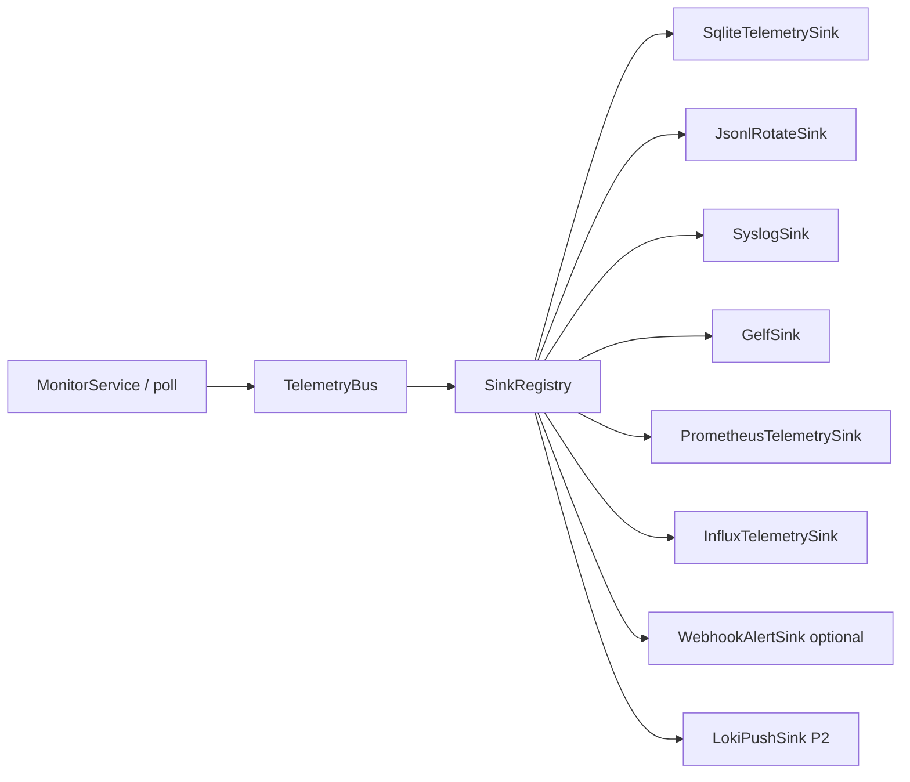

> **Мова:** Українська · [English](en/ADR_TELEMETRY.md)

# ADR: Телеметрія — events / samples / aggregates і sinks (P16-001)

**Статус:** accepted (P16-001)  
**Дата:** 2026-07-12  
**Гілка:** `beta` (після merge — `main` і `beta`).

## Контекст

Після фаз 10–15 у PINGUI є кілька **паралельних** шляхів даних з poll loop:

| Канал | Фаза | Що несе |
|-------|------|---------|
| Alerts (webhook / desktop) | P10 | Notify оператора про `route_change` |
| SQLite session | P11 | GUI history / session state |
| Prometheus scrape | P15 | Pull gauges/counters |
| Influx/Timescale push | P15 / B-05 | Write RTT + route markers |
| REST read-only | P15-040 | Snapshot hosts/routes |

NOC потребує ще: **локальний архів** samples/events і **відправку на LOG-server** (syslog/GELF). Без ADR легко:

- слати hop-RTT щосекунди в syslog;
- дублювати webhook payload окремим «telemetry» HTTP;
- змішати session SQLite з telemetry archive;
- лишити dual-emit з MonitorService назавжди.

[ADR_OBSERVABILITY.md](ADR_OBSERVABILITY.md) фіксує межі P15 і явно відкладає уніфіковану шину на P16.

## Рішення

### 1. Три класи даних

| Клас | Приклади | Частота | Куди (v1) |
|------|----------|---------|-----------|
| **Events** | `route_change`, `probe_error`, (опційно) `daemon_start` | Рідко | LOG-server (syslog/GELF); local event store; alerts лишаються окремим notify |
| **Samples** | RTT per hop, loss/jitter snapshot, `trace_duration_ms`, `target_reachable` | Висока (кожний poll) | TS / Prometheus / local SQLite-or-JSONL; **не** syslog за замовчуванням |
| **Aggregates** | avg/max RTT за 5 хв на hop | Низька | Опційно в LOG (`log_aggregates`); або лише local |

**Правило:** *events → LOG*; *samples → TS / scrape / local archive*; *aggregates → LOG лише якщо явно увімкнено*.

### 2. Топологія: bus → sinks

*Примітка:* `InfluxTelemetrySink` охоплює Influx **і** Timescale (обгортка P15-020 / B-05).
| Компонент | Роль | Ticket |
|-----------|------|--------|
| `MetricSample` / `TelemetryEvent` | Серіалізовані записи (host, hop, labels, ts) | P16-010 ✅ |
| `TelemetrySink` + `SinkRegistry` | Pluggable writers; no-op default | P16-011 ✅ |
| `TelemetryBus` | Async queue, batch flush, backpressure, drop policy | P16-012 ✅ |
| Wire з MonitorService | Один emit; **не** блокує poll | P16-013 ✅ |

**Наслідки для poll loop:** emit у bus має бути non-blocking (offer у чергу). Overflow → drop + counter/log за політикою bus (документується в P16-012).

### 3. Local vs remote sinks

| Sink | Тип | Default | Примітка |
|------|-----|---------|----------|
| `SqliteTelemetrySink` | local samples+events | **off** | Schema v4; окремо від P11 `host_session`; retention P16-022 |
| `JsonlRotateSink` | local file | **off** | `telemetry.jsonl.yyyy-MM-dd` (+ `.N` size); P16-021 ✅ |
| `SyslogSink` | remote events | **off** | RFC 5424 TCP; TLS optional; `events_only=true` за замовч. (P16-033); MSG = single-line JSON |
| `GelfSink` | remote events | **off** | Graylog; TCP preferred / UDP lab; `events_only=true` за замовч. (P16-033) |
| `LokiPushSink` | remote | **off** | P2 (P16-032); той самий `events_only` default |
| `PrometheusTelemetrySink` | in-process scrape state | via `--metrics-port` | Не remote_write (див. ADR_OBSERVABILITY) |
| `InfluxTelemetrySink` | remote samples | via TS config | Обгортка B-05 / P15-020 |
| Webhook as sink | remote events | via alerts config | P16-050 — один код emit, не другий HTTP клієнт |

### 4. Межі з P10 і P15

| Межа | Рішення |
|------|---------|
| **P10 alerts** | Лишаються **operator notify**. Telemetry **може** дублювати `route_change` як event у sinks, але UX-оповіщення не замінюється LOG. P16-050 рефакторить webhook у `TelemetrySink`, не змінює payload-контракт ADR_ALERTS. |
| **P15 Prometheus** | Pull/scrape лишається. P16-051: exporter стає sink, що оновлює in-process gauges з bus. |
| **P15 TS push** | P16-052: Influx/Timescale як sink з bus; dual-emit з MonitorService знімається після P16-013. |
| **P11 session DB** | GUI history / policy events. **Не** Grafana datasource і не заміна telemetry archive. |
| **REST API** | Read snapshot; не telemetry bus. |
| **OTLP** | Out of scope v1 (P16-080). |

### 5. Імена метрик (узгодження з P15)

Префікс `pingui_` зберігається. P16-014 ✅ канонізує імена/labels для bus (`MetricNames` / `metric_names.py`); мінімум уже в scrape:

| Імʼя | Клас | Примітка |
|------|------|----------|
| `pingui_rtt_ms` | sample | host/hop — поля sample; bus labels: profile, probe_mode, edition |
| `pingui_hop_loss_pct` | sample | hop loss % |
| `pingui_route_change_total` | derived from events | counter |
| `pingui_target_reachable` | sample/gauge | |
| `pingui_trace_duration_ms` | sample/gauge | |

Нові sample-поля (loss/jitter) додаються через P16-010 без зміни меж цього ADR.

### 6. Конфігурація (пріоритет)

1. CLI: `--telemetry-*` (P16-041)  
2. YAML `telemetry:` активного профілю (P16-040)  
3. Default: **усі sinks off** (zero remote IO)

Секрети (URL, token) — **не** логувати plaintext (P16-042).

### 7. Failure policy

| Ситуація | Поведінка |
|----------|-----------|
| Sink write fail | `WARNING`; poll **не** зупиняється |
| Bus overflow | drop oldest/newest за політикою P16-012; метрика drop-count |
| Sink misconfigured | fail-fast на старті daemon **або** disable sink + WARN (вибір у ticket sink) |

## Наслідки

- **Документація:** цей ADR — gate перед P16-010+; SPIKE протоколів — P16-002 ✅ (`docs/SPIKE_LOG_SINKS.md`).
- **Імплементація:** спочатку модель + bus (P16-010…013), потім local sinks, потім LOG, потім wrap P10/P15.
- **Оператори:** syslog отримує рідкі events; high-freq RTT — лише TS/Prometheus/local archive.
- **Не робити:** high-freq RTT у syslog; другий webhook-клієнт поруч із alerts; session SQLite як TS для Grafana.

## Посилання

- [ROADMAP.md](ROADMAP.md) — фаза 16 (P16-*)  
- [ADR_OBSERVABILITY.md](ADR_OBSERVABILITY.md) — Prometheus vs TS; dual-emit debt  
- [ADR_ALERTS.md](ADR_ALERTS.md) — notify-канал  
- [ADR_DAEMON.md](ADR_DAEMON.md) — headless process  
- [SPIKE_PERSISTENCE.md](SPIKE_PERSISTENCE.md) — SQLite session ≠ TS  
- Java (planned): `telemetry/`  
- Python (planned): дзеркало моделей + sinks
