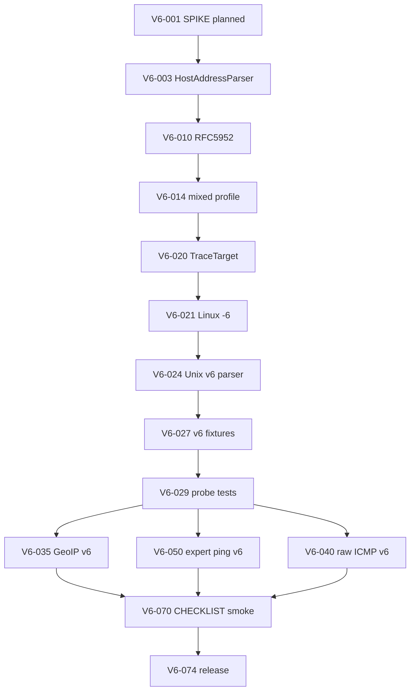
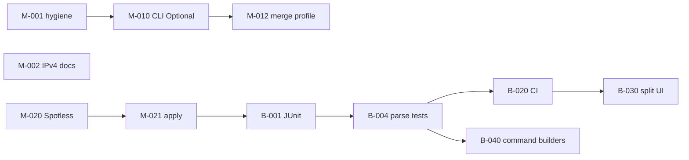

> **Мова:** Українська · [English](en/ROADMAP.md)

# ROADMAP — PINGUI Java (`main` / `beta`)

План виправлень після аудиту `main` (MVP desktop utility, production readiness: низька–середня).

**Легенда**

| Поле | Значення |
|------|----------|
| **Гілка** | `main` — Java + docs; `beta` — + Python, тести, CI |
| **Пріоритет** | P0 критично · P1 важливо · P2 бажано |
| **DoD** | Definition of Done — умова закриття задачі |

Задачі **атомарні**: одна задача ≈ один MR/коміт, ≤ 1 день роботи.

---

## Фаза 0 — Швидкі виправлення (`main`, P0)

| ID | Задача | Файли | DoD |
|----|--------|-------|-----|
| **M-001** | [x] Видалити дубльований `import java.io.IOException` | `probe/RawIcmpRouteProbe.java` | `./gradlew compileJava` OK; один import |
| **M-002** | [x] Задокументувати **IPv4-only** (validator + raw ICMP) | `README.md`, `docs/JAVA.md`, `docs/DEPLOYMENT.md`, `AppMenuDialogs` help | Явна примітка «IPv6 не підтримується»; приклади лише IPv4/hostname |
| **M-003** | [x] CHANGELOG: запис про roadmap і IPv4-only | `CHANGELOG.md` | Секція `[Unreleased]` оновлена |

---

## Фаза 1 — CLI override (`main`, P0)

**Проблема:** `applyCliOverridesToActiveProfile()` завжди підставляє `AppOptions.defaults()`, затираючи YAML при старті без CLI.

| ID | Задача | Файли | DoD |
|----|--------|-------|-----|
| **M-010** | [x] Ввести `CliOverrides` (record з `Optional` полями: interval, maxHops, timeout, probe) | `CliProfileOverrides.java`, `AppOptions.java`, `PinguiApplication.java` | Парсер CLI заповнює `Optional.empty()` для непереданих прапорців |
| **M-011** | [x] `parseOptions`: розрізняти «не передано» vs «default» | `PinguiApplication.java` | `--interval 2` → override; без `--interval` → empty |
| **M-012** | [x] `applyCliOverridesToActiveProfile`: merge лише present-полів | `MainController.java` | Старт без CLI зберігає YAML `interval`/`max_hops`/`timeout`/`probe` |
| **M-013** | [x] Документувати поведінку CLI vs YAML | `java/README.md`, `docs/JAVA.md` | Таблиця «CLI перезаписує поле профілю лише якщо передано» |
| **M-014** | [x] Ручний smoke: профіль `interval: 30` + `./pingui-java.sh` | — | Unit-тест M-014 + CHECKLIST § CLI interval |

---

## Фаза 2 — Hygiene / static checks (`main` → `beta`, P1)

| ID | Задача | Файли | DoD |
|----|--------|-------|-----|
| **M-020** | [x] Підключити Spotless (Google Java Format або Palantir) | `java/build.gradle.kts`, `settings.gradle.kts` | `./gradlew spotlessCheck` проходить |
| **M-021** | [x] `./gradlew spotlessApply` + форматування існуючих `.java` | `java/src/main/**` | `spotlessCheck` green; diff лише formatting |
| **M-022** | [x] Gradle task `check` = `compileJava` + `spotlessCheck` | `java/build.gradle.kts` | `./gradlew check` на `main` |
| **M-023** | [x] Checkstyle — мінімальний ruleset | `java/build.gradle.kts`, `config/checkstyle/checkstyle.xml` | RedundantImport, UnusedImports; `./gradlew check` |

---

## Фаза 3 — Тестовий шар (`beta`, P0)

| ID | Задача | Файли | DoD |
|----|--------|-------|-----|
| **B-001** | [x] JUnit 5 + test deps у `java/build.gradle.kts` | `build.gradle.kts` | `./gradlew test` запускається |
| **B-002** | [x] Фікстури: зразки виводу `traceroute` (Linux/macOS) | `src/test/resources/trace/unix_*.txt` | ≥ 3 файли (ok, timeout, hostname) |
| **B-003** | [x] Фікстури: зразки `tracert` (Windows) | `src/test/resources/trace/win_*.txt` | ≥ 3 файли (`<1 ms`, `host [IP]`, timeout) |
| **B-004** | [x] Unit: `ProcessRouteProbe.parseUnix` | `ProcessRouteProbeTest.java` | Hop count, IP, RTT для кожної фікстури |
| **B-005** | [x] Unit: `ProcessRouteProbe.parseWindows` | той самий test class | Парсинг Windows-рядків без `No hops parsed` |
| **B-006** | [x] Unit: `windowsTracertWaitMs` / `-w` ≥ 4000 | `ProcessRouteProbeTest.java` | Assert на мінімальний wait |
| **B-007** | [x] Unit: `HostsConfig.validateSessionHost` | `HostsConfigTest.java` | duplicate, max 10, invalid chars, IPv4 ok |
| **B-008** | [x] Unit: `ProfilesConfig` v2 + legacy migration | `ProfilesConfigTest.java` | load/save round-trip; `active_profile` |
| **B-009** | [x] Unit: `PingExpertValidator` | `PingExpertValidatorTest.java` | invalid flags → `ConfigError` |
| **B-010** | [x] Unit: CLI override merge | `PinguiApplicationTest.java` | optional fields не затирають profile |

---

## Фаза 4 — CI (`beta`, P0)

| ID | Задача | Файли | DoD |
|----|--------|-------|-----|
| **B-020** | [x] GitHub Actions: JDK 21, venv не потрібен для Java job | `.github/workflows/java.yml` | `compileJava` + `test` + `spotlessCheck` на push/PR |
| **B-021** | [x] CI matrix: `ubuntu-latest` (обовʼязково); Windows optional | workflow | Linux green; Windows job `continue-on-error` |
| **B-022** | [x] Badge / статус у README | `README.md` | Badge CI видимий |
| **B-023** | [x] Living spec: матриця «ТЗ → модуль → тест» | `docs/LIVING_SPEC.md` | Рядки для probe, config, CLI override, CI |

---

## Фаза 5 — Розділення UI (`beta`, P1)

**Мета:** `MainController` ≤ ~300 рядків; SRP.

| ID | Задача | Виділити з | DoD |
|----|--------|------------|-----|
| **B-030** | [x] `ProfileUiActions` — new/delete/select profile, combo sync | `MainController` | Profile CRUD винесено; controller делегує |
| **B-031** | [x] `HostListPresenter` — add/edit/remove, toggles, list height | `MainController` | Host ops + `HostListCell` callbacks |
| **B-032** | [x] `MonitorLifecycle` — create/close monitor, reload profile | `MainController` | `reloadActiveProfile` + `createMonitor` |
| **B-033** | [x] `ViewModeController` — Simple/Extended, `fitWindowToContent` | `MainController` | Easter egg лишається або → `HostViewRules` helper |
| **B-034** | [x] `RouteGraphPresenter` — `redrawRouteIfExtended`, graph panel | `MainController` | Extended mode graph + status label |
| **B-035** | [x] Smoke GUI: профіль, host, save, F1/About | `docs/CHECKLIST.md` § GUI smoke | Checklist B-035; ручний прогін на Linux |

---

## Фаза 6 — Probe / OS strategy (`beta`, P1)

| ID | Задача | Файли | DoD |
|----|--------|-------|-----|
| **B-040** | [x] Інтерфейс `TraceCommandBuilder` (OS → argv[]) | `probe/` | Linux/macOS/Windows реалізації |
| **B-041** | [x] Перенести команди з `ProcessRouteProbe` | `LinuxTracerouteCommand`, `MacTracerouteCommand`, `WindowsTracertCommand` | Паритет з поточною поведінкою; тести B-004/B-005 green |
| **B-042** | [x] Парсер Unix: окремий `UnixTraceOutputParser` | `probe/` | Unit-тести на фікстурах |
| **B-043** | [x] Парсер Windows: `WindowsTraceOutputParser` | `probe/` | Локалізовані timeout-рядки в фікстурах |
| **B-044** | [x] Документувати обмеження парсера (IPv6 trace output, ASN) | `docs/JAVA.md` | Known limitations |

---

## Фаза 7 — IPv6 SPIKE (закрито, P2)

| ID | Задача | DoD |
|----|--------|-----|
| **B-050** | [x] SPIKE: IPv6 trace + ping — обсяг робіт | `docs/SPIKE_IPV6.md` | Рішення: wontfix (MVP) |
| **B-051** | — (cancelled) `HostsConfig` — IPv6 literal | — | Перенесено → **V6-010…V6-019** |
| **B-052** | — (cancelled) Raw ICMP IPv6 | — | Перенесено → **V6-040…V6-049** |
| **B-053** | [x] Закрити B-050 статусом «IPv4-only by design» | `HostsConfig`, `SPIKE_IPV6.md` | Явна помилка для IPv6 literal |

> **Перегляд рішення (2026-06):** wontfix знято для product request; реалізація — **Фаза 9 (V6-*)**.

---

## Фаза 9 — IPv6 implementation (`beta` → `main`, P1)

**Мета:** dual-stack моніторинг — IPv6 literal, subprocess trace/ping, GeoIP v6; raw ICMP v6 — Linux-only (P2).

**Передумови:** `./gradlew check` green; B-064 JaCoCo gate ≥80%.

**Поза scope фази 9 (окремі ticket):** Python-шар на `beta`; повний Windows expert-ping parity (див. backlog після V6-059).

### 9.0 — Design gate

| ID | Задача | Файли | DoD |
|----|--------|-------|-----|
| **V6-001** | [x] Оновити SPIKE: статус **planned**, цілі фази 9, матриця OS | `docs/SPIKE_IPV6.md` | Таблиця «шар → v4 → v6 → OS»; посилання на V6-* |
| **V6-002** | [x] ADR: політика dual-stack (literal v6, hostname→AAAA, mixed profile) | `docs/ADR_IPV6.md` | Рішення: bracket YAML, canonical RFC 5952, probe fallback |
| **V6-003** | [x] `HostAddressKind` + `HostAddressParser` (IPv4 / IPv6 / hostname) | `config/HostAddress*.java` | Unit-тест: parse/normalize без UI |

### 9.1 — Config / validator (P0)

| ID | Задача | Файли | DoD |
|----|--------|-------|-----|
| **V6-010** | [x] RFC 5952 normalize для IPv6 literal | `HostsConfig.java`, `HostAddressParser` | `2001:db8::1` → canonical; `[::1]` strip brackets |
| **V6-011** | [x] Приймати IPv6 у `normalizeHostEntry` / `isValidHost` | `HostsConfig.java` | Прибрати blanket `:` → error; зберегти reject invalid |
| **V6-012** | [x] Duplicate key: canonical v6 (case-insensitive hex) | `HostsConfig.java`, `ProfilesConfig` | `HostsConfigTest`: dup `2001:DB8::1` vs `2001:db8:0:0:0:0:0:1` |
| **V6-013** | [x] Bracket notation у YAML прикладах | `java/README.md`, `docs/DEPLOYMENT.md` | Приклад `address: "2001:db8::1"` |
| **V6-014** | [x] Mixed profile: IPv4 + IPv6 hosts в одному профілі | `ProfilesConfigTest` | load/save round-trip 2+2 hosts |
| **V6-015** | [x] LIVING_SPEC: рядки HostAddress / v6 validator | `docs/LIVING_SPEC.md` | Матриця оновлена |

### 9.2 — Process trace (subprocess, P0)

| ID | Задача | Файли | DoD |
|----|--------|-------|-----|
| **V6-020** | [x] `TraceTarget` — визначення address family з literal | `probe/TraceTarget.java` | Unit-тест: v4/v6/hostname |
| **V6-021** | [x] `LinuxTracerouteCommand`: `-6` для v6 literal | `LinuxTracerouteCommand.java` | Test: argv містить `-6` |
| **V6-022** | [x] `MacTracerouteCommand`: `-6` для v6 literal | `MacTracerouteCommand.java` | Test: argv містить `-6` |
| **V6-023** | [x] `WindowsTracertCommand`: `-6` для v6 literal | `WindowsTracertCommand.java` | Test: argv містить `-6` |
| **V6-024** | [x] `UnixTraceOutputParser`: hop token `[2001:db8::n]` | `UnixTraceOutputParser.java` | Regex + unit-тест |
| **V6-025** | [x] `UnixTraceOutputParser`: compressed v6 без дужок (GNU) | `UnixTraceOutputParser.java` | Фікстура + test |
| **V6-026** | [x] `WindowsTraceOutputParser`: IPv6 tracert рядки | `WindowsTraceOutputParser.java` | Фікстура + test |
| **V6-027** | [x] Фікстури `trace/unix_v6_*.txt` (≥3) | `src/test/resources/trace/` | ok / timeout / multihop |
| **V6-028** | [x] Фікстури `trace/win_v6_*.txt` (≥2) | `src/test/resources/trace/` | ok / timeout |
| **V6-029** | [x] `ProcessRouteProbeTest` — v6 fixtures green | `ProcessRouteProbeTest.java` | Hop count + IP match |
| **V6-030** | [x] Документ: hostname AAAA — резолв ОС, не PINGUI | `docs/JAVA.md` | Known limitations оновлено |

### 9.3 — GeoIP v6 (P1)

| ID | Задача | Файли | DoD |
|----|--------|-------|-----|
| **V6-035** | [ ] `GeoCountry`: `Inet6Address` — loopback/link-local/ULA → `LAN` | `GeoCountry.java` | `GeoCountryTest` |
| **V6-036** | [ ] `GeoCountry`: longest-prefix для IPv6 CIDR | `GeoCountry.java`, `geoip_hints.yaml` | Test: `2001:db8::/32` |
| **V6-037** | [ ] Схема YAML: optional `prefixes_v6` (або unified map) | `GeoCountry.java`, docs | Backward compat v4 hints |

### 9.4 — Raw ICMP v6 (Linux only, P2)

| ID | Задача | Файли | DoD |
|----|--------|-------|-----|
| **V6-040** | [ ] JNA: `AF_INET6`, `sockaddr_in6` | `LinuxSocketConstants`, `LinuxCLibrary` | Compile + struct layout test |
| **V6-041** | [ ] ICMPv6 echo request/reply parse | `IcmpPacket.java` або `IcmpV6Packet.java` | Unit-тест без cap (build packet) |
| **V6-042** | [ ] `LinuxJnaIcmpTransport` dual: v4/v6 socket | `LinuxJnaIcmpTransport.java` | Integration test optional; mock-friendly unit |
| **V6-043** | [ ] `RawIcmpRouteProbe`: hop limit для v6 | `RawIcmpRouteProbe.java` | v6 target → trace hops |
| **V6-044** | [ ] `RouteProbeFactory`: v6 + non-Linux → process fallback | `RouteProbeFactory.java` | Test: AUTO on macOS → process |
| **V6-045** | [ ] DEPLOYMENT: cap note для ICMPv6 | `docs/DEPLOYMENT.md` | Linux-only raw v6 documented |

### 9.5 — Expert ping v6 (P1)

| ID | Задача | Файли | DoD |
|----|--------|-------|-----|
| **V6-050** | [ ] Auto `-6` у `ProcessExpertPing.buildCommand` для v6 target | `ProcessExpertPing.java` | Test: v6 target → `-6` in argv |
| **V6-051** | [ ] `ProcessHostPing`: expert args + v6 на Linux/macOS | `ProcessHostPing.java` | Test: args appended |
| **V6-052** | [ ] Validator: `-4` + v6 target → `ConfigError` (profile save) | `PingExpertValidator` або host-level check | Unit-тест |
| **V6-053** | [ ] `-F` flow label — лише з v6 target (UI hint) | `PingExpertDialog.java` | Tooltip / disable when target v4 |

### 9.6 — UI / docs (P1)

| ID | Задача | Файли | DoD |
|----|--------|-------|-----|
| **V6-060** | [ ] Help/About: dual-stack замість «IPv4-only» | `AppMenuDialogs.java`, `README.md` | Текст оновлено |
| **V6-061** | [ ] `GraphCanvas` / labels: bracket display для довгих v6 | `GraphCanvas.java`, `RouteGraphLayout` | Manual smoke note in CHECKLIST |
| **V6-062** | [ ] Input validation у Add Host dialog для v6 | `HostListPresenter` / dialog | Invalid v6 → log error |
| **V6-063** | [ ] CHANGELOG + ROADMAP `[x]` при закритті підфаз | `CHANGELOG.md` | Per-sprint notes |

### 9.7 — QA / release gate (P0)

| ID | Задача | Файли | DoD |
|----|--------|-------|-----|
| **V6-070** | [ ] CHECKLIST § IPv6 smoke (Linux process trace) | `docs/CHECKLIST.md` | literal v6 + ping-only |
| **V6-071** | [ ] CHECKLIST § IPv6 smoke (Windows tracert -6) | `docs/CHECKLIST.md` | optional OS job |
| **V6-072** | [ ] Regression: усі v4 fixtures лишаються green | CI | `./gradlew check` |
| **V6-073** | [ ] JaCoCo: нові модулі в bundle або documented exclusion | `build.gradle.kts` | Gate ≥80% |
| **V6-074** | [ ] Release note: «IPv6 beta» / feature flag якщо потрібно | `CHANGELOG.md` | Semver minor bump note |

### Рекомендований порядок (фаза 9)

**Орієнтовно:** 3–5 sprint × 3–5 задач; raw ICMP (V6-040…) можна відкласти після process+GeoIP MVP.

| Sprint (пропоз.) | Задачі |
|------------------|--------|
| IPv6-S1 | V6-001…V6-015 (config) |
| IPv6-S2 | V6-020…V6-030 (process trace) |
| IPv6-S3 | V6-035…V6-037, V6-050…V6-053 (GeoIP + expert) |
| IPv6-S4 | V6-060…V6-063, V6-070…V6-074 (UI + QA) |
| IPv6-S5 (opt.) | V6-040…V6-045 (raw ICMP v6 Linux) |

---

## Фаза 8 — Production polish (`beta`, P2)

| ID | Задача | DoD |
|----|--------|-----|
| **B-060** | [x] Версія в About з CI build number / git sha | `AppInfo`, Gradle `generateBuildProperties` | About показує `versionDetail()` |
| **B-061** | [x] jpackage smoke у CHECKLIST після кожного release | `docs/CHECKLIST.md` § Release |
| **B-062** | [x] Weekly doc smoke (README ↔ фактичний CLI) | `docs/CHECKLIST.md` § Docs smoke |
| **B-063** | [x] Import graph / cycle detection (Gradle plugin або script) | `java/scripts/check-layer-deps.sh`, `layerCheck` | `./gradlew check` включає layerCheck |

---

## Рекомендований порядок виконання

**Sprint 1 (`main`):** M-001, M-002, M-010…M-014  
**Sprint 2 (`main`→`beta` merge):** M-020…M-023, B-001…B-010  
**Sprint 3 (`beta`):** B-020…B-023, B-030…B-035  
**Backlog:** M/B roadmap закрито; B-064 coverage ongoing; **IPv6 — Фаза 9 (V6-*)**.

---

## Anti-stub checklist (кожен MR)

- [ ] Немає `pass` / `return null` / `Mock` без TODO з ticket ID  
- [ ] Змінений модуль — тест або оновлений рядок у `LIVING_SPEC.md`  
- [ ] `./gradlew check` (або `compileJava` на `main`) green у venv/CI  
- [ ] README / `java/README` / CHANGELOG — якщо змінилась поведінка  
- [ ] Ревʼю: рекурсія, невикористані поля, заглушки  

---

## Звʼязок з гілками

| Після задачі | Дія |
|--------------|-----|
| `main` only | cherry-pick або merge `main` → `beta` |
| `beta` only | періодично merge `beta` Java-шар → `main` (без Python/tests у tree `main`) |

**Sprint 10 (2025-06-26):** `origin/main` злито в `beta`; Python-дерево збережено; `./gradlew check` + JaCoCo ≥80% + Python pytest green.

**Sprint 11 (2025-06-26):** Java test suite + JaCoCo gate з `beta` → `main`; Python-дерево на `main` не додається.

**Sprint 12 (2025-06-26):** `origin/main` злито в `beta` — паритет гілок після Sprint 11.

**Sprint 13 (2025-06-26):** B-064 — розширено `ProfilesConfigTest`/`HopStatsTest`; прибрано 6 JaCoCo exclusions (RoutePoller, HopStats, HostEntry, ProfileDocument, HostTargetStats, GeoCountry lookup).

**Sprint 13b (2025-06-30):** B-064 — `MonitorServiceTest`/`SessionStoreTest`/`IcmpPacketTest`; прибрано exclusion `IcmpPacket`.

**Sprint 14 (2025-06-26):** `origin/main` (B-064 push) злито в `beta`; `origin/beta` синхронізовано.

**Sprint 13b (2025-06-30):** B-064 — `MonitorServiceTest`/`SessionStoreTest`/`IcmpPacketTest`; прибрано exclusion `IcmpPacket`.

**Sprint 15 (2025-06-30):** B-064b з `beta` → `main` (cherry-pick).

**Sprint 16 (2025-06-30):** `MonitorService` — wire `PingOnlyResolver` у `pollHostOnce` (live ping-only з `SessionStore`).

**Sprint 17 (2025-06-30):** B-064c — розширено config/geoip unit-тести (`HostsConfig`, `ProfileDocument`, `GeoCountry`).

**Sprint 18 (2025-06-26):** B-064d — `GeoCountryTest`/`ProfilesConfigTest` (longest-prefix, LAN edge cases, host entry flags); JaCoCo bundle ≥80%.

**Sprint 19 (2025-06-26):** B-064e — `HostEntryTest`; GeoIP YAML validation + ProfilesConfig type/save guards.

**Sprint 20 (2025-06-26):** B-064f — `PingExpertValidator` + `ExpertPingEnricher` stub tests; −exclusion `ExpertPingEnricher`.

**IPv6-S1 (2026-06-26):** V6-001…V6-015 — `HostAddressParser`, RFC 5952, mixed v4/v6 YAML.

Оновлюй цей файл при закритті задачі: `[x] M-001` + дата в CHANGELOG.
