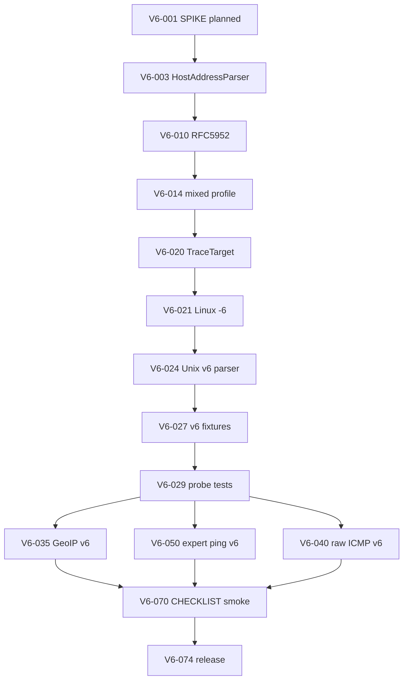
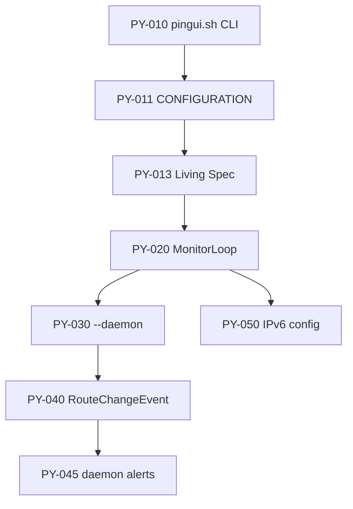
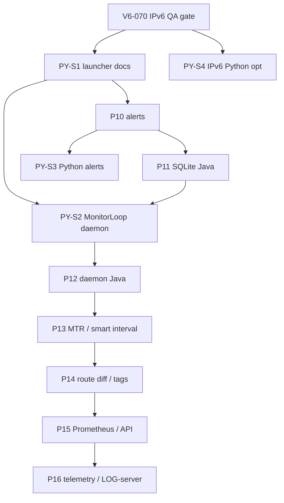
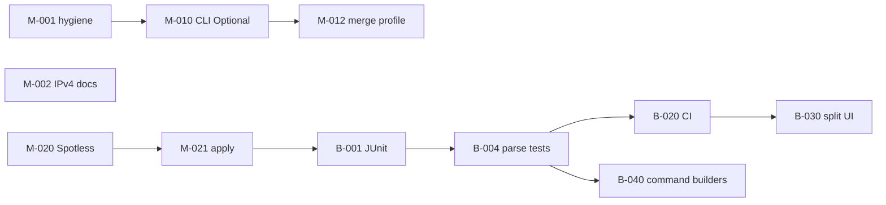

> **Мова:** Українська · [English](en/ROADMAP.md)

# ROADMAP — PINGUI Java (`main` / `beta`)

**Офіційний документ планів роботи над проектом.** Оновлюй при закритті задачі: `[x]` + дата в `CHANGELOG.md`.

План розвитку після MVP (2026-06-26) для **профільних користувачів** (NOC/SRE, мережеві інженери, адміни WAN/MPLS).

**Легенда**

| Поле | Значення |
|------|----------|
| **Гілка** | `main` — стабільний Java GUI (RAM); `beta` — розробка: Java P9–P12 (SQLite, alerts, daemon) + Python + повний CI |
| **Пріоритет** | P0 критично · P1 важливо · P2 бажано |
| **DoD** | Definition of Done — умова закриття задачі |

Задачі **атомарні**: одна задача ≈ один MR/коміт, ≤ 1 день роботи.

---

## Фаза 0 — Швидкі виправлення (`main`, P0)

| ID | Задача | Файли | DoD |
|----|--------|-------|-----|
| **M-001** | [x] Видалити дубльований `import java.io.IOException` | `probe/RawIcmpRouteProbe.java` | `./gradlew compileJava` OK; один import |
| **M-002** | [x] Задокументувати **IPv4-only** (validator + raw ICMP) | `README.md`, `docs/JAVA.md`, `docs/DEPLOYMENT.md`, `AppMenuDialogs` help | Явна примітка «IPv6 не підтримується»; приклади лише IPv4/hostname |
| **M-003** | [x] CHANGELOG: запис про roadmap і IPv4-only | `CHANGELOG.md` | Секція `[Unreleased]` оновлена |

---

## Фаза 1 — CLI override (`main`, P0)

**Проблема:** `applyCliOverridesToActiveProfile()` завжди підставляє `AppOptions.defaults()`, затираючи YAML при старті без CLI.

| ID | Задача | Файли | DoD |
|----|--------|-------|-----|
| **M-010** | [x] Ввести `CliOverrides` (record з `Optional` полями: interval, maxHops, timeout, probe) | `CliProfileOverrides.java`, `AppOptions.java`, `PinguiApplication.java` | Парсер CLI заповнює `Optional.empty()` для непереданих прапорців |
| **M-011** | [x] `parseOptions`: розрізняти «не передано» vs «default» | `PinguiApplication.java` | `--interval 2` → override; без `--interval` → empty |
| **M-012** | [x] `applyCliOverridesToActiveProfile`: merge лише present-полів | `MainController.java` | Старт без CLI зберігає YAML `interval`/`max_hops`/`timeout`/`probe` |
| **M-013** | [x] Документувати поведінку CLI vs YAML | `java/README.md`, `docs/JAVA.md` | Таблиця «CLI перезаписує поле профілю лише якщо передано» |
| **M-014** | [x] Ручний smoke: профіль `interval: 30` + `./pingui-java.sh` | — | Unit-тест M-014 + CHECKLIST § CLI interval |

---

## Фаза 2 — Hygiene / static checks (`main` → `beta`, P1)

| ID | Задача | Файли | DoD |
|----|--------|-------|-----|
| **M-020** | [x] Підключити Spotless (Google Java Format або Palantir) | `java/build.gradle.kts`, `settings.gradle.kts` | `./gradlew spotlessCheck` проходить |
| **M-021** | [x] `./gradlew spotlessApply` + форматування існуючих `.java` | `java/src/main/**` | `spotlessCheck` green; diff лише formatting |
| **M-022** | [x] Gradle task `check` = `compileJava` + `spotlessCheck` | `java/build.gradle.kts` | `./gradlew check` на `main` |
| **M-023** | [x] Checkstyle — мінімальний ruleset | `java/build.gradle.kts`, `config/checkstyle/checkstyle.xml` | RedundantImport, UnusedImports; `./gradlew check` |

---

## Фаза 3 — Тестовий шар (`beta`, P0)

| ID | Задача | Файли | DoD |
|----|--------|-------|-----|
| **B-001** | [x] JUnit 5 + test deps у `java/build.gradle.kts` | `build.gradle.kts` | `./gradlew test` запускається |
| **B-002** | [x] Фікстури: зразки виводу `traceroute` (Linux/macOS) | `src/test/resources/trace/unix_*.txt` | ≥ 3 файли (ok, timeout, hostname) |
| **B-003** | [x] Фікстури: зразки `tracert` (Windows) | `src/test/resources/trace/win_*.txt` | ≥ 3 файли (`<1 ms`, `host [IP]`, timeout) |
| **B-004** | [x] Unit: `ProcessRouteProbe.parseUnix` | `ProcessRouteProbeTest.java` | Hop count, IP, RTT для кожної фікстури |
| **B-005** | [x] Unit: `ProcessRouteProbe.parseWindows` | той самий test class | Парсинг Windows-рядків без `No hops parsed` |
| **B-006** | [x] Unit: `windowsTracertWaitMs` / `-w` ≥ 4000 | `ProcessRouteProbeTest.java` | Assert на мінімальний wait |
| **B-007** | [x] Unit: `HostsConfig.validateSessionHost` | `HostsConfigTest.java` | duplicate, max 10, invalid chars, IPv4 ok |
| **B-008** | [x] Unit: `ProfilesConfig` v2 + legacy migration | `ProfilesConfigTest.java` | load/save round-trip; `active_profile` |
| **B-009** | [x] Unit: `PingExpertValidator` | `PingExpertValidatorTest.java` | invalid flags → `ConfigError` |
| **B-010** | [x] Unit: CLI override merge | `PinguiApplicationTest.java` | optional fields не затирають profile |

---

## Фаза 4 — CI (`beta`, P0)

| ID | Задача | Файли | DoD |
|----|--------|-------|-----|
| **B-020** | [x] GitHub Actions: JDK 21, venv не потрібен для Java job | `.github/workflows/java.yml` | `compileJava` + `test` + `spotlessCheck` на push/PR |
| **B-021** | [x] CI matrix: `ubuntu-latest` (обовʼязково); Windows optional | workflow | Linux green; Windows job `continue-on-error` |
| **B-022** | [x] Badge / статус у README | `README.md` | Badge CI видимий |
| **B-023** | [x] Living spec: матриця «ТЗ → модуль → тест» | `docs/LIVING_SPEC.md` | Рядки для probe, config, CLI override, CI |

---

## Фаза 5 — Розділення UI (`beta`, P1)

**Мета:** `MainController` ≤ ~300 рядків; SRP.

| ID | Задача | Виділити з | DoD |
|----|--------|------------|-----|
| **B-030** | [x] `ProfileUiActions` — new/delete/select profile, combo sync | `MainController` | Profile CRUD винесено; controller делегує |
| **B-031** | [x] `HostListPresenter` — add/edit/remove, toggles, list height | `MainController` | Host ops + `HostListCell` callbacks |
| **B-032** | [x] `MonitorLifecycle` — create/close monitor, reload profile | `MainController` | `reloadActiveProfile` + `createMonitor` |
| **B-033** | [x] `ViewModeController` — Simple/Extended, `fitWindowToContent` | `MainController` | Easter egg лишається або → `HostViewRules` helper |
| **B-034** | [x] `RouteGraphPresenter` — `redrawRouteIfExtended`, graph panel | `MainController` | Extended mode graph + status label |
| **B-035** | [x] Smoke GUI: профіль, host, save, F1/About | `docs/CHECKLIST.md` § GUI smoke | Checklist B-035; ручний прогін на Linux |

---

## Фаза 6 — Probe / OS strategy (`beta`, P1)

| ID | Задача | Файли | DoD |
|----|--------|-------|-----|
| **B-040** | [x] Інтерфейс `TraceCommandBuilder` (OS → argv[]) | `probe/` | Linux/macOS/Windows реалізації |
| **B-041** | [x] Перенести команди з `ProcessRouteProbe` | `LinuxTracerouteCommand`, `MacTracerouteCommand`, `WindowsTracertCommand` | Паритет з поточною поведінкою; тести B-004/B-005 green |
| **B-042** | [x] Парсер Unix: окремий `UnixTraceOutputParser` | `probe/` | Unit-тести на фікстурах |
| **B-043** | [x] Парсер Windows: `WindowsTraceOutputParser` | `probe/` | Локалізовані timeout-рядки в фікстурах |
| **B-044** | [x] Документувати обмеження парсера (IPv6 trace output, ASN) | `docs/JAVA.md` | Known limitations |

---

## Фаза 7 — IPv6 SPIKE (закрито, P2)

| ID | Задача | DoD |
|----|--------|-----|
| **B-050** | [x] SPIKE: IPv6 trace + ping — обсяг робіт | `docs/SPIKE_IPV6.md` | Рішення: wontfix (MVP) |
| **B-051** | — (cancelled) `HostsConfig` — IPv6 literal | — | Перенесено → **V6-010…V6-019** |
| **B-052** | — (cancelled) Raw ICMP IPv6 | — | Перенесено → **V6-040…V6-049** |
| **B-053** | [x] Закрити B-050 статусом «IPv4-only by design» | `HostsConfig`, `SPIKE_IPV6.md` | Явна помилка для IPv6 literal |

> **Перегляд рішення (2026-06):** wontfix знято для product request; реалізація — **Фаза 9 (V6-*)**.

---

## Фаза 9 — IPv6 implementation (`beta` → `main`, P1)

**Мета:** dual-stack моніторинг — IPv6 literal, subprocess trace/ping, GeoIP v6; raw ICMP v6 — Linux-only (P2).

**Передумови:** `./gradlew check` green; B-064 JaCoCo gate ≥80%.

**Поза scope фази 9 (окремі ticket):** Python IPv6 — **Фаза PY.4 (PY-050…PY-052)** ✅ на `beta`; повний Windows expert-ping parity (див. backlog після V6-059).

### 9.0 — Design gate

| ID | Задача | Файли | DoD |
|----|--------|-------|-----|
| **V6-001** | [x] Оновити SPIKE: статус **planned**, цілі фази 9, матриця OS | `docs/SPIKE_IPV6.md` | Таблиця «шар → v4 → v6 → OS»; посилання на V6-* |
| **V6-002** | [x] ADR: політика dual-stack (literal v6, hostname→AAAA, mixed profile) | `docs/ADR_IPV6.md` | Рішення: bracket YAML, canonical RFC 5952, probe fallback |
| **V6-003** | [x] `HostAddressKind` + `HostAddressParser` (IPv4 / IPv6 / hostname) | `config/HostAddress*.java` | Unit-тест: parse/normalize без UI |

### 9.1 — Config / validator (P0)

| ID | Задача | Файли | DoD |
|----|--------|-------|-----|
| **V6-010** | [x] RFC 5952 normalize для IPv6 literal | `HostsConfig.java`, `HostAddressParser` | `2001:db8::1` → canonical; `[::1]` strip brackets |
| **V6-011** | [x] Приймати IPv6 у `normalizeHostEntry` / `isValidHost` | `HostsConfig.java` | Прибрати blanket `:` → error; зберегти reject invalid |
| **V6-012** | [x] Duplicate key: canonical v6 (case-insensitive hex) | `HostsConfig.java`, `ProfilesConfig` | `HostsConfigTest`: dup `2001:DB8::1` vs `2001:db8:0:0:0:0:0:1` |
| **V6-013** | [x] Bracket notation у YAML прикладах | `java/README.md`, `docs/DEPLOYMENT.md` | Приклад `address: "2001:db8::1"` |
| **V6-014** | [x] Mixed profile: IPv4 + IPv6 hosts в одному профілі | `ProfilesConfigTest` | load/save round-trip 2+2 hosts |
| **V6-015** | [x] LIVING_SPEC: рядки HostAddress / v6 validator | `docs/LIVING_SPEC.md` | Матриця оновлена |

### 9.2 — Process trace (subprocess, P0)

| ID | Задача | Файли | DoD |
|----|--------|-------|-----|
| **V6-020** | [x] `TraceTarget` — визначення address family з literal | `probe/TraceTarget.java` | Unit-тест: v4/v6/hostname |
| **V6-021** | [x] `LinuxTracerouteCommand`: `-6` для v6 literal | `LinuxTracerouteCommand.java` | Test: argv містить `-6` |
| **V6-022** | [x] `MacTracerouteCommand`: `-6` для v6 literal | `MacTracerouteCommand.java` | Test: argv містить `-6` |
| **V6-023** | [x] `WindowsTracertCommand`: `-6` для v6 literal | `WindowsTracertCommand.java` | Test: argv містить `-6` |
| **V6-024** | [x] `UnixTraceOutputParser`: hop token `[2001:db8::n]` | `UnixTraceOutputParser.java` | Regex + unit-тест |
| **V6-025** | [x] `UnixTraceOutputParser`: compressed v6 без дужок (GNU) | `UnixTraceOutputParser.java` | Фікстура + test |
| **V6-026** | [x] `WindowsTraceOutputParser`: IPv6 tracert рядки | `WindowsTraceOutputParser.java` | Фікстура + test |
| **V6-027** | [x] Фікстури `trace/unix_v6_*.txt` (≥3) | `src/test/resources/trace/` | ok / timeout / multihop |
| **V6-028** | [x] Фікстури `trace/win_v6_*.txt` (≥2) | `src/test/resources/trace/` | ok / timeout |
| **V6-029** | [x] `ProcessRouteProbeTest` — v6 fixtures green | `ProcessRouteProbeTest.java` | Hop count + IP match |
| **V6-030** | [x] Документ: hostname AAAA — резолв ОС, не PINGUI | `docs/JAVA.md` | Known limitations оновлено |

### 9.3 — GeoIP v6 (P1)

| ID | Задача | Файли | DoD |
|----|--------|-------|-----|
| **V6-035** | [x] `GeoCountry`: `Inet6Address` — loopback/link-local/ULA → `LAN` | `GeoCountry.java` | `GeoCountryTest` |
| **V6-036** | [x] `GeoCountry`: longest-prefix для IPv6 CIDR | `GeoCountry.java`, `geoip_hints.yaml` | Test: `2001:db8::/32` |
| **V6-037** | [x] Схема YAML: optional `prefixes_v6` (або unified map) | `GeoCountry.java`, docs | Backward compat v4 hints |

### 9.4 — Raw ICMP v6 (Linux only, P2)

| ID | Задача | Файли | DoD |
|----|--------|-------|-----|
| **V6-040** | [x] JNA: `AF_INET6`, `sockaddr_in6` | `LinuxSocketConstants`, `LinuxCLibrary` | Compile + struct layout test |
| **V6-041** | [x] ICMPv6 echo request/reply parse | `IcmpV6Packet.java` | Unit-тест без cap (build packet) |
| **V6-042** | [x] `LinuxJnaIcmpTransport` dual: v4/v6 socket | `LinuxJnaIcmpTransport.java` | Integration test optional; mock-friendly unit |
| **V6-043** | [x] `RawIcmpRouteProbe`: hop limit для v6 | `RawIcmpRouteProbe.java` | v6 target → trace hops |
| **V6-044** | [x] `RouteProbeFactory`: v6 literal → process fallback при AUTO+raw | `DualStackRouteProbe.java` | Test: v6 → process, v4 → raw |
| **V6-045** | [x] DEPLOYMENT: cap note для ICMPv6 | `docs/DEPLOYMENT.md`, `docs/en/DEPLOYMENT.md` | Linux-only raw v6 documented |

### 9.5 — Expert ping v6 (P1)

| ID | Задача | Файли | DoD |
|----|--------|-------|-----|
| **V6-050** | [x] Auto `-6` у `ProcessExpertPing.buildCommand` для v6 target | `ExpertPingArgs.java` | Test: v6 target → `-6` in argv |
| **V6-051** | [x] `ProcessHostPing`: expert args + auto v6 на Linux/macOS | `ProcessHostPing.java` | Test: args appended |
| **V6-052** | [x] Validator: `-4` + v6 target → `ConfigError` | `ExpertPingArgs.java` | Unit-тест |
| **V6-053** | [x] `-F` flow label — лише з v6 target (UI hint) | `PingExpertDialog.java`, `ExpertPingUiRules.java` | Tooltip / disable when target v4 |
| **V6-054** | [x] Expert ping: один AF (-4 або -6), default IPv4 | `ExpertPingArgs.java`, `PingExpertDialog.java` | Без dual-stack ping; hostname/v4 → `-4` |
| **V6-055** | [x] Expert ping `-6`: hostname → AAAA resolve перед ping | `HostAddressResolver.java`, `PingTargetResolver.java` | Unit-тест literals + localhost |

### 9.6 — UI / docs (P1)

| ID | Задача | Файли | DoD |
|----|--------|-------|-----|
| **V6-060** | [x] Help/About: dual-stack замість «IPv4-only» | `AppMenuDialogs.java`, `README.md` | Текст оновлено |
| **V6-061** | [x] `GraphCanvas` / labels: bracket display для довгих v6 | `HopDisplay.java`, `PingColor.java` | Manual smoke note in CHECKLIST |
| **V6-062** | [x] Input validation у Add Host dialog для v6 | `HostListPresenter` | Invalid v6 → log error |
| **V6-063** | [x] CHANGELOG + ROADMAP `[x]` при закритті підфаз | `CHANGELOG.md` | Per-sprint notes |

### 9.7 — QA / release gate (P0)

| ID | Задача | Файли | DoD |
|----|--------|-------|-----|
| **V6-070** | [x] CHECKLIST § IPv6 smoke (Linux process trace) | `docs/CHECKLIST.md` | literal v6 + ping-only |
| **V6-071** | [x] CHECKLIST § IPv6 smoke (Windows tracert -6) | `docs/CHECKLIST.md` | optional OS job |
| **V6-072** | [x] Regression: усі v4 fixtures лишаються green | `ProcessRouteProbeTest`, CI | `./gradlew check` |
| **V6-073** | [x] JaCoCo: нові модулі в bundle або documented exclusion | `build.gradle.kts` | Gate ≥80% |
| **V6-074** | [x] Release note: «IPv6 beta» / feature flag якщо потрібно | `CHANGELOG.md` | Semver minor bump note |

### Рекомендований порядок (фаза 9)

**Орієнтовно:** 3–5 sprint × 3–5 задач; raw ICMP (V6-040…) можна відкласти після process+GeoIP MVP.

| Sprint (пропоз.) | Задачі |
|------------------|--------|
| IPv6-S1 | V6-001…V6-015 (config) |
| IPv6-S2 | V6-020…V6-030 (process trace) |
| IPv6-S3 | V6-035…V6-037, V6-050…V6-053 (GeoIP + expert) |
| IPv6-S4 | V6-060…V6-063, V6-070…V6-074 (UI + QA) |
| IPv6-S5 (opt.) | V6-040…V6-045 (raw ICMP v6 Linux) |

---

## Фаза PY — Python CLI/NOC hardening (`beta`, P0–P1)

**Мета:** перетворити post-MVP Python-шар на повноцінний NOC-інструмент: launcher, документація, headless monitor, daemon; узгодження з фазами P10–P12.

**Контекст:** B-01…B-06 ✅ (`--session-db`, export, GeoIP, geo-map, timeseries, jitter/loss). Фази 10–16 описані переважно Java-файлами; Python **випереджає** в P11/P15, але **відстає** в launcher, docs, daemon, alerts.

**Гілка:** лише `beta` (Python-дерево на `main` не додається).

**Звʼязок:** PY-S1 — перед Pro-S2; PY-S2 — передумова Python-частини P12; PY-S3 — Python parity P10.

### PY.0 — CLI launcher і документація (P0)

| ID | Задача | Файли | DoD |
|----|--------|-------|-----|
| **PY-010** | [x] `pingui.sh`: прокидання CLI-прапорців у `python -m pingui` | `pingui.sh` | `./pingui.sh --export-csv out.csv` або `./pingui.sh -- --session-db db.sqlite` працює; `--deploy`/`--help` без змін |
| **PY-011** | [x] `CONFIGURATION.md`: повний довідник CLI + env | `docs/CONFIGURATION.md`, `docs/en/CONFIGURATION.md` | Усі прапорці з `__main__.py`; `INFLUXDB_*`, `PINGUI_TIMESCALE_DSN` |
| **PY-012** | [x] `MODULES.md`: post-MVP Python-модулі | `docs/MODULES.md`, `docs/en/MODULES.md` | `session_db`, `export`, `geoip`, `timeseries`, `hop_stats` |
| **PY-013** | [x] Python Living Spec: матриця модуль → тест | `docs/LIVING_SPEC.md`, `docs/en/LIVING_SPEC.md` | Секція «Python (`beta`)»; закриває прогалину B-023 для Python |
| **PY-014** | [x] Unit: CLI `--export-html` без GUI | `tests/unit/test_main_export.py` | `main([...,"--export-html", path])` → файл існує |
| **PY-015** | [x] Deploy gate = CI gate | `pingui.sh`, `scripts/ci_venv.sh` | `./pingui.sh --deploy` запускає `check_doc_parity.py` |
| **PY-016** | [x] `TESTING.md`: таблиця post-MVP тестів | `docs/TESTING.md`, `docs/en/TESTING.md` | `test_session_db`, `test_timeseries`, `test_geo_*`, `test_main_export` |

**Орієнтовно:** 1 sprint (≤ 1 день на ticket).

### PY.1 — Monitor loop без Qt (P1)

**Проблема:** `LightweightMonitorWorker` = `QThread`; headless/daemon неможливий без PyQt.

| ID | Задача | Файли | DoD |
|----|--------|-------|-----|
| **PY-020** | [x] `MonitorLoop` на stdlib `threading` | `monitor/monitor_loop.py` | Цикл enabled hosts → `poll_host_route()`; callbacks замість Qt signals |
| **PY-021** | [x] `LightweightMonitorWorker` — тонка обгортка | `monitor/worker.py` | Worker делегує в `MonitorLoop`; існуючі Qt-тести green |
| **PY-022** | [x] Єдиний `enabled` state | `session_store.py`, `worker.py`, `ui/main_window.py` | Прибрати дубль `worker._enabled` vs `HostSessionData.enabled` |
| **PY-023** | [x] CLI subcommands: `run` \| `export` \| `monitor` \| `daemon` \| `stop` \| `status` | `src/pingui/__main__.py` | `argparse` subparsers; backward compat: без subcommand = `run` |

**Орієнтовно:** 1–2 sprint. **Передумова** для PY-030…034 і Python P12.

### PY.2 — Headless daemon (P1) — Python parity з P12

| ID | Задача | Файли | DoD |
|----|--------|-------|-----|
| **PY-030** | [x] `daemon`: без PyQt, лише `MonitorLoop` | `__main__.py`, `monitor/daemon_runner.py` | `python -m pingui daemon --session-db PATH` — процес не завершується |
| **PY-031** | [x] PID file + `stop` / `status` | `monitor/daemon_runner.py` | Contract test start/stop |
| **PY-032** | [x] `systemd/pingui.service.example` | `systemd/` | `Type=simple`, `Restart=on-failure`, `User=` |
| **PY-033** | [x] DEPLOYMENT § Python NOC headless | `docs/DEPLOYMENT.md` | `--session-db`, daemon flags |
| **PY-034** | [x] CHECKLIST § Python daemon smoke | `docs/CHECKLIST.md` | start → status → stop |

**Орієнтовно:** 1–2 sprint. **Паралельно** з P12-001…P12-040 (Java).

### PY.3 — Alerts Python (P0) — parity з P10

| ID | Задача | Файли | DoD |
|----|--------|-------|-----|
| **PY-040** | [x] `RouteChangeEvent` у `models.py` | `models.py`, `tests/unit/test_route_change_event.py` | Serialize/deserialize JSON; спільний контракт з P10-010 |
| **PY-041** | [x] `AlertDispatcher` + `WebhookAlertDispatcher` | `monitor/alert_dispatcher.py` | POST JSON; contract test з mock HTTP |
| **PY-042** | [x] CLI `--alert-webhook URL` | `__main__.py` | Secret не в логах; помилка мережі → log, не crash |
| **PY-043** | [x] Desktop notify (`notify-send`) | `monitor/desktop_notifier.py` | Linux smoke: route change → notification |
| **PY-044** | [x] Rate limit alerts | `monitor/alert_rate_limiter.py` | Unit-тест burst per host |
| **PY-045** | [x] Daemon + alerts | `daemon_runner.py` | Route change → webhook без GUI (Python P12-030) |

**Орієнтовно:** 1–2 sprint. **Може йти паралельно** з Pro-S2 (P10).

### PY.4 — IPv6 Python (P2) — parity з V6

| ID | Задача | Файли | DoD |
|----|--------|-------|-----|
| **PY-050** | [x] IPv6 literal у `config.py` | `config.py`, `tests/unit/test_config.py` | RFC 5952 normalize; mixed v4+v6 profile |
| **PY-051** | [x] Dual-stack ICMP trace | `icmp/tracer.py`, `icmp/process_tracer.py` | v6 literal → `traceroute -6`; `@pytest.mark.network` optional |
| **PY-052** | [x] GeoIP `prefixes_v6` | `geoip/country.py`, `config/geoip_hints.yaml` | Parity з V6-036…V6-037 |

**Орієнтовно:** 2–3 sprint після V6-015. **Поза scope v1:** raw ICMPv6 (див. V6-040…V6-045).

### PY.4b — Persistence events Python (P1) — parity з P11-002

| ID | Задача | Файли | DoD |
|----|--------|-------|-----|
| **PY-P11** | [ ] YAML `persistence.events` + запис у SQLite | `config.py`, `session_db.py`, `session_store.py` | Спільний YAML з SPIKE; `route_change` + `probe_error` у `persistence_event` |

**Орієнтовно:** 1 sprint після Java P11-013. **Не блокує** Java P11-010.

### PY.5 — Packaging і CI hygiene (P1–P2)

| ID | Задача | Файли | DoD |
|----|--------|-------|-----|
| **PY-060** | [x] `optional-dependencies.gui` | `pyproject.toml` | Base: `scapy`, `PyYAML`, `networkx`; extra: PyQt6, WebEngine, folium, matplotlib |
| **PY-061** | [x] CI push на `beta` | `.github/workflows/ci.yml` | `branches: [main, master, beta]` |
| **PY-062** | [x] Python CI badge у README | `README.md`, `README.en.md` | Badge поруч з Java CI |
| **PY-063** | [x] mypy `python_version` узгоджено з CI runtime | `pyproject.toml` | CI `setup-python` 3.11; mypy 3.12 (numpy stubs); numpy `ignore_errors` |
| **PY-064** | [x] Coverage: `__main__.py` у gate | `pyproject.toml`, `tests/unit/test_main_dispatch.py` | omit знято; ≥80% total gate |

**Орієнтовно:** 1 sprint; PY-060…064 можна cherry-pick у PY-S1.

### Рекомендований порядок (фаза PY)

| Sprint (пропоз.) | Задачі | Пріоритет |
|------------------|--------|-----------|
| **PY-S1** | PY-010…PY-016, PY-060…PY-064 (частково) | P0 |
| **PY-S2** | PY-020…PY-023, PY-030…PY-034 | P1 |
| **PY-S3** | PY-040…PY-045 | P0 |
| **PY-S4 (opt.)** | PY-050…PY-052 | P2 |

---

## Фаза 10 — Оповіщення про зміну маршруту (`beta` → `main`, P0)

**Мета:** профільний користувач дізнається про route change без відкритого GUI.

**Цільова аудиторія:** NOC, чергова зміна, SRE runbook.

| ID | Задача | Файли | DoD |
|----|--------|-------|-----|
| **P10-001** | [x] ADR: політика alerts (channels, rate limit, payload) | `docs/ADR_ALERTS.md`, `docs/en/ADR_ALERTS.md` | Webhook + desktop; SNMP/email — out of scope v1 |
| **P10-010** | [x] Модель `RouteChangeEvent` (host, old_ips, new_ips, ts, profile) | `monitor/RouteChangeEvent.java`, Python `models.py` | Unit-тест serialize/deserialize |
| **P10-011** | [x] `AlertDispatcher` interface + no-op default | `monitor/AlertDispatcher.java`, `MonitorService` | Monitor викликає при `onRouteChanged` |
| **P10-020** | [x] Desktop notification (Linux notify-send / Windows toast / macOS) | `ui/RouteChangeNotifier.java` | Manual smoke: route change → notification |
| **P10-021** | [x] YAML/CLI: `alerts.desktop: true\|false` | `ProfilesConfig`, `PinguiApplication` | Default off; документовано в CONFIGURATION |
| **P10-030** | [x] Webhook POST JSON (Slack-compatible + generic) | `monitor/WebhookAlertDispatcher.java` | Contract test з mock HTTP server |
| **P10-031** | [x] CLI `--alert-webhook URL` + profile field `alert_webhook` | `CliAlertOverrides`, YAML schema | Secret не логувати; помилка мережі → log, не crash |
| **P10-040** | [x] Rate limit: max N alerts / host / годину | `AlertRateLimiter.java` | Unit-тест burst |
| **P10-050** | [x] LIVING_SPEC + CHECKLIST § alert smoke | `docs/LIVING_SPEC.md`, `docs/CHECKLIST.md` | Ручний прогін Linux |

**Орієнтовно:** 1–2 sprint.

---

## Фаза 11 — Персистентність і таймлайн (Java parity з Python, P0)

**Мета:** історія маршрутів між сесіями; replay «коли змінився hop N».

**Контекст:** Python `beta` має `--session-db`, export, jitter/loss; Java `beta` — `--session-db` + wire `SessionStore`/`MonitorService` (policy GUI — P11-013+). Підключення БД з GUI без CLI — **P11-016**.

| ID | Задача | Файли | DoD |
|----|--------|-------|-----|
| **P11-001** | [x] SPIKE: схема SQLite для Java (routes, events, samples) | `docs/SPIKE_PERSISTENCE.md` | Parity з Python `session_db.py` |
| **P11-002** | [x] SPIKE amend: політика подій, меню, YAML, purge rules | `docs/SPIKE_PERSISTENCE.md` | Defaults: state+route_change+probe_error; poll-cycle |
| **P11-010** | [x] `SessionDatabase` — open/migrate/close | `persistence/SessionDatabase.java` | JDBC schema v3 (`host_session` + `persistence_event`) |
| **P11-011** | [x] Запис `host_session` + `persistence_event` | `SessionStore`, `PersistenceEventWriter`, `MonitorService` | `SessionStorePersistenceTest`, `PersistenceEventWriterTest`, `MonitorServiceTest` |
| **P11-012** | [x] CLI `--session-db PATH` | `PinguiApplication`, `java/README.md` | Optional; без PATH — RAM-only |
| **P11-013** | [x] `PersistencePolicy` + gate у writer | `PersistencePolicy`, `PersistencePolicyHolder`, `PersistenceEventWriter`, `MonitorService` | `PersistencePolicyTest`, `MonitorServiceTest.appliesPersistencePolicyAfterPollCycle` |
| **P11-014** | [x] GUI «База даних…» + confirm purge (політика подій; потребує `--session-db`) | `PersistenceSettingsDialog`, `MainController` | Manual smoke; purge via `SessionDatabase.deleteEventsByType` |
| **P11-015** | [x] YAML `persistence.events` + CLI override | `PersistenceEventsConfig`, `CliPersistenceOverrides`, `ProfilesConfig` | `ProfilesConfigTest.loadPersistenceEventsSection`, `PinguiApplicationTest.parseOptions_noPersistRouteChange` |
| **P11-016** | [x] GUI підключення SQLite (file picker + YAML `session_db`) | `PersistenceSettingsDialog`, `MainController`, `ProfilesConfig`, `PersistenceConfig` | Меню «База даних…» активне без CLI `--session-db`; пріоритет CLI > YAML > GUI; reload `SessionStore` |
| **P11-020** | [x] UI: панель «Історія» — список route change за 24h/7d | `RouteHistoryPresenter`, `SessionDatabase.listEvents` | `SessionDatabaseTest.listRouteChangeEventsFiltersByHostAndTime` |
| **P11-021** | [x] UI: replay snapshot на графі (read-only) | `RouteGraphPresenter`, `RouteHistoryPresenter` | Вибір події → граф; `RouteHistoryPresenterTest` |
| **P11-030** | [x] Export CSV/HTML з БД (як Python `session_report`) | `export/SessionReportExporter.java` | CLI `--export-report` |
| **P11-040** | [x] Java parity: jitter/loss labels з історії | `HopStats`, `GraphCanvas`, `SessionStore` | `hop_stats` persist у SQLite; labels після reopen; `SessionStorePersistenceTest.hopStatsPersistAcrossReopen` |
| **P11-050** | [x] LIVING_SPEC + DEPLOYMENT (disk, retention) | `docs/LIVING_SPEC.md`, `docs/DEPLOYMENT.md` | Retention policy documented |

**Орієнтовно:** 2–3 sprint.

---

## Фаза 12 — Headless / daemon mode (Linux, P1)

**Мета:** моніторинг на NOC-сервері без GUI; `systemd` unit.

| ID | Задача | Файли | DoD |
|----|--------|-------|-----|
| **P12-001** | [x] ADR: daemon lifecycle (signals, single instance, logging) | `docs/ADR_DAEMON.md` | SIGHUP reload → P12-050 |
| **P12-010** | [x] `--daemon` mode: без JavaFX, лише MonitorService loop | `PinguiApplication`, `DaemonRunner.java` | `./pingui-java.sh -- --daemon` blocks until stop |
| **P12-011** | [x] PID file + `--stop` / `--status` | `DaemonPidFile.java` | `DaemonPidFileTest`, CLI parse tests |
| **P12-020** | [x] `systemd/pingui-java.service.example` | `systemd/` | `Type=simple`, `Restart=on-failure` |
| **P12-021** | [x] DEPLOYMENT § NOC headless | `docs/DEPLOYMENT.md` | webhook, session-db, enabled hosts |
| **P12-030** | [x] Інтеграція з P10 alerts у daemon | `DaemonRunner` | `AlertDispatchers` via CLI `--alert-webhook` |
| **P12-040** | [x] CHECKLIST § daemon smoke | `docs/CHECKLIST.md` | Java daemon smoke steps |

**Орієнтовно:** 1–2 sprint. **Поза scope:** Windows service (окремий ticket).

---

## Фаза 13 — Ефективність probe (MTR, інтервали, P1)

**Мета:** менше навантаження, швидша реакція; особливо на Windows.

| ID | Задача | Файли | DoD |
|----|--------|-------|-----|
| **P13-001** | [x] ADR: `probe_mode: trace \| mtr \| ping_only` | `docs/ADR_PROBE_MODES.md` | MTR = continuous per-hop, не full trace кожен цикл |
| **P13-010** | [x] `MtrProbe` / per-hop poll state machine | `probe/MtrProbe.java` | Unit-тест state transitions |
| **P13-011** | [x] YAML `probe_mode` на профіль + override на host | `ProfilesConfig`, `HostEntry`, `MonitorService` | `ProfilesConfigTest.loadProbeModeOnProfileAndHost`, `HostEntryProbeModeTest` |
| **P13-020** | [x] Smart interval: `ping_only` 1–2s, `trace` 30–300s per host | `MonitorService`, `HostPollSchedule` | Profile default + per-host override |
| **P13-021** | [x] Burst on change: після route change — interval ×0.25 на 5 хв | `BurstSchedulePolicy.java` | Unit-тест timer |
| **P13-030** | [x] Parallel poll: `max_concurrent_traces` (default 3) | `MonitorService`, `TraceConcurrencyLimiter` | Не більше N subprocess одночасно |
| **P13-040** | [x] Windows profile preset: auto `ping_only` + `interval: 60` | `config/hosts.windows.example.yaml` | CHECKLIST Windows |
| **P13-050** | [x] LIVING_SPEC + JAVA.md known limitations | `docs/JAVA.md` | MTR vs traceroute doc |

**Орієнтовно:** 2–3 sprint.

---

## Фаза 14 — GUI для профі (`beta`, P1)

**Мета:** швидше читати зміни маршруту; організація цілей.

| ID | Задача | Файли | DoD |
|----|--------|-------|-----|
| **P14-010** | [x] Route diff panel: hop-by-hop «було → стало», Δ RTT | `RouteDiffPresenter.java`, `GraphCanvas` | Manual smoke route change |
| **P14-020** | [x] Теги цілей: `tags: [dc, vpn, customer-x]` у YAML | `HostEntry`, `ProfilesConfig` | Filter у ListView |
| **P14-021** | [x] UI: фільтр за тегом + quick filter chips | `HostListPresenter` | Збереження в YAML |
| **P14-030** | [x] ASN + короткий descr у label hop (offline cache) | `geoip/AsnLookup.java` | Offline configurable; whois timeout reserved 2s |
| **P14-031** | [ ] rDNS у label (async, не блокує UI) | `DnsResolver.java`, `GraphCanvas` | Cache TTL 5 хв |
| **P14-040** | [ ] Expert ping presets: MTU probe, DF, DSCP, burst | `PingExpertDialog`, `ping_presets.yaml` | 4 preset кнопки |
| **P14-050** | [ ] USER_GUIDE § pro workflow | `docs/USER_GUIDE.md` | NOC сценарій |

**Орієнтовно:** 2 sprint.

---

## Фаза 15 — Інтеграції для команд (P1–P2)

**Мета:** Grafana, runbook API, звіти по розкладу.

| ID | Задача | Файли | DoD |
|----|--------|-------|-----|
| **P15-001** | [ ] ADR: observability boundaries (metrics vs TS backend) | `docs/ADR_OBSERVABILITY.md` | Prometheus read; write → Influx optional |
| **P15-010** | [ ] Prometheus `/metrics` endpoint (daemon mode) | `observability/PrometheusExporter.java` | `pingui_rtt_ms`, `pingui_route_change_total` |
| **P15-011** | [ ] CLI `--metrics-port 9090` | `DaemonRunner` | localhost bind default |
| **P15-020** | [ ] Java parity: InfluxDB/Timescale writer (як Python B-05) | `persistence/timeseries/` | Config parity з Python |
| **P15-030** | [ ] Scheduled CSV/HTML export (cron-friendly CLI) | `export/ScheduledExport.java` | `--export-schedule daily` one-shot |
| **P15-040** | [ ] REST read-only API: `GET /hosts`, `GET /routes/{host}` | `api/ReadOnlyApiServer.java` | OpenAPI stub; auth out of scope v1 |
| **P15-041** | [ ] DEPLOYMENT § reverse proxy + TLS | `docs/DEPLOYMENT.md` | nginx example |
| **P15-050** | [ ] LIVING_SPEC + contract tests API | `docs/LIVING_SPEC.md` | Mock HTTP tests |

**Орієнтовно:** 2–3 sprint. **Поза scope:** повна заміна Zabbix/NMS.

**Звʼязок:** фаза 16 — уніфікований шар збору метрик і відправки на LOG-server; Prometheus (P15-010) і Influx (P15-020) — remote sink-и цього шару.

---

## Фаза 16 — Телеметрія: метрики мережі + LOG-server (`beta` → `main`, P0–P1)

**Мета:** збір RTT/loss/jitter/route-change подій з **локальним збереженням** та/або **відправкою на LOG-server**; єдиний контракт для GUI, daemon і Python/Java.

**Передумови:** P11 (SQLite), P12 (daemon) — рекомендовано; P10 (alerts) — окремий канал, але події дублюються в telemetry.

**Принцип:** *events* → LOG-server (syslog/GELF); *time-series samples* → SQLite / Influx / Prometheus; не слати hop-RTT кожну секунду в syslog.

### 16.0 — Design gate

| ID | Задача | Файли | DoD |
|----|--------|-------|-----|
| **P16-001** | [ ] ADR: telemetry (events vs samples vs aggregates, sinks) | `docs/ADR_TELEMETRY.md` | Діаграма bus → local/remote; межі з P10/P15 |
| **P16-002** | [ ] SPIKE: порівняння LOG-server протоколів (syslog, GELF, Loki) | `docs/SPIKE_LOG_SINKS.md` | Рекомендація v1: syslog TCP + GELF |

### 16.1 — Модель і шина (P0)

| ID | Задача | Файли | DoD |
|----|--------|-------|-----|
| **P16-010** | [ ] `MetricSample` + `TelemetryEvent` (host, hop, labels) | `telemetry/MetricSample.java`, `models.py` | Unit-тест serialize |
| **P16-011** | [ ] `TelemetrySink` interface + `SinkRegistry` | `telemetry/TelemetrySink.java` | register/unregister; no-op default |
| **P16-012** | [ ] `TelemetryBus` — async queue, batch flush, backpressure | `telemetry/TelemetryBus.java` | Queue max size; drop policy documented |
| **P16-013** | [ ] Wire MonitorService → bus (RTT, loss, route_change, probe_error) | `MonitorService`, `worker.py` | Не блокує poll loop |
| **P16-014** | [ ] Метрики: `trace_duration_ms`, `target_reachable` | `telemetry/MetricNames.java` | Labels: profile, probe_mode, edition |

### 16.2 — Локальне збереження (P0)

| ID | Задача | Файли | DoD |
|----|--------|-------|-----|
| **P16-020** | [ ] `SqliteTelemetrySink` — samples + events (розширення P11 schema) | `persistence/SqliteTelemetrySink.java` | Migration v2; unit insert/query |
| **P16-021** | [ ] `JsonlRotateSink` — JSONL з ротацією за розміром/днем | `telemetry/JsonlRotateSink.java` | `telemetry.jsonl.%Y-%m-%d` |
| **P16-022** | [ ] `retention_days` — purge старих samples/events | `TelemetryRetentionJob.java` | CLI `--telemetry-retention 30` |
| **P16-023** | [ ] Export з local store: `--telemetry-dump` (CSV/JSON) | `export/TelemetryDump.java` | Cron-friendly one-shot |

### 16.3 — Відправка на LOG-server (P1)

| ID | Задача | Файли | DoD |
|----|--------|-------|-----|
| **P16-030** | [ ] `SyslogSink` — RFC 5424 TCP/TLS, structured data | `telemetry/SyslogSink.java` | Contract test з mock server |
| **P16-031** | [ ] `GelfSink` — Graylog UDP/TCP | `telemetry/GelfSink.java` | route_change + probe_error events |
| **P16-032** | [ ] `LokiPushSink` — HTTP push (опційно P2) | `telemetry/LokiPushSink.java` | labels: job=pingui, site |
| **P16-033** | [ ] `events_only` mode для LOG-sink (без high-freq RTT) | `SinkConfig.java` | Default true для syslog |
| **P16-034** | [ ] 5m aggregates (avg/max RTT per hop) → LOG опційно | `AggregateTelemetryJob.java` | YAML `log_aggregates: true` |

### 16.4 — Конфігурація (P0)

| ID | Задача | Файли | DoD |
|----|--------|-------|-----|
| **P16-040** | [ ] YAML секція `telemetry:` (local + remote sinks) | `ProfilesConfig`, `config.py` | Приклад у `hosts.example.yaml` |
| **P16-041** | [ ] CLI: `--telemetry-syslog HOST:PORT`, `--telemetry-jsonl DIR` | `PinguiApplication`, `__main__.py` | Override profile |
| **P16-042** | [ ] Секрети (URL, token) — не логувати; mask у debug | `TelemetryConfig.java` | Unit-тест redaction |
| **P16-043** | [ ] Windows preset: `events_only` + без jsonl high-freq | `config/hosts.windows.example.yaml` | CHECKLIST |

### 16.5 — Інтеграція з P10/P15 (P1)

| ID | Задача | Файли | DoD |
|----|--------|-------|-----|
| **P16-050** | [ ] P10 webhook — реалізація як `TelemetrySink` (не дубль коду) | `WebhookAlertDispatcher` → `telemetry/` | Один шлях emit |
| **P16-051** | [ ] P15 Prometheus — `PrometheusTelemetrySink` implements sink | `observability/PrometheusExporter.java` | Scrape з daemon |
| **P16-052** | [ ] Python B-05 Influx — `InfluxTelemetrySink` wrapper | `persistence/timeseries/influx.py` | Config parity |

### 16.6 — Docs / QA (P0)

| ID | Задача | Файли | DoD |
|----|--------|-------|-----|
| **P16-060** | [ ] CONFIGURATION § telemetry | `docs/CONFIGURATION.md`, `docs/en/CONFIGURATION.md` | Повна таблиця полів |
| **P16-061** | [ ] DEPLOYMENT § LOG-server, rsyslog, Graylog, retention | `docs/DEPLOYMENT.md` | nginx/TLS optional |
| **P16-070** | [ ] LIVING_SPEC: telemetry bus + sinks | `docs/LIVING_SPEC.md` | Матриця модуль → тест |
| **P16-071** | [ ] CHECKLIST § telemetry smoke | `docs/CHECKLIST.md` | local sqlite + syslog event |
| **P16-072** | [ ] Contract tests: mock syslog/gelf | `src/test/java/.../SyslogSinkTest.java` | CI green |

**Орієнтовно:** 2–3 sprint. **Поза scope v1:** OpenTelemetry OTLP export (P2 ticket P16-080).

| ID | Задача | Пріоритет |
|----|--------|-----------|
| **P16-080** | [ ] OTLP logs/metrics export | P2 |

---

## Поза scope (не плануємо)

| ID | Ідея | Чому ні |
|----|------|---------|
| **X-001** | BGP looking glass | Інший клас продукту |
| **X-002** | >10 цілей без redesign worker | MVP-обмеження свідоме |
| **X-003** | Повноцінний NMS/alert manager | PINGUI — route-focused utility |

---

## Рекомендований порядок (2026 Q3–Q4)

| Пріоритет | Sprint (пропоз.) | Фаза | Задачі |
|-----------|------------------|------|--------|
| **P0** | PY-S1 | PY.0 + PY.5 | PY-010…PY-016, PY-060…PY-064 |
| **P1** | PY-S2 | PY.1 + PY.2 | PY-020…PY-034 |
| **P0** | PY-S3 | PY.3 | PY-040…PY-045 |
| **P2** | PY-S4 (opt.) | PY.4 | PY-050…PY-052 |
| **P0** | Pro-S1 | 9 (закриття) | V6-035…V6-037, V6-060…V6-074 |
| **P0** | Pro-S2 | 10 | P10-001…P10-050 (+ PY-S3 Python) |
| **P0** | Pro-S3–S4 | 11 | P11-001…P11-050 |
| **P1** | Pro-S5 | 12 | P12-001…P12-040 |
| **P1** | Pro-S6–S7 | 13 | P13-001…P13-050 |
| **P1** | Pro-S8 | 14 | P14-010…P14-050 |
| **P1–P2** | Pro-S9–S10 | 15 | P15-001…P15-050 |
| **P0–P1** | Pro-S11–S12 | 16 | P16-001…P16-072 |
| **P2** | opt. | 9.4 | V6-040…V6-045 raw ICMP v6 |
| **P2** | opt. | 16.7 | P16-080 OTLP |

---

## Фаза 8 — Production polish (`beta`, P2)

| ID | Задача | DoD |
|----|--------|-----|
| **B-060** | [x] Версія в About з CI build number / git sha | `AppInfo`, Gradle `generateBuildProperties` | About показує `versionDetail()` |
| **B-061** | [x] jpackage smoke у CHECKLIST після кожного release | `docs/CHECKLIST.md` § Release |
| **B-062** | [x] Weekly doc smoke (README ↔ фактичний CLI) | `docs/CHECKLIST.md` § Docs smoke |
| **B-063** | [x] Import graph / cycle detection (Gradle plugin або script) | `java/scripts/check-layer-deps.sh`, `layerCheck` | `./gradlew check` включає layerCheck |

---

## Рекомендований порядок виконання

**Sprint 1 (`main`):** M-001, M-002, M-010…M-014  
**Sprint 2 (`main`→`beta` merge):** M-020…M-023, B-001…B-010  
**Sprint 3 (`beta`):** B-020…B-023, B-030…B-035  
**Backlog:** M/B roadmap закрито; B-064 coverage ongoing; **IPv6 — Фаза 9 (V6-*)**; **Python NOC — Фаза PY (PY-*)**; **Pro — Фази 10–16 (P10–P16)**.

Детальний план: цей файл. Короткий індекс фаз: [../ROADMAP.md](../ROADMAP.md).

---

## Anti-stub checklist (кожен MR)

- [ ] Немає `pass` / `return null` / `Mock` без TODO з ticket ID  
- [ ] Змінений модуль — тест або оновлений рядок у `LIVING_SPEC.md`  
- [ ] `./gradlew check` (або `compileJava` на `main`) green у venv/CI  
- [ ] README / `java/README` / CHANGELOG — якщо змінилась поведінка  
- [ ] Ревʼю: рекурсія, невикористані поля, заглушки  

---

## Звʼязок з гілками

| Після задачі | Дія |
|--------------|-----|
| `main` only | cherry-pick або merge `main` → `beta` |
| `beta` only | періодично merge `beta` Java-шар → `main` (без Python/tests у tree `main`) |

**Sprint 10 (2025-06-26):** `origin/main` злито в `beta`; Python-дерево збережено; `./gradlew check` + JaCoCo ≥80% + Python pytest green.

**Sprint 11 (2025-06-26):** Java test suite + JaCoCo gate з `beta` → `main`; Python-дерево на `main` не додається.

**Sprint 12 (2025-06-26):** `origin/main` злито в `beta` — паритет гілок після Sprint 11.

**Sprint 13 (2025-06-26):** B-064 — розширено `ProfilesConfigTest`/`HopStatsTest`; прибрано 6 JaCoCo exclusions (RoutePoller, HopStats, HostEntry, ProfileDocument, HostTargetStats, GeoCountry lookup).

**Sprint 13b (2025-06-30):** B-064 — `MonitorServiceTest`/`SessionStoreTest`/`IcmpPacketTest`; прибрано exclusion `IcmpPacket`.

**Sprint 14 (2025-06-26):** `origin/main` (B-064 push) злито в `beta`; `origin/beta` синхронізовано.

**Sprint 13b (2025-06-30):** B-064 — `MonitorServiceTest`/`SessionStoreTest`/`IcmpPacketTest`; прибрано exclusion `IcmpPacket`.

**Sprint 15 (2025-06-30):** B-064b з `beta` → `main` (cherry-pick).

**Sprint 16 (2025-06-30):** `MonitorService` — wire `PingOnlyResolver` у `pollHostOnce` (live ping-only з `SessionStore`).

**Sprint 17 (2025-06-30):** B-064c — розширено config/geoip unit-тести (`HostsConfig`, `ProfileDocument`, `GeoCountry`).

**Sprint 18 (2025-06-26):** B-064d — `GeoCountryTest`/`ProfilesConfigTest` (longest-prefix, LAN edge cases, host entry flags); JaCoCo bundle ≥80%.

**Sprint 19 (2025-06-26):** B-064e — `HostEntryTest`; GeoIP YAML validation + ProfilesConfig type/save guards.

**Sprint 20 (2025-06-26):** B-064f — `PingExpertValidator` + `ExpertPingEnricher` stub tests; −exclusion `ExpertPingEnricher`.

**IPv6-S1 (2026-06-26):** V6-001…V6-015 — `HostAddressParser`, RFC 5952, mixed v4/v6 YAML.

**Roadmap Pro (2026-07-09):** додано фази 10–15 (alerts, persistence, daemon, MTR, GUI pro, integrations) — офіційний план для NOC/SRE.

**Roadmap Telemetry (2026-07-09):** фаза 16 — збір метрик мережі, локальне збереження (SQLite/JSONL), відправка на LOG-server (syslog/GELF/Loki).

**Roadmap Python (2026-07-09):** фаза PY — атомарні ticket-и PY-010…PY-064: launcher, docs, MonitorLoop, daemon, alerts, IPv6, CI/packaging (`beta` only).

**PY-S4 (2026-07-09):** PY-050…PY-052 — Python IPv6 dual-stack (`config.py`, `process_tracer.py`, `prefixes_v6`); commit `6a33133` на `beta`.

**IPv6-S3 (2026-07-09):** V6-035…V6-037 — `GeoCountry` IPv6 longest-prefix + `prefixes_v6` YAML.

**IPv6-S4 (2026-07-09):** V6-060…V6-063 — dual-stack Help/About, IPv6 graph labels, host input validation.

**IPv6-S4 QA (2026-07-09):** V6-070…V6-074 — CHECKLIST smoke, v4 fixture regression test, JaCoCo notes, IPv6 beta release note.

**IPv6 expert UI (2026-07-09):** V6-053 — `-F` flow label gated by IPv6 target / `-6` AF.

**IPv6 expert AF default (2026-07-09):** V6-054 — single address family for expert ping; default `-4` (no OS-delegation / no dual AF).

**IPv6 expert hostname resolve (2026-07-09):** V6-055 — expert ping `-6` resolves hostname to AAAA before argv.

**IPv6 deployment docs (2026-07-09):** V6-045 — `cap_net_raw` matrix for dual-stack (v4 raw vs v6 process trace).

**Raw ICMPv6 Linux (2026-07-09):** V6-040…V6-043 — JNA `sockaddr_in6`, `IcmpV6Packet`, dual transport, v6 hop-limit trace (`probe: raw`).

**IPv6 release 0.2.0 (2026-07-09):** semver bump, CHANGELOG `[0.2.0]`, SPIKE/CHECKLIST/DEPLOYMENT parity; phase 9 code-complete on `beta`.

**Alerts ADR (2026-07-09):** P10-001 — `ADR_ALERTS.md` (webhook + desktop v1, payload, rate limit); Java P10-010+.

**Java alerts foundation (2026-07-09):** P10-010…P10-011 — `RouteChangeEvent` JSON + `AlertDispatcher` wired in `MonitorService`.

**Java alerts pipeline (2026-07-09):** P10-020…P10-050 — webhook, desktop, YAML/CLI config, rate limit, tests + CHECKLIST.

**Persistence SPIKE (2026-07-09):** P11-001 — `SPIKE_PERSISTENCE.md` (schema v1 Python parity, v2 `persistence_event`).

**Persistence policy SPIKE (2026-07-09):** P11-002 — event menu, YAML `persistence.events`, purge confirm, poll-cycle policy swap; PY-P11 for Python parity.

**Java persistence wire (2026-07-09):** P11-011…P11-012 — `SessionStore`/`PersistenceEventWriter`/`MonitorService` + CLI `--session-db`.

**Java PersistencePolicy (2026-07-09):** P11-013 — active/pending policy gate; poll-cycle swap in `MonitorService`.

**Java persistence GUI + YAML (2026-07-09):** P11-014…P11-015 — «База даних…» dialog, purge confirm, `persistence.events` YAML, CLI `--no-persist-*`.

**Java route history UI (2026-07-09):** P11-020…P11-021 — timeline list 24h/7d + read-only graph replay from `persistence_event`.

**Java session export (2026-07-09):** P11-030 — `SessionReportExporter` CSV/HTML; CLI `--export-report` (headless, no JavaFX).

**Java GUI SQLite connection (2026-07-09):** P11-016 — file picker, YAML `session_db`, menu «База даних…» without CLI.

**Java hop stats + retention (2026-07-09):** P11-040…050 — `hop_stats` SQLite persist for graph labels; DEPLOYMENT disk/retention policy.

Оновлюй цей файл при закритті задачі: `[x] M-001` + дата в CHANGELOG.
