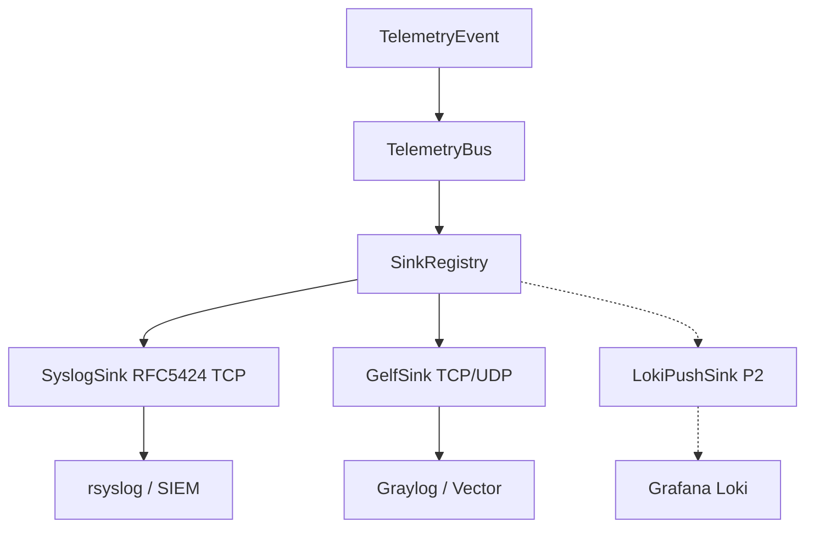

> **Мова:** Українська · [English](en/SPIKE_LOG_SINKS.md)

# SPIKE: Протоколи LOG-server для телеметрії (P16-002)

**Дата:** 2026-07-12  
**Статус:** **accepted** — рекомендація для [ROADMAP.md](ROADMAP.md) **Фаза 16** (P16-030…032)  
**Гілка:** `beta`  
**Передумова:** [ADR_TELEMETRY.md](ADR_TELEMETRY.md) (P16-001)

---

## Питання

Який wire-протокол обрати для remote LOG sinks PINGUI, щоб:

1. Доставляти **рідкі events** (`route_change`, `probe_error`) у типовий NOC stack (rsyslog, Graylog, Loki/Grafana)
2. Не затопити LOG **high-freq RTT samples** (див. ADR: `events_only` за замовч.)
3. Реалізувати Java/Python sinks без важких залежностей і з mockable contract tests
4. Залишити шлях для P2 (Loki / OTLP) без блокування v1

---

## Кандидати

| Протокол | Типовий споживач | Транспорт | Ticket |
|----------|------------------|-----------|--------|
| **Syslog RFC 5424** | rsyslog, syslog-ng, SIEM | UDP/TCP/(TLS) | P16-030 |
| **GELF** | Graylog, Vector | UDP/TCP/(HTTP) | P16-031 |
| **Loki push** | Grafana Loki | HTTP `/loki/api/v1/push` | P16-032 (P2) |

Поза порівнянням (окремі ADR/tickets): OTLP (P16-080), webhook alerts (P10 / P16-050).

---

## Критерії оцінки

| Критерій | Вага | Що добре для PINGUI |
|----------|------|---------------------|
| NOC fit | high | Працює з тим, що вже є в датацентрі |
| Event payload | high | Structured fields: host, event, old/new route, ts |
| Samples safety | high | Легко тримати `events_only`; не провокує «шльопати RTT у LOG» |
| Impl cost | high | JDK-friendly (socket / HTTP); mock у CI |
| Reliability | med | TCP/ack або чітка drop policy |
| Security | med | TLS / auth без секрету в логах |
| Ops complexity | med | Мінімум sidecar-ів |

---

## Порівняння

### Syslog (RFC 5424)

**Плюси**

- Універсальний: майже кожен NOC уже має rsyslog/syslog-ng.
- Structured Data (`SD-ID`) або JSON у MSG — достатньо для `TelemetryEvent`.
- TCP покриває **reliability** (без HTTP-стеку); **TLS (опційно)** — confidentiality/integrity.
- Легко mock-нути TCP listener у contract test (P16-072).

**Мінуси**

- UDP syslog — fire-and-forget, втрати під навантаженням (для events ок, якщо TCP доступний).
- Різні діалекти (BSD 3164 vs 5424) — **канон v1 = RFC 5424**.
- Немає нативної «label model» як у Loki; фільтрація через facility/severity/SD.

**Рекомендований профіль v1**

- Transport: **TCP** (default); TLS опційно (`--telemetry-syslog` / YAML).
- TCP framing: **канон v1 = RFC 6587 non-transparent trailing NL** (P16-030 ✅); той самий канон для Java/Python.
- Facility: `LOCAL0` (або конфіг); severity: `NOTICE` для `route_change`, `WARNING` для `probe_error`.
- MSG: **single-line JSON** (канон v1); SD `[pingui@…]` — опційно пізніше, не блокер P16-030.

### GELF

**Плюси**

- Природний fit для Graylog; structured `_field` без боротьби з syslog parsers.
- UDP простий для lab; TCP для production events.
- Добре лягає на `TelemetryEvent` → flat JSON (`short_message`, `host`, `_old_ips`, …).

**Мінуси**

- Менш універсальний поза Graylog/Vector екосистемою.
- UDP GELF chunking — складність; для v1 **не** вимагати chunking (події малі).
- HTTP GELF — опція пізніше; v1 достатньо UDP/TCP.

**Рекомендований профіль v1**

- Transport: **TCP** preferred; UDP для lab.
- TCP framing: GELF null-byte (`\0`) terminator (без UDP chunking у v1).
- Payload: GELF 1.1 JSON; `short_message` = event type; додаткові поля з префіксом `_` з **спільного** `TelemetryEvent → JSON` map (див. нижче).
- `events_only=true` за замовч. (симетрично з SyslogSink).

### Loki push API

**Плюси**

- Прямий шлях у Grafana без Graylog.
- Labels (`job=pingui`, `site`, `host`) зручні для LogQL.

**Мінуси**

- HTTP batching, label cardinality, retries — вища вартість імплементації.
- Ризик «залити» Loki samples, якщо хтось вимкне `events_only`.
- Дублює роль з Prometheus/TS для метрик; для events — ок, але не критичніше за syslog/GELF у класичному NOC.

**Висновок:** **P2** (P16-032), після стабілізації bus + Syslog/GELF.

---

## Матриця рішення

| Критерій | Syslog 5424 | GELF | Loki |
|----------|-------------|------|------|
| NOC fit | ★★★ | ★★☆ (Graylog) | ★★☆ (Grafana) |
| Structured events | ★★★ | ★★★ | ★★★ |
| Samples safety | ★★★ | ★★★ | ★★☆ |
| Impl cost | ★★★ | ★★★ | ★★☆ |
| Reliability (TCP) | ★★★ | ★★★ | ★★★ (HTTP) |
| v1 priority | **P0** | **P0** | **P2** |

Filter point: `SinkConfig` / LOG sinks відкидають samples коли `events_only=true` (default); bus лишається class-agnostic (ADR).

---

## Рекомендація (accepted)

1. **v1 LOG sinks:** реалізувати **обидва** `SyslogSink` (P16-030) і `GelfSink` (P16-031); оператор обирає 0–N через YAML/CLI.
2. **Default:** sinks **off**; якщо **будь-який** remote LOG sink увімкнено → **`events_only=true`** для **усіх** LOG sinks — syslog, GELF, майбутній Loki (P16-033).
3. **Transport default:** TCP для syslog і GELF; TLS для syslog — опція в конфігу (TCP ≠ security).
4. **Shared mapper:** `TelemetryEvent → Map/JSON` (P16-010/011) спільний для syslog MSG, GELF `_fields` і contract fixture P16-072 — до merge dual sinks.
5. **Loki:** лише P16-032 (P2); не блокує v1.
6. **Aggregates у LOG:** лише за `log_aggregates: true` (P16-034); ніколи hop-RTT each poll; aggregates не обходять `events_only` для raw samples.
7. **Contract tests:** mock TCP syslog + mock GELF + shared field fixture (P16-072) до merge sinks.

Це збігається з DoD ROADMAP («рекомендація v1: syslog TCP + GELF») і з [ADR_TELEMETRY.md](ADR_TELEMETRY.md).

### Alternatives considered

| Альтернатива | Чому відхилено |
|--------------|----------------|
| **Лише Syslog P0** (GELF P1) | Graylog-native `_fields` і ROADMAP/ADR уже вимагають обидва sinks у v1 topology; Graylog *може* їсти syslog, але DoD фази 16.3 — обидва протоколи. Mitigation dual-cost: shared JSON mapper + один field-contract. |
| **Лише GELF** | Гірший NOC fit поза Graylog/Vector (матриця вище). |
| **Loki у v1** | Вища вартість HTTP/labels; P2 після стабілізації bus. |

---

## Відкриті ризики (на tickets імплементації)

| Ризик | Мітигація |
|-------|-----------|
| Syslog MSG encoding / multiline | Один JSON-рядок; без `\n` у payload |
| TCP framing drift Java/Python | Один канон у P16-030/031 DoD (RFC 6587 / GELF `\0`) |
| GELF UDP loss | Документувати TCP для production; lab UDP ok |
| Field drift Syslog vs GELF | Shared mapper + P16-072 field fixture |
| Label explosion у Loki (майбутнє) | Обмежений набір labels; events_only |
| Дубль `route_change` у alerts + LOG | Очікувано; різні споживачі (ADR §4) |
| Секрети в URL | Redact у логах (P16-042) |

---

## Наступні кроки

| ID | Дія |
|----|-----|
| **P16-010…013** | Модель + bus (до remote sinks) |
| **P16-030** | `SyslogSink` RFC 5424 TCP |
| **P16-031** | `GelfSink` |
| **P16-032** | `LokiPushSink` (P2) |
| **P16-061** | DEPLOYMENT § rsyslog/Graylog |

---

## Посилання

- [ADR_TELEMETRY.md](ADR_TELEMETRY.md)  
- [ADR_OBSERVABILITY.md](ADR_OBSERVABILITY.md)  
- [ROADMAP.md](ROADMAP.md) — фаза 16.3  
- RFC 5424 — The Syslog Protocol  
- Graylog GELF — docs.graylog.org  
- Grafana Loki HTTP API — `/loki/api/v1/push`
