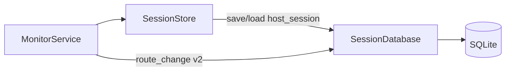

> **Мова:** Українська · [English](en/SPIKE_PERSISTENCE.md)

# SPIKE: SQLite персистентність сесії (P11-001)

**Дата:** 2026-07-09  
**Статус:** **accepted** — реалізація у [ROADMAP.md](ROADMAP.md) **Фаза 11 (P11-*)**  
**Гілки:** `beta` (Java + Python reference), `main` (Java GUI)

---

## Питання

Яку схему SQLite і API потрібно для Java, щоб:

1. Зберігати метрики сесії між перезапусками GUI (parity з Python `--session-db`)
2. Підтримати майбутній таймлайн route change (P11-020) і telemetry (P16-020)
3. Залишити RAM-only режим, коли `--session-db` не передано

**Відповідь:** v1 — дзеркало Python `host_session`; v2 — append-only `route_change_event`; v3 — розширення під telemetry samples (окремо P16).

---

## Поточний стан (evidence)

| Шар | Python `beta` | Java `beta` |
|-----|---------------|-------------|
| In-memory | `SessionStore` | `SessionStore` |
| SQLite | `persistence/session_db.py` (`SCHEMA_VERSION = 2`) | **немає** |
| CLI | `--session-db PATH` | **немає** |
| Route change log у SQLite | **немає** (лише timeseries backend) | **немає** |
| Export CSV/HTML | `export/session_report.py` з RAM/DB | **немає** |

Python `SessionStore._write_route_event` пише лише в **timeseries** (`InfluxDB` / `Timescale`), не в `session_db`.

---

## Python reference — schema v2

Таблиці (`session_db.py`):

```sql
CREATE TABLE schema_meta (
    version INTEGER NOT NULL
);

CREATE TABLE host_session (
    host TEXT PRIMARY KEY,
    enabled INTEGER NOT NULL,
    current_route_json TEXT NOT NULL,
    previous_route_json TEXT NOT NULL,
    last_known_json TEXT NOT NULL,
    ping_history_json TEXT NOT NULL,
    hop_stats_json TEXT NOT NULL DEFAULT '{}',
    updated_at TEXT NOT NULL  -- ISO-8601 UTC
);
```

**Поля JSON** (контракт parity):

| Колонка | Вміст |
|---------|--------|
| `current_route_json` | `HopNode[]` |
| `previous_route_json` | `HopNode[]` |
| `last_known_json` | `map<hop, HopNode>` |
| `ping_history_json` | `map<ip, float[]>` (trim 50) |
| `hop_stats_json` | `map<hop, {probes, successes, rtt_samples}>` |

API: `load(host)`, `save(host, data)`, `delete(host)`, `rename(old, new)`, `close()`.

Міграції: ручні (`ALTER TABLE` v1→v2 для `hop_stats_json`).

---

## Рекомендована Java schema

### v1 — parity (P11-010…P11-012)

**Ідентична** Python `host_session` + `schema_meta`. JSON-серіалізація через той самий контракт hop-об'єктів (`HopNode` у Java).

Пакет: `io.pingui.persistence.SessionDatabase`  
Залежність: `org.xerial:sqlite-jdbc` (Maven Central, JDBC URL `jdbc:sqlite:path`).

Підключення з `SessionStore` (опційний delegate), як у Python:

```
MonitorService → SessionStore → [SessionDatabase?]
```

Без `PATH` — поведінка як сьогодні (RAM-only).

### v2 — timeline events (P11-011, P11-020)

Append-only таблиця для UI «Історія» (не дублює timeseries P16):

```sql
CREATE TABLE route_change_event (
    id INTEGER PRIMARY KEY AUTOINCREMENT,
    host TEXT NOT NULL,
    profile TEXT NOT NULL DEFAULT 'default',
    old_ips_json TEXT NOT NULL,
    new_ips_json TEXT NOT NULL,
    observed_at TEXT NOT NULL,
    FOREIGN KEY (host) REFERENCES host_session(host) ON DELETE CASCADE
);

CREATE INDEX idx_route_change_host_time ON route_change_event(host, observed_at);
```

Запис: з `MonitorService` після `onRouteChanged` (паралельно з P10 alerts).  
Payload узгоджений з `RouteChangeEvent` (P10), без дублювання повного snapshot hop-ів у v2 (лише IP lists).

### v3 — telemetry samples (P16-020, out of scope P11-001)

Окрема міграція: `telemetry_sample`, `telemetry_event` — див. [ROADMAP.md](ROADMAP.md) фаза 16. Не блокує P11 v1.

---

## Діаграма (цільовий стан P11)



---

## Рішення

| Тема | Рішення |
|------|---------|
| ORM | **Ні** — JDBC + підготовлені statements (як Python `sqlite3`) |
| Міграції v1 | Ручна `schema_meta.version` (parity Python); Flyway — опційно P2 |
| Транзакції | `save` per host у autocommit; batch flush — P2 |
| Retention | P11-050: документувати; purge events > N днів — job P2 |
| Шлях БД | CLI `--session-db`; default off |
| Шар | `persistence` — без import `ui`; `monitor` імпортує `persistence` |
| Dual-stack IP у JSON | RFC 5952 strings як у RAM (`HopNode.ip`) |

---

## Мапінг SPIKE → ROADMAP

| SPIKE | ID |
|-------|-----|
| Schema v1 + `SessionDatabase` | P11-010 |
| Wire save + route_change insert | P11-011 |
| CLI `--session-db` | P11-012 |
| UI timeline query v2 | P11-020, P11-021 |
| Export | P11-030 |
| hop_stats parity labels | P11-040 |
| Docs retention | P11-050 |
| Telemetry tables | P16-020 (не P11) |

**Орієнтовно:** v1 parity — 1 sprint; v2 timeline UI — +1 sprint.

---

## DoD P11-001

- [x] Документ UK + EN
- [x] Схема v1 parity з Python задокументована
- [x] v2 `route_change_event` запропонована для timeline
- [x] Межі з P10 (`RouteChangeEvent`) і P16 (telemetry) зафіксовані
- [x] Посилання в ROADMAP `[x]`

---

## Посилання

- Python: `src/pingui/persistence/session_db.py`, `tests/unit/test_session_db.py`
- Java: `io.pingui.monitor.SessionStore`, `io.pingui.model.Models.HostSessionData`
- [ROADMAP.md](ROADMAP.md) — Фаза 11  
- [ADR_ALERTS.md](ADR_ALERTS.md) — `RouteChangeEvent` JSON (P10)
