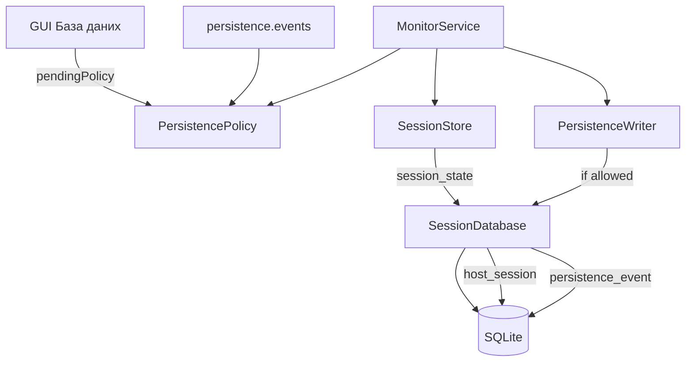

> **Мова:** Українська · [English](en/SPIKE_PERSISTENCE.md)

# SPIKE: SQLite персистентність сесії (P11-001)

**Дата:** 2026-07-09  
**Оновлено:** 2026-07-10 (політика подій, меню, YAML; evidence після P11/PY-P11)  
**Статус:** **accepted** — реалізація у [ROADMAP.md](ROADMAP.md) **Фаза 11 (P11-*)**  
**Гілки:** `main` і `beta` (Java + Python reference після merge; нові зміни — спочатку `beta`)

---

## Питання

Яку схему SQLite і API потрібно для Java, щоб:

1. Зберігати метрики сесії між перезапусками GUI (parity з Python `--session-db`)
2. Підтримати майбутній таймлайн route change (P11-020) і telemetry (P16-020)
3. Залишити RAM-only режим, коли `--session-db` не передано
4. Дозволити оператору **обирати**, які дискретні події писати в БД, і **безпечно змінювати** цей набір без перезапуску

**Відповідь:** v1 — `host_session`; v2 — уніфікована `persistence_event` + `PersistencePolicy`; v3 — telemetry samples (P16). Політика подій — спільний YAML (docs), Java першим, Python у PY-P11.

---

## Поточний стан (evidence)

> Оновлено 2026-07-10: P11 Java + PY-P11 реалізовані на `main`/`beta` після merge.

| Шар | Python | Java |
|-----|--------|------|
| In-memory | `SessionStore` | `SessionStore` |
| SQLite | `persistence/session_db.py` (schema v3) | `io.pingui.persistence.SessionDatabase` |
| CLI | `--session-db PATH` | `--session-db PATH` |
| Route change / probe_error у SQLite | ✅ `persistence_event` (PY-P11) | ✅ `persistence_event` |
| Меню вибору подій | YAML `persistence.events` | GUI «База даних…» + YAML |
| Export CSV/HTML | `export/session_report.py` | `--export-report` |

Timeseries (`InfluxDB` / `Timescale`) лишається окремим каналом від SQLite session DB.

---

## Таксономія подій

| ID | Подія | Джерело | Default з `--session-db` | Меню |
|----|-------|---------|--------------------------|------|
| `session_state` | Знімок `host_session` | `SessionStore.save` | **увімкнено** | приховано (завжди) |
| `route_change` | Зміна hop IP | `onRouteChanged` | **увімкнено** | чекбокс |
| `probe_error` | Помилка trace/ping | `onProbeError` | **увімкнено** | чекбокс |
| `route_snapshot` | Кожен успішний poll | `onDataReceived` | вимкнено | **не в P11 v1** (обсяг) |
| `ping_sample` | RTT per hop | `appendPingSamples` | вимкнено | **P16** / timeseries |

**Default при першому увімкненні `--session-db`:** `session_state` + `route_change` + `probe_error`.

Alerts (P10 webhook/desktop) **незалежні** від політики persistence — вимкнення `route_change` у БД не вимикає alerts.

---

## Конфігурація (спільний YAML)

Схема фіксується в docs **до** імплементації; Java — P11-010+, Python — ticket **PY-P11** (той самий YAML).

```yaml
persistence:
  session_db: data/ping.db   # опційно; дублює/доповнює CLI --session-db
  events:
    route_change: true       # default: true
    probe_error: true        # default: true
```

**Пріоритет** (як [ADR_ALERTS.md](ADR_ALERTS.md) §6):

1. CLI flags (найвищий)
2. YAML активного профілю (`persistence.events`)
3. GUI «База даних…» — session override
4. Default: `route_change` + `probe_error` on; `session_state` implicit

До реалізації PY-P11: Python може ігнорувати невідомий блок `persistence:` (forward-compat).

**Статус:** PY-P11 ✅ — Python читає `persistence.events` / `session_db`, пише `persistence_event` (schema v3).

---

## Меню «База даних…» (Java GUI, P11-014)

Розташування: **Налаштування → База даних…** (або підменю поруч із Alerts).

| Елемент UI | Поведінка |
|------------|-----------|
| Шлях до файлу | read-only, якщо задано CLI; інакше file picker / підказка |
| ☑ Зміни маршруту | `persistence.events.route_change` |
| ☑ Помилки probe | `persistence.events.probe_error` |
| Стан сесії | не показувати (завжди on з `--session-db`) |
| Застосувати | Записує `pendingPolicy`; активна з **наступного poll-циклу** |

---

## Правила зміни політики

### Увімкнення типу події

- З **наступного poll-циклу** `MonitorService` починає писати цей тип.
- Існуючі рядки не змінюються.

### Вимкнення типу події

1. Користувач знімає галочку → підтвердження застосування політики.
2. **Завжди** діалог purge (для будь-якого типу):

   > «Видалити з бази всі збережені події типу *X*?»  
   > **[Залишити історію]** — лише stop write з наступного циклу  
   > **[Видалити]** — `DELETE FROM persistence_event WHERE event_type = ?` одразу після confirm

3. `pendingPolicy` (stop write) набуває чинності після **завершення поточного** poll-циклу.
4. Purge SQL виконується **одразу** після confirm (не чекає циклу).

### Реалізація в `MonitorService`

```
activePolicy  — читається під час запису подій
pendingPolicy — встановлюється з UI/YAML/CLI
після cycle(): activePolicy = pendingPolicy
```

`session_state` (`host_session` upsert) не проходить через `PersistencePolicy` gate для типів подій.

---

## Python reference — schema v2 (`host_session`)

Таблиці (`session_db.py`):

```sql
CREATE TABLE schema_meta (
    version INTEGER NOT NULL
);

CREATE TABLE host_session (
    host TEXT PRIMARY KEY,
    enabled INTEGER NOT NULL,
    current_route_json TEXT NOT NULL,
    previous_route_json TEXT NOT NULL,
    last_known_json TEXT NOT NULL,
    ping_history_json TEXT NOT NULL,
    hop_stats_json TEXT NOT NULL DEFAULT '{}',
    updated_at TEXT NOT NULL  -- ISO-8601 UTC
);
```

API: `load(host)`, `save(host, data)`, `delete(host)`, `rename(old, new)`, `close()`.

---

## Рекомендована Java schema

### v1 — parity (P11-010…P11-012)

**Ідентична** Python `host_session` + `schema_meta`.

Пакет: `io.pingui.persistence.SessionDatabase`  
Залежність: `org.xerial:sqlite-jdbc`

```
MonitorService → SessionStore → host_session (session_state)
MonitorService → PersistenceWriter → persistence_event (policy gate)
```

Без `--session-db` / без `session_db` у YAML — RAM-only.

### v2 — дискретні події (P11-011, P11-013…P11-015)

Уніфікована append-only таблиця (замість окремої лише `route_change_event`):

```sql
CREATE TABLE persistence_event (
    id INTEGER PRIMARY KEY AUTOINCREMENT,
    event_type TEXT NOT NULL,   -- route_change | probe_error
    host TEXT NOT NULL,
    profile TEXT,
    payload_json TEXT NOT NULL,
    observed_at TEXT NOT NULL,
    FOREIGN KEY (host) REFERENCES host_session(host) ON DELETE CASCADE
);

CREATE INDEX idx_pe_host_type_time ON persistence_event(host, event_type, observed_at);
```

**Payload:**

| `event_type` | JSON |
|--------------|------|
| `route_change` | контракт [RouteChangeEvent](ADR_ALERTS.md) (P10) |
| `probe_error` | `{"message":"…","host":"…"}` |

Запис: після `onRouteChanged` / `onProbeError`, якщо `activePolicy.allows(type)`.

### v4 — telemetry (P16-020)

`telemetry_sample`, `telemetry_event` — schema_meta **v4** (окрема міграція після P11 v3); не блокує GUI history.

---

## Діаграма (цільовий стан P11)



---

## Рішення

| Тема | Рішення |
|------|---------|
| ORM | **Ні** — JDBC + prepared statements |
| Міграції | Ручна `schema_meta.version`; v2 додає `persistence_event` |
| Default events | `session_state` + `route_change` + `probe_error` |
| Purge при вимкненні | **Завжди** confirm; optional DELETE |
| Зміна політики | **Наступний poll-цикл**; purge — одразу |
| Python parity | **Спільний YAML у docs**; Java P11-010+; Python **PY-P11** |
| Шар | `persistence` без `ui`; `PersistencePolicy` у config або persistence |
| P10 alerts | Незалежно від persistence policy |

---

## Мапінг SPIKE → ROADMAP

| SPIKE | ID |
|-------|-----|
| SPIKE amend (цей документ) | P11-001 ✅, політика — **P11-002** |
| `PersistencePolicy` + gate | P11-013 |
| GUI «База даних…» + purge rules | P11-014 (політика подій; потребує `--session-db`) |
| GUI підключення SQLite (file picker, YAML `session_db`) | **P11-016** ✅ |
| YAML `persistence.events` + CLI | P11-015 |
| Schema v1 + `SessionDatabase` | P11-010 |
| Wire save + event insert | P11-011 |
| CLI `--session-db` | P11-012 |
| UI timeline | P11-020, P11-021 |
| Python event write parity | **PY-P11** |
| Telemetry tables | P16-020 |

---

## DoD

### P11-001 (schema)

- [x] Документ UK + EN
- [x] Схема v1 parity з Python
- [x] v2 події для timeline
- [x] Межі з P10 і P16

### P11-002 (політика подій, amend SPIKE)

- [x] Таксономія подій + defaults
- [x] YAML schema + пріоритет конфігурації
- [x] Правила purge (confirm завжди) і poll-cycle
- [x] Меню GUI — scope P11-014
- [x] Python parity шлях (PY-P11)

---

## Посилання

- Python: `src/pingui/persistence/session_db.py`, `tests/unit/test_session_db.py`
- Java: `io.pingui.monitor.SessionStore`, `io.pingui.monitor.MonitorService`
- [ROADMAP.md](ROADMAP.md) — Фаза 11  
- [ADR_ALERTS.md](ADR_ALERTS.md) — `RouteChangeEvent` (P10)
