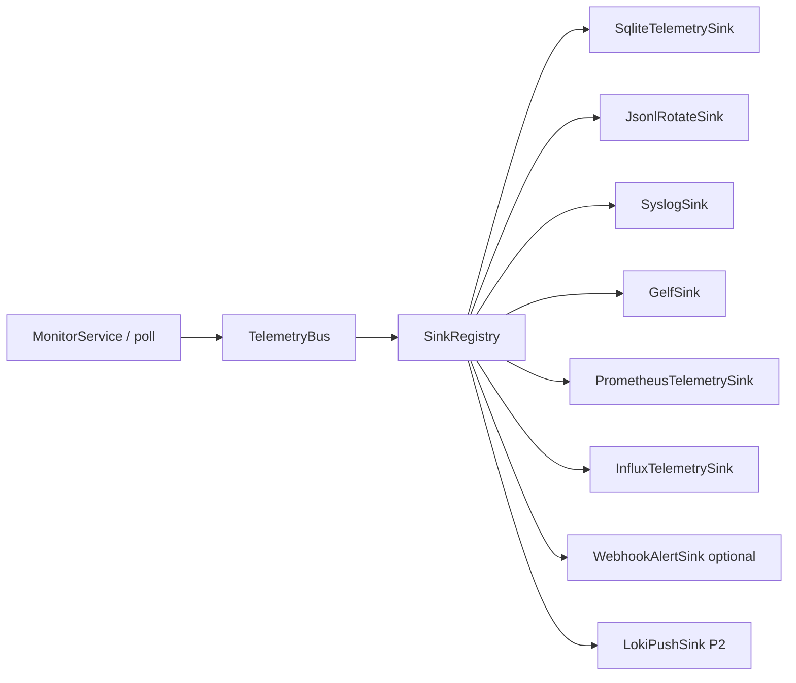

> **Language:** English · [Українська](../ADR_TELEMETRY.md)

# ADR: Telemetry — events / samples / aggregates and sinks (P16-001)

**Status:** accepted (P16-001)  
**Date:** 2026-07-12  
**Branch:** `beta` (after merge — `main` and `beta`).

## Context

After phases 10–15, PINGUI has several **parallel** data paths from the poll loop:

| Channel | Phase | Carries |
|---------|-------|---------|
| Alerts (webhook / desktop) | P10 | Operator notify on `route_change` |
| SQLite session | P11 | GUI history / session state |
| Prometheus scrape | P15 | Pull gauges/counters |
| Influx/Timescale push | P15 / B-05 | Write RTT + route markers |
| REST read-only | P15-040 | Host/route snapshot |

NOC still needs a **local archive** of samples/events and **LOG-server export** (syslog/GELF). Without an ADR it is easy to:

- send hop-RTT every second to syslog;
- duplicate webhook payloads via a separate “telemetry” HTTP client;
- mix session SQLite with a telemetry archive;
- keep dual-emit from MonitorService forever.

[ADR_OBSERVABILITY.md](ADR_OBSERVABILITY.md) fixes P15 boundaries and explicitly defers a unified bus to P16.

## Decision

### 1. Three data classes

| Class | Examples | Frequency | Where (v1) |
|-------|----------|-----------|------------|
| **Events** | `route_change`, `probe_error`, (optional) `daemon_start` | Rare | LOG-server (syslog/GELF); local event store; alerts remain separate notify |
| **Samples** | RTT per hop, loss/jitter snapshot, `trace_duration_ms`, `target_reachable` | High (each poll) | TS / Prometheus / local SQLite-or-JSONL; **not** syslog by default |
| **Aggregates** | avg/max RTT per hop over 5 min | Low | Optionally to LOG (`log_aggregates`); P16-034 ✅ `AggregateTelemetryJob` → `rtt_aggregate` |

**Rule:** *events → LOG*; *samples → TS / scrape / local archive*; *aggregates → LOG only when explicitly enabled*.

### 2. Topology: bus → sinks

*Note:* `InfluxTelemetrySink` covers Influx **and** Timescale (wrapper over P15-020 / B-05).
| Component | Role | Ticket |
|-----------|------|--------|
| `MetricSample` / `TelemetryEvent` | Serializable records (host, hop, labels, ts) | P16-010 ✅ |
| `TelemetrySink` + `SinkRegistry` | Pluggable writers; no-op default | P16-011 ✅ |
| `TelemetryBus` | Async queue, batch flush, backpressure, drop policy | P16-012 ✅ |
| Wire from MonitorService | Single emit; **must not** block poll | P16-013 ✅ |

**Poll-loop consequence:** bus emit must be non-blocking (queue offer). Overflow → drop + counter/log per bus policy (documented in P16-012).

### 3. Local vs remote sinks

| Sink | Kind | Default | Notes |
|------|------|---------|-------|
| `SqliteTelemetrySink` | local samples+events | **off** | Schema v4; separate from P11 `host_session`; retention P16-022 ✅ |
| `JsonlRotateSink` | local file | **off** | `telemetry.jsonl.yyyy-MM-dd` (+ `.N` size); P16-021 ✅ |
| `SyslogSink` | remote events | **off** | P16-030 ✅ RFC 5424 TCP; TLS optional; framing trailing NL; MSG = single-line JSON; `events_only` via `SinkConfig` (P16-033 ✅ default true) |
| `GelfSink` | remote events | **off** | P16-031 ✅ GELF 1.1; TCP `\0` framing / UDP lab; `events_only` via `SinkConfig` (P16-033 ✅) |
| `LokiPushSink` | remote | **off** | P16-032 ✅ HTTP `/loki/api/v1/push`; labels `job`/`site`/`host`; `events_only` via `SinkConfig` (P16-033 ✅) |
| `PrometheusTelemetrySink` | in-process scrape state | via `--metrics-port` | P16-051 ✅ — `PrometheusExporter` wrapper from bus; not remote_write |
| `InfluxTelemetrySink` | remote samples | via TS config | P16-052 ✅ — B-05 Influx/Timescale wrapper from bus |
| Webhook as sink | remote events | via alerts config | P16-050 ✅ — one emit path (`WebhookTelemetrySink`), not a second HTTP client |

### 4. Boundaries with P10 and P15

| Boundary | Decision |
|----------|----------|
| **P10 alerts** | Remain **operator notify**. Telemetry **may** mirror `route_change` as an event to sinks, but LOG does not replace UX notify. P16-050 ✅ refactors webhook into `WebhookTelemetrySink`; `WebhookAlertDispatcher` delegates HTTP (ADR_ALERTS payload unchanged). |
| **P15 Prometheus** | Pull/scrape remains. P16-051 ✅: `PrometheusTelemetrySink` updates in-process gauges from the bus (`DaemonRunner` registers on `--metrics-port`). |
| **P15 TS push** | P16-052 ✅: `InfluxTelemetrySink` from bus (Python daemon/GUI); SessionStore TS dual-emit removed. |
| **P11 session DB** | GUI history / policy events. **Not** a Grafana datasource and not a telemetry archive replacement. |
| **REST API** | Read snapshot; not the telemetry bus. |
| **OTLP** | Out of scope for v1 (P16-080). |

### 5. Metric names (aligned with P15)

Keep the `pingui_` prefix. P16-014 ✅ canonicalizes names/labels for the bus (`MetricNames` / `metric_names.py`); the scrape minimum already exists:

| Name | Class | Notes |
|------|-------|-------|
| `pingui_rtt_ms` | sample | host/hop are sample fields; bus labels: profile, probe_mode, edition |
| `pingui_hop_loss_pct` | sample | hop loss % |
| `pingui_route_change_total` | derived from events | counter |
| `pingui_target_reachable` | sample/gauge | |
| `pingui_trace_duration_ms` | sample/gauge | |

New sample fields (loss/jitter) are added via P16-010 without changing this ADR’s boundaries.

### 6. Configuration (priority)

1. CLI: `--telemetry-*` (P16-041)  
2. YAML `telemetry:` on the active profile (P16-040)  
3. Default: **all sinks off** (zero remote IO)

Secrets (URL, token) must **not** be logged in plaintext (P16-042 ✅ `TelemetryConfig.redactUrl` / `redactSecret` / `toRedactedString`).

### 7. Failure policy

| Situation | Behaviour |
|-----------|-----------|
| Sink write failure | `WARNING`; poll **does not** stop |
| Bus overflow | drop oldest/newest per P16-012 policy; drop-count metric |
| Sink misconfigured | fail-fast at daemon start **or** disable sink + WARN (chosen in the sink ticket) |

## Consequences

- **Documentation:** this ADR gates P16-010+; protocol SPIKE is P16-002 ✅ (`docs/SPIKE_LOG_SINKS.md`).
- **Implementation:** model + bus first (P16-010…013), then local sinks, then LOG, then P10/P15 wrappers.
- **Operators:** syslog gets rare events; high-freq RTT only via TS/Prometheus/local archive.
- **Do not:** high-freq RTT in syslog; a second webhook client beside alerts; session SQLite as TS for Grafana.

## References

- [ROADMAP.md](ROADMAP.md) — phase 16 (P16-*)  
- [ADR_OBSERVABILITY.md](ADR_OBSERVABILITY.md) — Prometheus vs TS; dual-emit debt  
- [ADR_ALERTS.md](ADR_ALERTS.md) — notify channel  
- [ADR_DAEMON.md](ADR_DAEMON.md) — headless process  
- [SPIKE_PERSISTENCE.md](SPIKE_PERSISTENCE.md) — SQLite session ≠ TS  
- Java (planned): `telemetry/`  
- Python (planned): mirrored models + sinks
