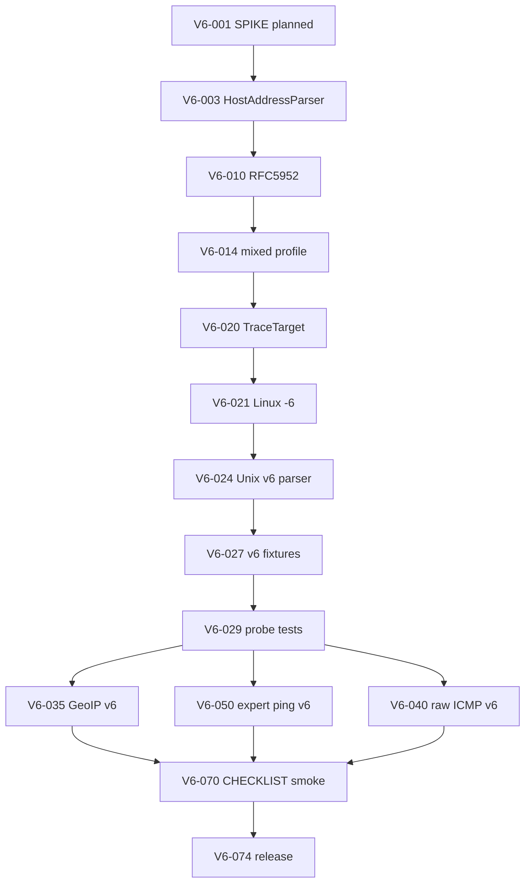
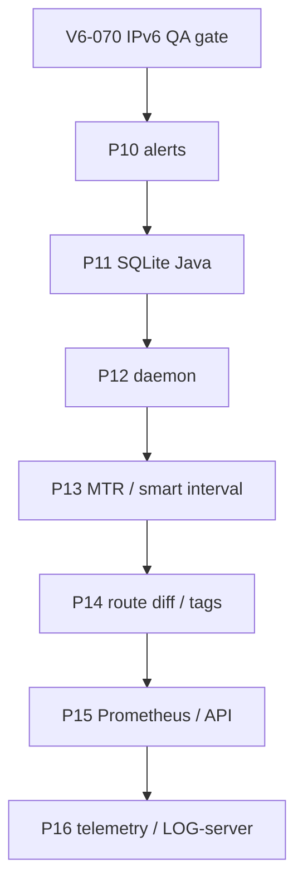
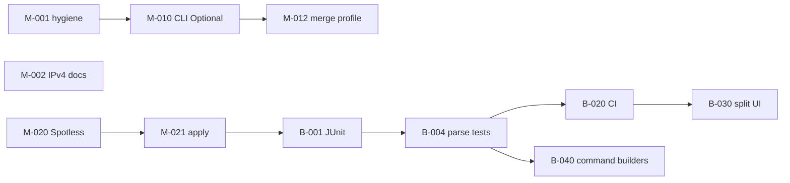

> **Language:** [Ukrainian](../ROADMAP.md) · English

# ROADMAP — PINGUI Java (`main` / `beta`)

**Official project work plan.** Update on task closure: `[x]` + date in `CHANGELOG.md`.

Post-MVP roadmap (2026-06-26) for **professional users** (NOC/SRE, network engineers, WAN/MPLS admins).

**Legend**

| Field | Value |
|-------|-------|
| **Branch** | `main` — Java + docs; `beta` — + Python, tests, CI |
| **Priority** | P0 critical · P1 important · P2 nice-to-have |
| **DoD** | Definition of Done — task closure condition |

Tasks are **atomic**: one task ≈ one MR/commit, ≤ 1 day of work.

---

## Phase 0 — Quick fixes (`main`, P0)

| ID | Task | Files | DoD |
|----|------|-------|-----|
| **M-001** | [x] Remove duplicate `import java.io.IOException` | `probe/RawIcmpRouteProbe.java` | `./gradlew compileJava` OK; one import |
| **M-002** | [x] Document **IPv4-only** (validator + raw ICMP) | `README.md`, `docs/JAVA.md`, `docs/DEPLOYMENT.md`, `AppMenuDialogs` help | Explicit note «IPv6 not supported»; examples IPv4/hostname only |
| **M-003** | [x] CHANGELOG: entry about roadmap and IPv4-only | `CHANGELOG.md` | `[Unreleased]` section updated |

---

## Phase 1 — CLI override (`main`, P0)

**Problem:** `applyCliOverridesToActiveProfile()` always substitutes `AppOptions.defaults()`, overwriting YAML on start without CLI.

| ID | Task | Files | DoD |
|----|------|-------|-----|
| **M-010** | [x] Introduce `CliOverrides` (record with `Optional` fields: interval, maxHops, timeout, probe) | `CliProfileOverrides.java`, `AppOptions.java`, `PinguiApplication.java` | CLI parser fills `Optional.empty()` for non-passed flags |
| **M-011** | [x] `parseOptions`: distinguish «not passed» vs «default» | `PinguiApplication.java` | `--interval 2` → override; without `--interval` → empty |
| **M-012** | [x] `applyCliOverridesToActiveProfile`: merge only present fields | `MainController.java` | Start without CLI preserves YAML `interval`/`max_hops`/`timeout`/`probe` |
| **M-013** | [x] Document CLI vs YAML behavior | `java/README.md`, `docs/JAVA.md` | Table «CLI overwrites profile field only if passed» |
| **M-014** | [x] Manual smoke: profile `interval: 30` + `./pingui-java.sh` | — | Unit test M-014 + CHECKLIST § CLI interval |

---

## Phase 2 — Hygiene / static checks (`main` → `beta`, P1)

| ID | Task | Files | DoD |
|----|------|-------|-----|
| **M-020** | [x] Add Spotless (Google Java Format or Palantir) | `java/build.gradle.kts`, `settings.gradle.kts` | `./gradlew spotlessCheck` passes |
| **M-021** | [x] `./gradlew spotlessApply` + format existing `.java` | `java/src/main/**` | `spotlessCheck` green; diff formatting only |
| **M-022** | [x] Gradle task `check` = `compileJava` + `spotlessCheck` | `java/build.gradle.kts` | `./gradlew check` on `main` |
| **M-023** | [x] Checkstyle — minimal ruleset | `java/build.gradle.kts`, `config/checkstyle/checkstyle.xml` | RedundantImport, UnusedImports; `./gradlew check` |

---

## Phase 3 — Test layer (`beta`, P0)

| ID | Task | Files | DoD |
|----|------|-------|-----|
| **B-001** | [x] JUnit 5 + test deps in `java/build.gradle.kts` | `build.gradle.kts` | `./gradlew test` runs |
| **B-002** | [x] Fixtures: `traceroute` output samples (Linux/macOS) | `src/test/resources/trace/unix_*.txt` | ≥ 3 files (ok, timeout, hostname) |
| **B-003** | [x] Fixtures: `tracert` samples (Windows) | `src/test/resources/trace/win_*.txt` | ≥ 3 files (`<1 ms`, `host [IP]`, timeout) |
| **B-004** | [x] Unit: `ProcessRouteProbe.parseUnix` | `ProcessRouteProbeTest.java` | Hop count, IP, RTT for each fixture |
| **B-005** | [x] Unit: `ProcessRouteProbe.parseWindows` | same test class | Windows line parsing without `No hops parsed` |
| **B-006** | [x] Unit: `windowsTracertWaitMs` / `-w` ≥ 4000 | `ProcessRouteProbeTest.java` | Assert minimum wait |
| **B-007** | [x] Unit: `HostsConfig.validateSessionHost` | `HostsConfigTest.java` | duplicate, max 10, invalid chars, IPv4 ok |
| **B-008** | [x] Unit: `ProfilesConfig` v2 + legacy migration | `ProfilesConfigTest.java` | load/save round-trip; `active_profile` |
| **B-009** | [x] Unit: `PingExpertValidator` | `PingExpertValidatorTest.java` | invalid flags → `ConfigError` |
| **B-010** | [x] Unit: CLI override merge | `PinguiApplicationTest.java` | optional fields do not overwrite profile |

---

## Phase 4 — CI (`beta`, P0)

| ID | Task | Files | DoD |
|----|------|-------|-----|
| **B-020** | [x] GitHub Actions: JDK 21, venv not needed for Java job | `.github/workflows/java.yml` | `compileJava` + `test` + `spotlessCheck` on push/PR |
| **B-021** | [x] CI matrix: `ubuntu-latest` (required); Windows optional | workflow | Linux green; Windows job `continue-on-error` |
| **B-022** | [x] Badge / status in README | `README.md` | CI badge visible |
| **B-023** | [x] Living spec: matrix «spec → module → test» | `docs/LIVING_SPEC.md` | Rows for probe, config, CLI override, CI |

---

## Phase 5 — UI split (`beta`, P1)

**Goal:** `MainController` ≤ ~300 lines; SRP.

| ID | Task | Extract from | DoD |
|----|------|--------------|-----|
| **B-030** | [x] `ProfileUiActions` — new/delete/select profile, combo sync | `MainController` | Profile CRUD extracted; controller delegates |
| **B-031** | [x] `HostListPresenter` — add/edit/remove, toggles, list height | `MainController` | Host ops + `HostListCell` callbacks |
| **B-032** | [x] `MonitorLifecycle` — create/close monitor, reload profile | `MainController` | `reloadActiveProfile` + `createMonitor` |
| **B-033** | [x] `ViewModeController` — Simple/Extended, `fitWindowToContent` | `MainController` | Easter egg remains or → `HostViewRules` helper |
| **B-034** | [x] `RouteGraphPresenter` — `redrawRouteIfExtended`, graph panel | `MainController` | Extended mode graph + status label |
| **B-035** | [x] GUI smoke: profile, host, save, F1/About | `docs/CHECKLIST.md` § GUI smoke | Checklist B-035; manual run on Linux |

---

## Phase 6 — Probe / OS strategy (`beta`, P1)

| ID | Task | Files | DoD |
|----|------|-------|-----|
| **B-040** | [x] Interface `TraceCommandBuilder` (OS → argv[]) | `probe/` | Linux/macOS/Windows implementations |
| **B-041** | [x] Move commands from `ProcessRouteProbe` | `LinuxTracerouteCommand`, `MacTracerouteCommand`, `WindowsTracertCommand` | Parity with current behavior; tests B-004/B-005 green |
| **B-042** | [x] Unix parser: separate `UnixTraceOutputParser` | `probe/` | Unit tests on fixtures |
| **B-043** | [x] Windows parser: `WindowsTraceOutputParser` | `probe/` | Localized timeout lines in fixtures |
| **B-044** | [x] Document parser limitations (IPv6 trace output, ASN) | `docs/JAVA.md` | Known limitations |

---

## Phase 7 — IPv6 SPIKE (closed, P2)

| ID | Task | DoD |
|----|------|-----|
| **B-050** | [x] SPIKE: IPv6 trace + ping — scope of work | `docs/SPIKE_IPV6.md` | Decision: wontfix (MVP) |
| **B-051** | — (cancelled) `HostsConfig` — IPv6 literal | — | Moved → **V6-010…V6-019** |
| **B-052** | — (cancelled) Raw ICMP IPv6 | — | Moved → **V6-040…V6-049** |
| **B-053** | [x] Close B-050 with status «IPv4-only by design» | `HostsConfig`, `SPIKE_IPV6.md` | Explicit error for IPv6 literal |

> **Decision review (2026-06):** wontfix lifted per product request; implementation — **Phase 9 (V6-*)**.

---

## Phase 9 — IPv6 implementation (`beta` → `main`, P1)

**Goal:** dual-stack monitoring — IPv6 literal, subprocess trace/ping, GeoIP v6; raw ICMP v6 — Linux-only (P2).

**Prerequisites:** `./gradlew check` green; B-064 JaCoCo gate ≥80%.

**Out of phase 9 scope (separate ticket):** Python layer on `beta`; full Windows expert-ping parity (see backlog after V6-059).

### 9.0 — Design gate

| ID | Task | Files | DoD |
|----|------|-------|-----|
| **V6-001** | [x] Update SPIKE: status **planned**, phase 9 goals, OS matrix | `docs/SPIKE_IPV6.md` | Table «layer → v4 → v6 → OS»; links to V6-* |
| **V6-002** | [x] ADR: dual-stack policy (literal v6, hostname→AAAA, mixed profile) | `docs/ADR_IPV6.md` | Decision: bracket YAML, canonical RFC 5952, probe fallback |
| **V6-003** | [x] `HostAddressKind` + `HostAddressParser` (IPv4 / IPv6 / hostname) | `config/HostAddress*.java` | Unit test: parse/normalize without UI |

### 9.1 — Config / validator (P0)

| ID | Task | Files | DoD |
|----|------|-------|-----|
| **V6-010** | [x] RFC 5952 normalize for IPv6 literal | `HostsConfig.java`, `HostAddressParser` | `2001:db8::1` → canonical; `[::1]` strip brackets |
| **V6-011** | [x] Accept IPv6 in `normalizeHostEntry` / `isValidHost` | `HostsConfig.java` | Remove blanket `:` → error; keep reject invalid |
| **V6-012** | [x] Duplicate key: canonical v6 (case-insensitive hex) | `HostsConfig.java`, `ProfilesConfig` | `HostsConfigTest`: dup `2001:DB8::1` vs `2001:db8:0:0:0:0:0:1` |
| **V6-013** | [x] Bracket notation in YAML examples | `java/README.md`, `docs/DEPLOYMENT.md` | Example `address: "2001:db8::1"` |
| **V6-014** | [x] Mixed profile: IPv4 + IPv6 hosts in one profile | `ProfilesConfigTest` | load/save round-trip 2+2 hosts |
| **V6-015** | [x] LIVING_SPEC: HostAddress / v6 validator rows | `docs/LIVING_SPEC.md` | Matrix updated |

### 9.2 — Process trace (subprocess, P0)

| ID | Task | Files | DoD |
|----|------|-------|-----|
| **V6-020** | [x] `TraceTarget` — address family from literal | `probe/TraceTarget.java` | Unit test: v4/v6/hostname |
| **V6-021** | [x] `LinuxTracerouteCommand`: `-6` for v6 literal | `LinuxTracerouteCommand.java` | Test: argv contains `-6` |
| **V6-022** | [x] `MacTracerouteCommand`: `-6` for v6 literal | `MacTracerouteCommand.java` | Test: argv contains `-6` |
| **V6-023** | [x] `WindowsTracertCommand`: `-6` for v6 literal | `WindowsTracertCommand.java` | Test: argv contains `-6` |
| **V6-024** | [x] `UnixTraceOutputParser`: hop token `[2001:db8::n]` | `UnixTraceOutputParser.java` | Regex + unit test |
| **V6-025** | [x] `UnixTraceOutputParser`: compressed v6 without brackets (GNU) | `UnixTraceOutputParser.java` | Fixture + test |
| **V6-026** | [x] `WindowsTraceOutputParser`: IPv6 tracert lines | `WindowsTraceOutputParser.java` | Fixture + test |
| **V6-027** | [x] Fixtures `trace/unix_v6_*.txt` (≥3) | `src/test/resources/trace/` | ok / timeout / multihop |
| **V6-028** | [x] Fixtures `trace/win_v6_*.txt` (≥2) | `src/test/resources/trace/` | ok / timeout |
| **V6-029** | [x] `ProcessRouteProbeTest` — v6 fixtures green | `ProcessRouteProbeTest.java` | Hop count + IP match |
| **V6-030** | [x] Doc: hostname AAAA — OS resolve, not PINGUI | `docs/JAVA.md` | Known limitations updated |

### 9.3 — GeoIP v6 (P1)

| ID | Task | Files | DoD |
|----|------|-------|-----|
| **V6-035** | [ ] `GeoCountry`: `Inet6Address` — loopback/link-local/ULA → `LAN` | `GeoCountry.java` | `GeoCountryTest` |
| **V6-036** | [ ] `GeoCountry`: longest-prefix for IPv6 CIDR | `GeoCountry.java`, `geoip_hints.yaml` | Test: `2001:db8::/32` |
| **V6-037** | [ ] YAML schema: optional `prefixes_v6` (or unified map) | `GeoCountry.java`, docs | Backward compat v4 hints |

### 9.4 — Raw ICMP v6 (Linux only, P2)

| ID | Task | Files | DoD |
|----|------|-------|-----|
| **V6-040** | [ ] JNA: `AF_INET6`, `sockaddr_in6` | `LinuxSocketConstants`, `LinuxCLibrary` | Compile + struct layout test |
| **V6-041** | [ ] ICMPv6 echo request/reply parse | `IcmpPacket.java` or `IcmpV6Packet.java` | Unit test without cap (build packet) |
| **V6-042** | [ ] `LinuxJnaIcmpTransport` dual: v4/v6 socket | `LinuxJnaIcmpTransport.java` | Integration test optional; mock-friendly unit |
| **V6-043** | [ ] `RawIcmpRouteProbe`: hop limit for v6 | `RawIcmpRouteProbe.java` | v6 target → trace hops |
| **V6-044** | [ ] `RouteProbeFactory`: v6 + non-Linux → process fallback | `RouteProbeFactory.java` | Test: AUTO on macOS → process |
| **V6-045** | [ ] DEPLOYMENT: cap note for ICMPv6 | `docs/DEPLOYMENT.md` | Linux-only raw v6 documented |

### 9.5 — Expert ping v6 (P1)

| ID | Task | Files | DoD |
|----|------|-------|-----|
| **V6-050** | [ ] Auto `-6` in `ProcessExpertPing.buildCommand` for v6 target | `ProcessExpertPing.java` | Test: v6 target → `-6` in argv |
| **V6-051** | [ ] `ProcessHostPing`: expert args + v6 on Linux/macOS | `ProcessHostPing.java` | Test: args appended |
| **V6-052** | [ ] Validator: `-4` + v6 target → `ConfigError` (profile save) | `PingExpertValidator` or host-level check | Unit test |
| **V6-053** | [ ] `-F` flow label — only with v6 target (UI hint) | `PingExpertDialog.java` | Tooltip / disable when target v4 |

### 9.6 — UI / docs (P1)

| ID | Task | Files | DoD |
|----|------|-------|-----|
| **V6-060** | [ ] Help/About: dual-stack instead of «IPv4-only» | `AppMenuDialogs.java`, `README.md` | Text updated |
| **V6-061** | [ ] `GraphCanvas` / labels: bracket display for long v6 | `GraphCanvas.java`, `RouteGraphLayout` | Manual smoke note in CHECKLIST |
| **V6-062** | [ ] Input validation in Add Host dialog for v6 | `HostListPresenter` / dialog | Invalid v6 → log error |
| **V6-063** | [ ] CHANGELOG + ROADMAP `[x]` on subphase closure | `CHANGELOG.md` | Per-sprint notes |

### 9.7 — QA / release gate (P0)

| ID | Task | Files | DoD |
|----|------|-------|-----|
| **V6-070** | [ ] CHECKLIST § IPv6 smoke (Linux process trace) | `docs/CHECKLIST.md` | literal v6 + ping-only |
| **V6-071** | [ ] CHECKLIST § IPv6 smoke (Windows tracert -6) | `docs/CHECKLIST.md` | optional OS job |
| **V6-072** | [ ] Regression: all v4 fixtures remain green | CI | `./gradlew check` |
| **V6-073** | [ ] JaCoCo: new modules in bundle or documented exclusion | `build.gradle.kts` | Gate ≥80% |
| **V6-074** | [ ] Release note: «IPv6 beta» / feature flag if needed | `CHANGELOG.md` | Semver minor bump note |

### Recommended order (phase 9)

**Estimate:** 3–5 sprint × 3–5 tasks; raw ICMP (V6-040…) can be deferred after process+GeoIP MVP.

| Sprint (proposed) | Tasks |
|-------------------|-------|
| IPv6-S1 | V6-001…V6-015 (config) |
| IPv6-S2 | V6-020…V6-030 (process trace) |
| IPv6-S3 | V6-035…V6-037, V6-050…V6-053 (GeoIP + expert) |
| IPv6-S4 | V6-060…V6-063, V6-070…V6-074 (UI + QA) |
| IPv6-S5 (opt.) | V6-040…V6-045 (raw ICMP v6 Linux) |

---

## Phase 10 — Route change alerts (`beta` → `main`, P0)

**Goal:** professional users learn about route changes without an open GUI.

**Audience:** NOC, on-call, SRE runbooks.

| ID | Task | Files | DoD |
|----|------|-------|-----|
| **P10-001** | [ ] ADR: alert policy (channels, rate limit, payload) | `docs/ADR_ALERTS.md` | Webhook + desktop; SNMP/email optional — out of scope v1 |
| **P10-010** | [ ] Model `RouteChangeEvent` (host, old_ips, new_ips, ts, profile) | `monitor/RouteChangeEvent.java`, Python `models.py` | Unit test serialize/deserialize |
| **P10-011** | [ ] `AlertDispatcher` interface + no-op default | `monitor/AlertDispatcher.java` | Monitor calls on `onRouteChanged` |
| **P10-020** | [ ] Desktop notification (Linux notify-send / Windows toast / macOS) | `ui/RouteChangeNotifier.java` | Manual smoke: route change → notification |
| **P10-021** | [ ] YAML/CLI: `alerts.desktop: true\|false` | `ProfilesConfig`, `PinguiApplication` | Default off; documented in CONFIGURATION |
| **P10-030** | [ ] Webhook POST JSON (Slack-compatible + generic) | `monitor/WebhookAlertDispatcher.java` | Contract test with mock HTTP server |
| **P10-031** | [ ] CLI `--alert-webhook URL` + profile field `alert_webhook` | `CliProfileOverrides`, YAML schema | Do not log secrets; network error → log, no crash |
| **P10-040** | [ ] Rate limit: max N alerts / host / hour | `AlertRateLimiter.java` | Unit test burst |
| **P10-050** | [ ] LIVING_SPEC + CHECKLIST § alert smoke | `docs/LIVING_SPEC.md`, `docs/CHECKLIST.md` | Manual Linux run |

**Estimate:** 1–2 sprints.

---

## Phase 11 — Persistence and timeline (Java parity with Python, P0)

**Goal:** route history across sessions; replay «when hop N changed».

**Context:** Python `beta` has `--session-db`, export, jitter/loss; Java `main` is RAM-only.

| ID | Task | Files | DoD |
|----|------|-------|-----|
| **P11-001** | [ ] SPIKE: SQLite schema for Java (routes, events, samples) | `docs/SPIKE_PERSISTENCE.md` | Parity with Python `session_db.py` |
| **P11-010** | [ ] `SessionDatabase` — open/migrate/close | `persistence/SessionDatabase.java` | Flyway or manual schema v1 |
| **P11-011** | [ ] Persist route snapshot + route_change event | `MonitorService`, `SessionDatabase` | Unit test insert/query |
| **P11-012** | [ ] CLI `--session-db PATH` | `PinguiApplication`, `java/README.md` | Optional; without PATH — RAM-only |
| **P11-020** | [ ] UI: «History» panel — route changes 24h/7d | `RouteHistoryPresenter.java` | Manual smoke |
| **P11-021** | [ ] UI: replay snapshot on graph (read-only) | `RouteGraphPresenter` | Select event → graph |
| **P11-030** | [ ] Export CSV/HTML from DB (like Python `session_report`) | `export/SessionReportExporter.java` | CLI `--export-report` |
| **P11-040** | [ ] Java parity: jitter/loss labels from history | `HopStats`, `GraphCanvas` | Parity with J-06 / B-06 |
| **P11-050** | [ ] LIVING_SPEC + DEPLOYMENT (disk, retention) | `docs/LIVING_SPEC.md`, `docs/DEPLOYMENT.md` | Retention policy documented |

**Estimate:** 2–3 sprints.

---

## Phase 12 — Headless / daemon mode (Linux, P1)

**Goal:** monitoring on NOC server without GUI; `systemd` unit.

| ID | Task | Files | DoD |
|----|------|-------|-----|
| **P12-001** | [ ] ADR: daemon lifecycle (signals, single instance, logging) | `docs/ADR_DAEMON.md` | SIGHUP reload config |
| **P12-010** | [ ] `--daemon` mode: no JavaFX, MonitorService loop only | `PinguiApplication`, `DaemonRunner.java` | `./pingui-java.sh --daemon` stays running |
| **P12-011** | [ ] PID file + `--stop` / `--status` | `DaemonPidFile.java` | Contract test start/stop |
| **P12-020** | [ ] `systemd/pingui.service.example` | `systemd/` | `Type=simple`, `Restart=on-failure` |
| **P12-021** | [ ] DEPLOYMENT § NOC headless | `docs/DEPLOYMENT.md` | cap_net_raw, webhook, session-db |
| **P12-030** | [ ] P10 alerts integration in daemon | `DaemonRunner` | Route change → webhook without GUI |
| **P12-040** | [ ] CHECKLIST § daemon smoke | `docs/CHECKLIST.md` | start → route change → webhook log |

**Estimate:** 1–2 sprints. **Out of scope:** Windows service (separate ticket).

---

## Phase 13 — Probe efficiency (MTR, intervals, P1)

**Goal:** less load, faster reaction; especially on Windows.

| ID | Task | Files | DoD |
|----|------|-------|-----|
| **P13-001** | [ ] ADR: `probe_mode: trace \| mtr \| ping_only` | `docs/ADR_PROBE_MODES.md` | MTR = continuous per-hop, not full trace each cycle |
| **P13-010** | [ ] `MtrProbe` / per-hop poll state machine | `probe/MtrProbe.java` | Unit test state transitions |
| **P13-011** | [ ] YAML `probe_mode` per profile + host override | `ProfilesConfig`, `HostEntry` | Backward compat: default `trace` |
| **P13-020** | [ ] Smart interval: `ping_only` 1–2s, `trace` 30–300s per host | `MonitorService`, `HostPollSchedule` | Profile default + per-host override |
| **P13-021** | [ ] Burst on change: after route change — interval ×0.25 for 5 min | `BurstSchedulePolicy.java` | Unit test timer |
| **P13-030** | [ ] Parallel poll: `max_concurrent_traces` (default 3) | `MonitorService` | At most N subprocess at once |
| **P13-040** | [ ] Windows profile preset: auto `ping_only` + `interval: 60` | `config/hosts.windows.example.yaml` | CHECKLIST Windows |
| **P13-050** | [ ] LIVING_SPEC + JAVA.md known limitations | `docs/JAVA.md` | MTR vs traceroute doc |

**Estimate:** 2–3 sprints.

---

## Phase 14 — Pro GUI (`beta`, P1)

**Goal:** faster route change reading; target organization.

| ID | Task | Files | DoD |
|----|------|-------|-----|
| **P14-010** | [ ] Route diff panel: hop-by-hop «was → now», Δ RTT | `RouteDiffPresenter.java`, `GraphCanvas` | Manual smoke route change |
| **P14-020** | [ ] Target tags: `tags: [dc, vpn, customer-x]` in YAML | `HostEntry`, `ProfilesConfig` | Filter in ListView |
| **P14-021** | [ ] UI: tag filter + quick filter chips | `HostListPresenter` | Saved in YAML |
| **P14-030** | [ ] ASN + short descr in hop label (offline cache) | `geoip/AsnLookup.java` or lazy whois | Configurable; 2s timeout |
| **P14-031** | [ ] rDNS in label (async, non-blocking UI) | `DnsResolver.java`, `GraphCanvas` | Cache TTL 5 min |
| **P14-040** | [ ] Expert ping presets: MTU probe, DF, DSCP, burst | `PingExpertDialog`, `ping_presets.yaml` | 4 preset buttons |
| **P14-050** | [ ] USER_GUIDE § pro workflow | `docs/USER_GUIDE.md` | NOC scenario |

**Estimate:** 2 sprints.

---

## Phase 15 — Team integrations (P1–P2)

**Goal:** Grafana, runbook API, scheduled reports.

| ID | Task | Files | DoD |
|----|------|-------|-----|
| **P15-001** | [ ] ADR: observability boundaries (metrics vs TS backend) | `docs/ADR_OBSERVABILITY.md` | Prometheus read; Influx write optional |
| **P15-010** | [ ] Prometheus `/metrics` endpoint (daemon mode) | `observability/PrometheusExporter.java` | `pingui_rtt_ms`, `pingui_route_change_total` |
| **P15-011** | [ ] CLI `--metrics-port 9090` | `DaemonRunner` | localhost bind default |
| **P15-020** | [ ] Java parity: InfluxDB/Timescale writer (Python B-05) | `persistence/timeseries/` | Config parity with Python |
| **P15-030** | [ ] Scheduled CSV/HTML export (cron-friendly CLI) | `export/ScheduledExport.java` | `--export-schedule daily` one-shot |
| **P15-040** | [ ] REST read-only API: `GET /hosts`, `GET /routes/{host}` | `api/ReadOnlyApiServer.java` | OpenAPI stub; auth out of scope v1 |
| **P15-041** | [ ] DEPLOYMENT § reverse proxy + TLS | `docs/DEPLOYMENT.md` | nginx example |
| **P15-050** | [ ] LIVING_SPEC + API contract tests | `docs/LIVING_SPEC.md` | Mock HTTP tests |

**Estimate:** 2–3 sprints. **Out of scope:** full Zabbix/NMS replacement.

**Related:** phase 16 — unified network metrics collection and LOG-server export; Prometheus (P15-010) and Influx (P15-020) are remote sinks of this layer.

---

## Phase 16 — Telemetry: network metrics + LOG-server (`beta` → `main`, P0–P1)

**Goal:** collect RTT/loss/jitter/route-change with **local storage** and/or **LOG-server export**; single contract for GUI, daemon, and Python/Java.

**Prerequisites:** P11 (SQLite), P12 (daemon) recommended; P10 (alerts) — separate channel, events also emitted to telemetry.

**Principle:** *events* → LOG-server (syslog/GELF); *time-series samples* → SQLite / Influx / Prometheus; do not send per-second hop RTT to syslog.

### 16.0 — Design gate

| ID | Task | Files | DoD |
|----|------|-------|-----|
| **P16-001** | [ ] ADR: telemetry (events vs samples vs aggregates, sinks) | `docs/ADR_TELEMETRY.md` | Bus → local/remote diagram; boundaries with P10/P15 |
| **P16-002** | [ ] SPIKE: LOG-server protocol comparison (syslog, GELF, Loki) | `docs/SPIKE_LOG_SINKS.md` | v1 recommendation: syslog TCP + GELF |

### 16.1 — Model and bus (P0)

| ID | Task | Files | DoD |
|----|------|-------|-----|
| **P16-010** | [ ] `MetricSample` + `TelemetryEvent` (host, hop, labels) | `telemetry/MetricSample.java`, `models.py` | Unit test serialize |
| **P16-011** | [ ] `TelemetrySink` interface + `SinkRegistry` | `telemetry/TelemetrySink.java` | register/unregister; no-op default |
| **P16-012** | [ ] `TelemetryBus` — async queue, batch flush, backpressure | `telemetry/TelemetryBus.java` | Queue max size; drop policy documented |
| **P16-013** | [ ] Wire MonitorService → bus (RTT, loss, route_change, probe_error) | `MonitorService`, `worker.py` | Does not block poll loop |
| **P16-014** | [ ] Metrics: `trace_duration_ms`, `target_reachable` | `telemetry/MetricNames.java` | Labels: profile, probe_mode, edition |

### 16.2 — Local storage (P0)

| ID | Task | Files | DoD |
|----|------|-------|-----|
| **P16-020** | [ ] `SqliteTelemetrySink` — samples + events (P11 schema extension) | `persistence/SqliteTelemetrySink.java` | Migration v2; unit insert/query |
| **P16-021** | [ ] `JsonlRotateSink` — JSONL with size/day rotation | `telemetry/JsonlRotateSink.java` | `telemetry.jsonl.%Y-%m-%d` |
| **P16-022** | [ ] `retention_days` — purge old samples/events | `TelemetryRetentionJob.java` | CLI `--telemetry-retention 30` |
| **P16-023** | [ ] Export from local store: `--telemetry-dump` (CSV/JSON) | `export/TelemetryDump.java` | Cron-friendly one-shot |

### 16.3 — LOG-server export (P1)

| ID | Task | Files | DoD |
|----|------|-------|-----|
| **P16-030** | [ ] `SyslogSink` — RFC 5424 TCP/TLS, structured data | `telemetry/SyslogSink.java` | Contract test with mock server |
| **P16-031** | [ ] `GelfSink` — Graylog UDP/TCP | `telemetry/GelfSink.java` | route_change + probe_error events |
| **P16-032** | [ ] `LokiPushSink` — HTTP push (optional P2) | `telemetry/LokiPushSink.java` | labels: job=pingui, site |
| **P16-033** | [ ] `events_only` mode for LOG sinks (no high-freq RTT) | `SinkConfig.java` | Default true for syslog |
| **P16-034** | [ ] 5m aggregates (avg/max RTT per hop) → LOG optional | `AggregateTelemetryJob.java` | YAML `log_aggregates: true` |

### 16.4 — Configuration (P0)

| ID | Task | Files | DoD |
|----|------|-------|-----|
| **P16-040** | [ ] YAML section `telemetry:` (local + remote sinks) | `ProfilesConfig`, `config.py` | Example in `hosts.example.yaml` |
| **P16-041** | [ ] CLI: `--telemetry-syslog HOST:PORT`, `--telemetry-jsonl DIR` | `PinguiApplication`, `__main__.py` | Override profile |
| **P16-042** | [ ] Secrets (URL, token) — no logging; mask in debug | `TelemetryConfig.java` | Unit test redaction |
| **P16-043** | [ ] Windows preset: `events_only` + no high-freq jsonl | `config/hosts.windows.example.yaml` | CHECKLIST |

### 16.5 — Integration with P10/P15 (P1)

| ID | Task | Files | DoD |
|----|------|-------|-----|
| **P16-050** | [ ] P10 webhook — implement as `TelemetrySink` (no duplicate code) | `WebhookAlertDispatcher` → `telemetry/` | Single emit path |
| **P16-051** | [ ] P15 Prometheus — `PrometheusTelemetrySink` | `observability/PrometheusExporter.java` | Scrape from daemon |
| **P16-052** | [ ] Python B-05 Influx — `InfluxTelemetrySink` wrapper | `persistence/timeseries/influx.py` | Config parity |

### 16.6 — Docs / QA (P0)

| ID | Task | Files | DoD |
|----|------|-------|-----|
| **P16-060** | [ ] CONFIGURATION § telemetry | `docs/CONFIGURATION.md`, `docs/en/CONFIGURATION.md` | Full field table |
| **P16-061** | [ ] DEPLOYMENT § LOG-server, rsyslog, Graylog, retention | `docs/DEPLOYMENT.md` | nginx/TLS optional |
| **P16-070** | [ ] LIVING_SPEC: telemetry bus + sinks | `docs/LIVING_SPEC.md` | Module → test matrix |
| **P16-071** | [ ] CHECKLIST § telemetry smoke | `docs/CHECKLIST.md` | local sqlite + syslog event |
| **P16-072** | [ ] Contract tests: mock syslog/gelf | `src/test/java/.../SyslogSinkTest.java` | CI green |

**Estimate:** 2–3 sprints. **Out of scope v1:** OpenTelemetry OTLP export (P2 ticket P16-080).

| ID | Task | Priority |
|----|------|----------|
| **P16-080** | [ ] OTLP logs/metrics export | P2 |

---

## Out of scope (not planned)

| ID | Idea | Why not |
|----|------|---------|
| **X-001** | BGP looking glass | Different product class |
| **X-002** | >10 targets without worker redesign | Conscious MVP limit |
| **X-003** | Full NMS/alert manager | PINGUI is route-focused utility |

---

## Recommended order (2026 Q3–Q4)

| Priority | Sprint (prop.) | Phase | Tasks |
|----------|----------------|-------|-------|
| **P0** | Pro-S1 | 9 (close) | V6-035…V6-037, V6-060…V6-074 |
| **P0** | Pro-S2 | 10 | P10-001…P10-050 |
| **P0** | Pro-S3–S4 | 11 | P11-001…P11-050 |
| **P1** | Pro-S5 | 12 | P12-001…P12-040 |
| **P1** | Pro-S6–S7 | 13 | P13-001…P13-050 |
| **P1** | Pro-S8 | 14 | P14-010…P14-050 |
| **P1–P2** | Pro-S9–S10 | 15 | P15-001…P15-050 |
| **P0–P1** | Pro-S11–S12 | 16 | P16-001…P16-072 |
| **P2** | opt. | 9.4 | V6-040…V6-045 raw ICMP v6 |
| **P2** | opt. | 16.7 | P16-080 OTLP |

---

## Phase 8 — Production polish (`beta`, P2)

| ID | Task | DoD |
|----|------|-----|
| **B-060** | [x] Version in About with CI build number / git sha | `AppInfo`, Gradle `generateBuildProperties` | About shows `versionDetail()` |
| **B-061** | [x] jpackage smoke in CHECKLIST after each release | `docs/CHECKLIST.md` § Release |
| **B-062** | [x] Weekly doc smoke (README ↔ actual CLI) | `docs/CHECKLIST.md` § Docs smoke |
| **B-063** | [x] Import graph / cycle detection (Gradle plugin or script) | `java/scripts/check-layer-deps.sh`, `layerCheck` | `./gradlew check` includes layerCheck |

---

## Recommended execution order

**Sprint 1 (`main`):** M-001, M-002, M-010…M-014  
**Sprint 2 (`main`→`beta` merge):** M-020…M-023, B-001…B-010  
**Sprint 3 (`beta`):** B-020…B-023, B-030…B-035  
**Backlog:** M/B roadmap closed; B-064 coverage ongoing; **IPv6 — Phase 9 (V6-*)**; **Pro — Phases 10–16 (P10–P16)**.

Full plan: this file. Short phase index: [../../ROADMAP.md](../../ROADMAP.md).

---

## Anti-stub checklist (each MR)

- [ ] No `pass` / `return null` / `Mock` without TODO with ticket ID  
- [ ] Changed module — test or updated row in `LIVING_SPEC.md`  
- [ ] `./gradlew check` (or `compileJava` on `main`) green in venv/CI  
- [ ] README / `java/README` / CHANGELOG — if behavior changed  
- [ ] Review: recursion, unused fields, stubs  

---

## Branch relationship

| After task | Action |
|------------|--------|
| `main` only | cherry-pick or merge `main` → `beta` |
| `beta` only | periodically merge `beta` Java layer → `main` (without Python/tests in `main` tree) |

**Sprint 10 (2025-06-26):** `origin/main` merged into `beta`; Python tree preserved; `./gradlew check` + JaCoCo ≥80% + Python pytest green.

**Sprint 11 (2025-06-26):** Java test suite + JaCoCo gate from `beta` → `main`; Python tree not added to `main`.

**Sprint 12 (2025-06-26):** `origin/main` merged into `beta` — branch parity after Sprint 11.

**Sprint 13 (2025-06-26):** B-064 — extended `ProfilesConfigTest`/`HopStatsTest`; removed 6 JaCoCo exclusions (RoutePoller, HopStats, HostEntry, ProfileDocument, HostTargetStats, GeoCountry lookup).

**Sprint 13b (2025-06-30):** B-064 — `MonitorServiceTest`/`SessionStoreTest`/`IcmpPacketTest`; removed exclusion `IcmpPacket`.

**Sprint 14 (2025-06-26):** `origin/main` (B-064 push) merged into `beta`; `origin/beta` synchronized.

**Sprint 13b (2025-06-30):** B-064 — `MonitorServiceTest`/`SessionStoreTest`/`IcmpPacketTest`; removed exclusion `IcmpPacket`.

**Sprint 15 (2025-06-30):** B-064b from `beta` → `main` (cherry-pick).

**Sprint 16 (2025-06-30):** `MonitorService` — wire `PingOnlyResolver` in `pollHostOnce` (live ping-only from `SessionStore`).

**Sprint 17 (2025-06-30):** B-064c — extended config/geoip unit tests (`HostsConfig`, `ProfileDocument`, `GeoCountry`).

**Sprint 18 (2025-06-26):** B-064d — `GeoCountryTest`/`ProfilesConfigTest` (longest-prefix, LAN edge cases, host entry flags); JaCoCo bundle ≥80%.

**Sprint 19 (2025-06-26):** B-064e — `HostEntryTest`; GeoIP YAML validation + ProfilesConfig type/save guards.

**Sprint 20 (2025-06-26):** B-064f — `PingExpertValidator` + `ExpertPingEnricher` stub tests; −exclusion `ExpertPingEnricher`.

**IPv6-S1 (2026-06-26):** V6-001…V6-015 — `HostAddressParser`, RFC 5952, mixed v4/v6 YAML.

**Roadmap Pro (2026-07-09):** added phases 10–15 (alerts, persistence, daemon, MTR, pro GUI, integrations) — official NOC/SRE plan.

**Roadmap Telemetry (2026-07-09):** phase 16 — network metrics collection, local storage (SQLite/JSONL), LOG-server export (syslog/GELF/Loki).

Update this file when closing a task: `[x] M-001` + date in CHANGELOG.
