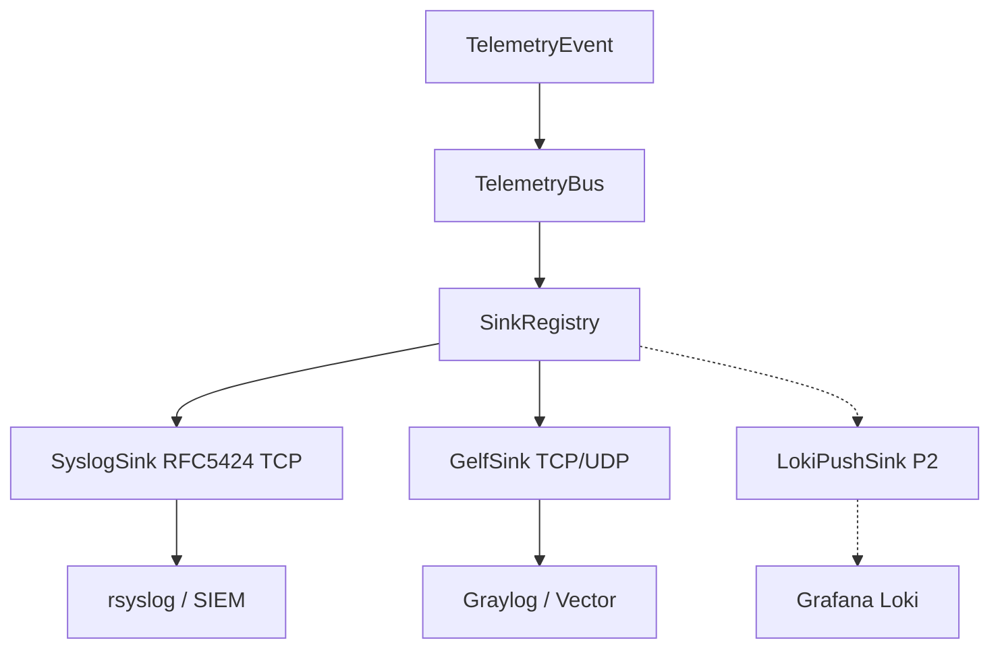

> **Language:** English · [Українська](../SPIKE_LOG_SINKS.md)

# SPIKE: LOG-server protocols for telemetry (P16-002)

**Date:** 2026-07-12  
**Status:** **accepted** — recommendation for [ROADMAP.md](ROADMAP.md) **Phase 16** (P16-030…032)  
**Branch:** `beta`  
**Prerequisite:** [ADR_TELEMETRY.md](ADR_TELEMETRY.md) (P16-001)

---

## Question

Which wire protocol(s) should PINGUI use for remote LOG sinks so that we:

1. Deliver **rare events** (`route_change`, `probe_error`) into a typical NOC stack (rsyslog, Graylog, Loki/Grafana)
2. Do not flood LOG with **high-freq RTT samples** (see ADR: `events_only` by default)
3. Implement Java/Python sinks without heavy dependencies and with mockable contract tests
4. Keep a path for P2 (Loki / OTLP) without blocking v1

---

## Candidates

| Protocol | Typical consumer | Transport | Ticket |
|----------|------------------|-----------|--------|
| **Syslog RFC 5424** | rsyslog, syslog-ng, SIEM | UDP/TCP/(TLS) | P16-030 |
| **GELF** | Graylog, Vector | UDP/TCP/(HTTP) | P16-031 |
| **Loki push** | Grafana Loki | HTTP `/loki/api/v1/push` | P16-032 (P2) |

Out of this comparison (separate ADR/tickets): OTLP (P16-080), webhook alerts (P10 / P16-050).

---

## Evaluation criteria

| Criterion | Weight | What “good” means for PINGUI |
|-----------|--------|------------------------------|
| NOC fit | high | Works with what datacenters already run |
| Event payload | high | Structured fields: host, event, old/new route, ts |
| Samples safety | high | Easy to keep `events_only`; does not encourage RTT-to-LOG |
| Impl cost | high | JDK-friendly (socket / HTTP); mockable in CI |
| Reliability | med | TCP/ack or a clear drop policy |
| Security | med | TLS / auth without secrets in logs |
| Ops complexity | med | Minimal sidecars |

---

## Comparison

### Syslog (RFC 5424)

**Pros**

- Universal: almost every NOC already has rsyslog/syslog-ng.
- Structured Data (`SD-ID`) or JSON in MSG is enough for `TelemetryEvent`.
- TCP covers **reliability** (no HTTP stack); **optional TLS** covers confidentiality/integrity.
- Easy to mock a TCP listener in contract tests (P16-072).

**Cons**

- UDP syslog is fire-and-forget (acceptable for rare events if TCP is available).
- Dialect drift (BSD 3164 vs 5424) — **v1 canon = RFC 5424**.
- No native Loki-style label model; filtering via facility/severity/SD.

**Recommended v1 profile**

- Transport: **TCP** (default); TLS optional (`--telemetry-syslog` / YAML).
- TCP framing: **v1 canon = RFC 6587 non-transparent trailing NL** (P16-030 ✅); same canon for Java/Python.
- Facility: `LOCAL0` (or config); severity: `NOTICE` for `route_change`, `WARNING` for `probe_error`.
- MSG: **single-line JSON** (v1 canon); SD `[pingui@…]` optional later, not a P16-030 blocker.

### GELF

**Pros**

- Natural fit for Graylog; structured `_field` without fighting syslog parsers.
- UDP is fine for labs; TCP for production events.
- Maps cleanly from `TelemetryEvent` → flat JSON (`short_message`, `host`, `_old_ips`, …).

**Cons**

- Less universal outside Graylog/Vector ecosystems.
- UDP GELF chunking adds complexity; v1 should **not** require chunking (events are small).
- HTTP GELF can wait; UDP/TCP is enough for v1.

**Recommended v1 profile**

- Transport: **TCP** preferred; UDP for lab.
- TCP framing: GELF null-byte (`\0`) terminator (no UDP chunking in v1).
- Payload: GELF 1.1 JSON; `short_message` = event type; extra `_` fields from the **shared** `TelemetryEvent → JSON` map (see below).
- `events_only=true` by default (symmetric with SyslogSink).

### Loki push API

**Pros**

- Direct path into Grafana without Graylog.
- Labels (`job=pingui`, `site`, `host`) work well with LogQL.

**Cons**

- HTTP batching, label cardinality, retries — higher implementation cost.
- Risk of flooding Loki with samples if someone disables `events_only`.
- Overlaps metrics roles with Prometheus/TS; fine for events, but not more critical than syslog/GELF in classic NOC.

**Conclusion:** **P2** (P16-032), after the bus + Syslog/GELF stabilize.

---

## Decision matrix

| Criterion | Syslog 5424 | GELF | Loki |
|-----------|-------------|------|------|
| NOC fit | ★★★ | ★★☆ (Graylog) | ★★☆ (Grafana) |
| Structured events | ★★★ | ★★★ | ★★★ |
| Samples safety | ★★★ | ★★★ | ★★☆ |
| Impl cost | ★★★ | ★★★ | ★★☆ |
| Reliability (TCP) | ★★★ | ★★★ | ★★★ (HTTP) |
| v1 priority | **P0** | **P0** | **P2** |

Filter point: `SinkConfig` / LOG sinks drop samples when `events_only=true` (default); the bus stays class-agnostic (ADR).

---

## Recommendation (accepted)

1. **v1 LOG sinks:** implement **both** `SyslogSink` (P16-030) and `GelfSink` (P16-031); operators enable 0–N via YAML/CLI.
2. **Default:** sinks **off**; when **any** remote LOG sink is enabled → **`events_only=true`** for **all** LOG sinks — syslog, GELF, future Loki (P16-033).
3. **Transport default:** TCP for syslog and GELF; TLS for syslog is a config option (TCP ≠ security).
4. **Shared mapper:** `TelemetryEvent → Map/JSON` (P16-010/011) shared by syslog MSG, GELF `_fields`, and the P16-072 contract fixture — before merging dual sinks.
5. **Loki:** P16-032 only (P2); does not block v1.
6. **Aggregates to LOG:** only with `log_aggregates: true` (P16-034); never hop-RTT every poll; aggregates do not bypass `events_only` for raw samples.
7. **Contract tests:** mock TCP syslog + mock GELF + shared field fixture (P16-072) before merging sinks.

This matches the ROADMAP DoD (“v1 recommendation: syslog TCP + GELF”) and [ADR_TELEMETRY.md](ADR_TELEMETRY.md).

### Alternatives considered

| Alternative | Why rejected |
|-------------|--------------|
| **Syslog-only P0** (GELF P1) | Graylog-native `_fields` and ROADMAP/ADR already require both sinks in the v1 topology; Graylog *can* ingest syslog, but phase 16.3 DoD is both protocols. Dual-cost mitigation: shared JSON mapper + one field-contract. |
| **GELF-only** | Worse NOC fit outside Graylog/Vector (matrix above). |
| **Loki in v1** | Higher HTTP/label cost; P2 after the bus stabilizes. |

---

## Open risks (for implementation tickets)

| Risk | Mitigation |
|------|------------|
| Syslog MSG encoding / multiline | Single JSON line; no `\n` in payload |
| TCP framing drift Java/Python | One canon in P16-030/031 DoD (RFC 6587 / GELF `\0`) |
| GELF UDP loss | Document TCP for production; lab UDP OK |
| Field drift Syslog vs GELF | Shared mapper + P16-072 field fixture |
| Future Loki label explosion | Small fixed label set; events_only |
| Duplicate `route_change` in alerts + LOG | Expected; different consumers (ADR §4) |
| Secrets in URLs | Redact in logs (P16-042) |

---

## Next steps

| ID | Action |
|----|--------|
| **P16-010…013** | Model + bus (before remote sinks) |
| **P16-030** | `SyslogSink` RFC 5424 TCP |
| **P16-031** | `GelfSink` |
| **P16-032** | `LokiPushSink` (P2) |
| **P16-061** | DEPLOYMENT § rsyslog/Graylog |

---

## References

- [ADR_TELEMETRY.md](ADR_TELEMETRY.md)  
- [ADR_OBSERVABILITY.md](ADR_OBSERVABILITY.md)  
- [ROADMAP.md](ROADMAP.md) — phase 16.3  
- RFC 5424 — The Syslog Protocol  
- Graylog GELF — docs.graylog.org  
- Grafana Loki HTTP API — `/loki/api/v1/push`
