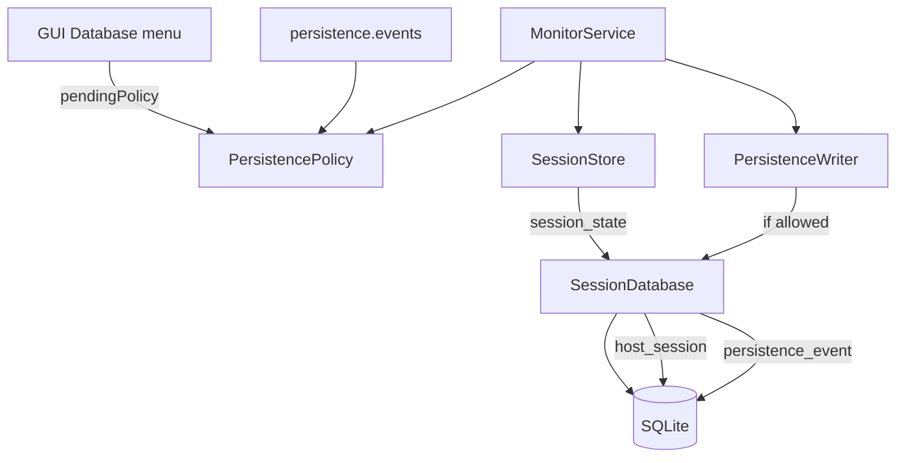

> **Language:** English · [Українська](../SPIKE_PERSISTENCE.md)

# SPIKE: SQLite session persistence (P11-001)

**Date:** 2026-07-09  
**Updated:** 2026-07-10 (event policy, menu, YAML; evidence after P11/PY-P11)  
**Status:** **accepted** — implementation in [ROADMAP.md](ROADMAP.md) **Phase 11 (P11-*)**  
**Branches:** `main` and `beta` (Java + Python reference after merge; new work lands on `beta` first)

---

## Question

What SQLite schema and API does Java need to:

1. Persist session metrics across GUI restarts (parity with Python `--session-db`)
2. Support a future route-change timeline (P11-020) and telemetry (P16-020)
3. Keep RAM-only mode when `--session-db` is omitted
4. Let the operator **choose** which discrete events are written to the DB and **safely change** that set without restart

**Answer:** v1 — `host_session`; v2 — unified `persistence_event` + `PersistencePolicy`; v3 — telemetry samples (P16). Event policy — shared YAML (docs), Java first, Python in PY-P11.

---

## Current state (evidence)

> Updated 2026-07-10: Java P11 + PY-P11 implemented on `main`/`beta` after merge.

| Layer | Python | Java |
|-------|--------|------|
| In-memory | `SessionStore` | `SessionStore` |
| SQLite | `persistence/session_db.py` (schema v3) | `io.pingui.persistence.SessionDatabase` |
| CLI | `--session-db PATH` | `--session-db PATH` |
| Route change / probe_error in SQLite | ✅ `persistence_event` (PY-P11) | ✅ `persistence_event` |
| Event selection menu | YAML `persistence.events` | GUI “Database…” + YAML |
| Export CSV/HTML | `export/session_report.py` | `--export-report` |

Timeseries (`InfluxDB` / `Timescale`) remains a separate channel from the SQLite session DB.

---

## Event taxonomy

| ID | Event | Source | Default with `--session-db` | Menu |
|----|-------|--------|----------------------------|------|
| `session_state` | `host_session` snapshot | `SessionStore.save` | **on** | hidden (always) |
| `route_change` | Hop IP change | `onRouteChanged` | **on** | checkbox |
| `probe_error` | Trace/ping failure | `onProbeError` | **on** | checkbox |
| `route_snapshot` | Every successful poll | `onDataReceived` | off | **not in P11 v1** (volume) |
| `ping_sample` | RTT per hop | `appendPingSamples` | off | **P16** / timeseries |

**Default on first `--session-db` enable:** `session_state` + `route_change` + `probe_error`.

P10 alerts (webhook/desktop) are **independent** of persistence policy — disabling `route_change` in the DB does not disable alerts.

---

## Configuration (shared YAML)

Schema is fixed in docs **before** implementation; Java — P11-010+; Python — **PY-P11** ticket (same YAML).

```yaml
persistence:
  session_db: data/ping.db   # optional; complements CLI --session-db
  events:
    route_change: true       # default: true
    probe_error: true        # default: true
```

**Priority** (same pattern as [ADR_ALERTS.md](ADR_ALERTS.md) §6):

1. CLI flags (highest)
2. Active profile YAML (`persistence.events`)
3. GUI “Database…” — session override
4. Default: `route_change` + `probe_error` on; `session_state` implicit

Until PY-P11: Python may ignore unknown `persistence:` block (forward-compat).

**Status:** PY-P11 ✅ — Python reads `persistence.events` / `session_db`, writes `persistence_event` (schema v3).

---

## “Database…” menu (Java GUI, P11-014)

Location: **Settings → Database…** (or adjacent to Alerts).

| UI element | Behaviour |
|------------|-----------|
| File path | read-only if set via CLI; else file picker / hint |
| ☑ Route changes | `persistence.events.route_change` |
| ☑ Probe errors | `persistence.events.probe_error` |
| Session state | not shown (always on with `--session-db`) |
| Apply | Sets `pendingPolicy`; active from **next poll cycle** |

---

## Policy change rules

### Enabling an event type

- From the **next poll cycle**, `MonitorService` starts writing that type.
- Existing rows are unchanged.

### Disabling an event type

1. User clears checkbox → confirm policy apply.
2. **Always** show purge dialog (for any type):

   > “Delete all stored events of type *X* from the database?”  
   > **[Keep history]** — stop write from next cycle only  
   > **[Delete]** — `DELETE FROM persistence_event WHERE event_type = ?` immediately after confirm

3. `pendingPolicy` (stop write) takes effect after the **current** poll cycle completes.
4. Purge SQL runs **immediately** after confirm (does not wait for cycle).

### `MonitorService` implementation

```
activePolicy  — used when writing events
pendingPolicy — set from UI/YAML/CLI
after cycle(): activePolicy = pendingPolicy
```

`session_state` (`host_session` upsert) does not go through event-type `PersistencePolicy` gate.

---

## Python reference — schema v2 (`host_session`)

Tables (`session_db.py`):

```sql
CREATE TABLE schema_meta (
    version INTEGER NOT NULL
);

CREATE TABLE host_session (
    host TEXT PRIMARY KEY,
    enabled INTEGER NOT NULL,
    current_route_json TEXT NOT NULL,
    previous_route_json TEXT NOT NULL,
    last_known_json TEXT NOT NULL,
    ping_history_json TEXT NOT NULL,
    hop_stats_json TEXT NOT NULL DEFAULT '{}',
    updated_at TEXT NOT NULL  -- ISO-8601 UTC
);
```

API: `load(host)`, `save(host, data)`, `delete(host)`, `rename(old, new)`, `close()`.

---

## Recommended Java schema

### v1 — parity (P11-010…P11-012)

**Identical** to Python `host_session` + `schema_meta`.

Package: `io.pingui.persistence.SessionDatabase`  
Dependency: `org.xerial:sqlite-jdbc`

```
MonitorService → SessionStore → host_session (session_state)
MonitorService → PersistenceWriter → persistence_event (policy gate)
```

Without `--session-db` / without `session_db` in YAML — RAM-only.

### v2 — discrete events (P11-011, P11-013…P11-015)

Unified append-only table (instead of `route_change_event` only):

```sql
CREATE TABLE persistence_event (
    id INTEGER PRIMARY KEY AUTOINCREMENT,
    event_type TEXT NOT NULL,   -- route_change | probe_error
    host TEXT NOT NULL,
    profile TEXT,
    payload_json TEXT NOT NULL,
    observed_at TEXT NOT NULL,
    FOREIGN KEY (host) REFERENCES host_session(host) ON DELETE CASCADE
);

CREATE INDEX idx_pe_host_type_time ON persistence_event(host, event_type, observed_at);
```

**Payload:**

| `event_type` | JSON |
|--------------|------|
| `route_change` | [RouteChangeEvent](ADR_ALERTS.md) contract (P10) |
| `probe_error` | `{"message":"…","host":"…"}` |

Write after `onRouteChanged` / `onProbeError` if `activePolicy.allows(type)`.

### v4 — telemetry (P16-020)

`telemetry_sample`, `telemetry_event` — schema_meta **v4** (separate migration after P11 v3); does not block GUI history.

---

## Diagram (P11 target)



---

## Decisions

| Topic | Decision |
|-------|----------|
| ORM | **No** — JDBC + prepared statements |
| Migrations | Manual `schema_meta.version`; v2 adds `persistence_event` |
| Default events | `session_state` + `route_change` + `probe_error` |
| Purge on disable | **Always** confirm; optional DELETE |
| Policy change | **Next poll cycle**; purge — immediate |
| Python parity | **Shared YAML in docs**; Java P11-010+; Python **PY-P11** |
| Layer | `persistence` without `ui`; `PersistencePolicy` in config or persistence |
| P10 alerts | Independent of persistence policy |

---

## SPIKE → ROADMAP mapping

| SPIKE | ID |
|-------|-----|
| SPIKE amend (this doc) | P11-001 ✅, policy — **P11-002** |
| `PersistencePolicy` + gate | P11-013 |
| GUI “Database…” + purge rules | P11-014 |
| YAML `persistence.events` + CLI | P11-015 |
| Schema v1 + `SessionDatabase` | P11-010 |
| Wire save + event insert | P11-011 |
| CLI `--session-db` | P11-012 |
| UI timeline | P11-020, P11-021 |
| Python event write parity | **PY-P11** |
| Telemetry tables | P16-020 |

---

## DoD

### P11-001 (schema)

- [x] UK + EN document
- [x] v1 Python parity schema
- [x] v2 events for timeline
- [x] P10 / P16 boundaries

### P11-002 (event policy, SPIKE amend)

- [x] Event taxonomy + defaults
- [x] YAML schema + config priority
- [x] Purge rules (always confirm) + poll-cycle
- [x] GUI menu scope → P11-014
- [x] Python parity path (PY-P11)

---

## References

- Python: `src/pingui/persistence/session_db.py`, `tests/unit/test_session_db.py`
- Java: `io.pingui.monitor.SessionStore`, `io.pingui.monitor.MonitorService`
- [ROADMAP.md](ROADMAP.md) — Phase 11  
- [ADR_ALERTS.md](ADR_ALERTS.md) — `RouteChangeEvent` (P10)
