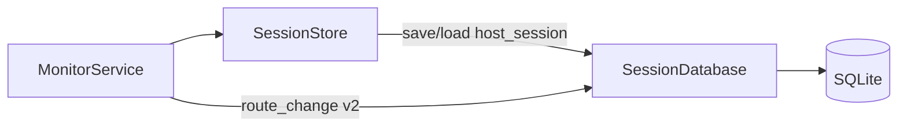

> **Language:** English · [Українська](../SPIKE_PERSISTENCE.md)

# SPIKE: SQLite session persistence (P11-001)

**Date:** 2026-07-09  
**Status:** **accepted** — implementation in [ROADMAP.md](ROADMAP.md) **Phase 11 (P11-*)**  
**Branches:** `beta` (Java + Python reference), `main` (Java GUI)

---

## Question

What SQLite schema and API does Java need to:

1. Persist session metrics across GUI restarts (parity with Python `--session-db`)
2. Support a future route-change timeline (P11-020) and telemetry (P16-020)
3. Keep RAM-only mode when `--session-db` is omitted

**Answer:** v1 mirrors Python `host_session`; v2 adds append-only `route_change_event`; v3 extends for telemetry samples (P16, separate).

---

## Current state (evidence)

| Layer | Python `beta` | Java `beta` |
|-------|---------------|-------------|
| In-memory | `SessionStore` | `SessionStore` |
| SQLite | `persistence/session_db.py` (`SCHEMA_VERSION = 2`) | **none** |
| CLI | `--session-db PATH` | **none** |
| Route change in SQLite | **none** (timeseries backends only) | **none** |
| Export CSV/HTML | `export/session_report.py` | **none** |

Python `SessionStore._write_route_event` writes only to **timeseries**, not `session_db`.

---

## Python reference — schema v2

Tables (`session_db.py`):

```sql
CREATE TABLE schema_meta (
    version INTEGER NOT NULL
);

CREATE TABLE host_session (
    host TEXT PRIMARY KEY,
    enabled INTEGER NOT NULL,
    current_route_json TEXT NOT NULL,
    previous_route_json TEXT NOT NULL,
    last_known_json TEXT NOT NULL,
    ping_history_json TEXT NOT NULL,
    hop_stats_json TEXT NOT NULL DEFAULT '{}',
    updated_at TEXT NOT NULL  -- ISO-8601 UTC
);
```

**JSON columns** (parity contract):

| Column | Content |
|--------|---------|
| `current_route_json` | `HopNode[]` |
| `previous_route_json` | `HopNode[]` |
| `last_known_json` | `map<hop, HopNode>` |
| `ping_history_json` | `map<ip, float[]>` (trim 50) |
| `hop_stats_json` | `map<hop, {probes, successes, rtt_samples}>` |

API: `load(host)`, `save(host, data)`, `delete(host)`, `rename(old, new)`, `close()`.

Migrations: manual (`ALTER TABLE` v1→v2 for `hop_stats_json`).

---

## Recommended Java schema

### v1 — parity (P11-010…P11-012)

**Identical** to Python `host_session` + `schema_meta`. JSON serialization uses the same hop object contract (`HopNode` in Java).

Package: `io.pingui.persistence.SessionDatabase`  
Dependency: `org.xerial:sqlite-jdbc` (Maven Central, JDBC URL `jdbc:sqlite:path`).

Wire from `SessionStore` (optional delegate), same as Python:

```
MonitorService → SessionStore → [SessionDatabase?]
```

Without `PATH` — current RAM-only behaviour.

### v2 — timeline events (P11-011, P11-020)

Append-only table for the History UI (not a duplicate of P16 timeseries):

```sql
CREATE TABLE route_change_event (
    id INTEGER PRIMARY KEY AUTOINCREMENT,
    host TEXT NOT NULL,
    profile TEXT NOT NULL DEFAULT 'default',
    old_ips_json TEXT NOT NULL,
    new_ips_json TEXT NOT NULL,
    observed_at TEXT NOT NULL,
    FOREIGN KEY (host) REFERENCES host_session(host) ON DELETE CASCADE
);

CREATE INDEX idx_route_change_host_time ON route_change_event(host, observed_at);
```

Write from `MonitorService` after `onRouteChanged` (alongside P10 alerts).  
Payload aligned with `RouteChangeEvent` (P10); v2 stores IP lists only, not full hop snapshots.

### v3 — telemetry samples (P16-020, out of scope P11-001)

Separate migration: `telemetry_sample`, `telemetry_event` — see [ROADMAP.md](ROADMAP.md) phase 16. Does not block P11 v1.

---

## Diagram (P11 target)



---

## Decisions

| Topic | Decision |
|-------|----------|
| ORM | **No** — JDBC + prepared statements (like Python `sqlite3`) |
| Migrations v1 | Manual `schema_meta.version` (Python parity); Flyway optional P2 |
| Transactions | `save` per host autocommit; batch flush P2 |
| Retention | P11-050: document; purge events > N days P2 |
| DB path | CLI `--session-db`; default off |
| Layer | `persistence` — no `ui` imports; `monitor` imports `persistence` |
| Dual-stack IPs in JSON | RFC 5952 strings as in RAM (`HopNode.ip`) |

---

## SPIKE → ROADMAP mapping

| SPIKE | ID |
|-------|-----|
| Schema v1 + `SessionDatabase` | P11-010 |
| Wire save + route_change insert | P11-011 |
| CLI `--session-db` | P11-012 |
| UI timeline query v2 | P11-020, P11-021 |
| Export | P11-030 |
| hop_stats parity labels | P11-040 |
| Docs retention | P11-050 |
| Telemetry tables | P16-020 (not P11) |

**Estimate:** v1 parity — 1 sprint; v2 timeline UI — +1 sprint.

---

## P11-001 DoD

- [x] UK + EN document
- [x] v1 parity schema documented
- [x] v2 `route_change_event` proposed for timeline
- [x] Boundaries with P10 (`RouteChangeEvent`) and P16 (telemetry) fixed
- [x] ROADMAP link `[x]`

---

## References

- Python: `src/pingui/persistence/session_db.py`, `tests/unit/test_session_db.py`
- Java: `io.pingui.monitor.SessionStore`, `io.pingui.model.Models.HostSessionData`
- [ROADMAP.md](ROADMAP.md) — Phase 11  
- [ADR_ALERTS.md](ADR_ALERTS.md) — `RouteChangeEvent` JSON (P10)
